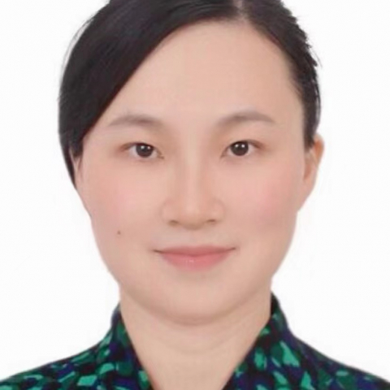

<!-- AUTO-GENERATED-BY: work/generate_obsidian_profiles.py -->

<!-- TEMPLATE: D:\workspace\信息收集整理\医生画像仓库\模板\医生画像模板.md -->

# 欧紫琳

## 基础信息

| 字段 | 内容 |
|---|---|
| 姓名 | 欧紫琳 |
| 医院 | 中山大学附属第一医院 |
| 科室 | 神经二科（脑血管病专科） |
| 职称/身份 | 副主任医师 |
| 来源链接 | [官网原文](https://www.fahsysu.org.cn/node/29069) |
| 采集日期 | 2026-08-13 |

## 简介/擅长

从事神经科临床工作十余年。 擅长：1、脑血管病的防治和长期管理（如脑梗、脑缺血、脑静脉血栓、脑出血、血管性认知障碍等）； 2、肌张力障碍的诊治和长期管理，尤其擅长肉毒毒素注射治疗各种面部肌肉痉挛（如眼睑痉挛、面肌痉挛、梅杰综合征）以及痉挛性斜颈，累计注射超过3000例次，有效率达98%以上； 3、对神经科常见病症的诊治亦有丰富经验（如头痛、头晕/眩晕、面瘫、神经痛、睡眠障碍、记忆减退/认知障碍、肢体麻木无力等）。 主要教育和工作经历： 教育背景： 2002-09至2007/06，复旦大学临床医学七年制（本硕连读），学士 2007-09至2009/06，复旦大学附属华山医院，获神经科硕士学位 2013-09至2016-06，中山大学附属第一医院，获神经科博士学位 工作经历： 2009-09至今，中山大学附属第一医院神经科，历任住院、主治和副主任医师（硕士生导师） 2025-03至2026-03，中山大学附属第一医院广西医院（派驻帮扶） 学术兼职： 中国神经科学学会神经毒素分会会员 广东省卒中学会医疗质量管理与促进分会首届委员 广东省医疗行业协会运动障碍与神经调控学组副组长 广东省脑科学应用学会脑与运动障碍分会常委 广东省...

## 教育与进修经历

- 主要教育和工作经历： 教育背景： 2002-09至2007/06，复旦大学临床医学七年制（本硕连读），学士 2007-09至2009/06，复旦大学附属华山医院，获神经科硕士学位 2013-09至2016-06，中山大学附属第一医院，获神经科博士学位 工作经历： 2009-09至今，中山大学附属第一医院神经科，历任住院、主治和副主任医师（硕士生导师） 2025-03至2026-03，中山大学附属第一医院广西医院（派驻帮扶） 学术兼职： 中国神经科学学会神经毒素分会会员 广东省卒中学会医疗质量管理与促进分会首届委员…

## 科研项目与成果

- 主持国家自然科学基金青年项目1项（脑血管病预后机制），参与多项国自然和国家重点研发计划项目。

## 论文与学术产出

- 以第一作者/通讯作者在Neurology、Movement Disorders 等神经科领域知名期刊发表多篇SCI论著。

## 可包装亮点

- 主要教育和工作经历： 教育背景： 2002-09至2007/06，复旦大学临床医学七年制（本硕连读），学士 2007-09至2009/06，复旦大学附属华山医院，获神经科硕士学位 2013-09至2016-06，中山大学附属第一医院，获神经科博士学位 工作经历： 2009-09至今，中山大学附属第一医院神经科，历任住院、主治和副主任医师（硕士生导师） 20…
- 以第一作者/通讯作者在Neurology、Movement Disorder...

## 重点疾病/人群标签

- 慢性病：
- 肿瘤：
- 生殖疾病：
- 免疫/风湿：
- 术后恢复/康复：
- 疑难重症：MDT

## 证据摘录

> 只摘录官网公开信息中的短句或关键字段，不复制大段原文。

- 官网身份字段：副主任医师
- 官网简介/擅长：从事神经科临床工作十余年。 擅长：1、脑血管病的防治和长期管理（如脑梗、脑缺血、脑静脉血栓、脑出血、血管性认知障碍等）； 2、肌张力障碍的诊治和长期管理，尤其擅长肉毒毒素注射治疗各种面部肌肉痉挛（如眼睑痉挛、面肌痉挛、梅杰综合征）以及痉挛性斜颈，累计注射超过3000例次，有效率达98%以上； 3、对神经科常见病症的诊治亦有丰富经验（如头痛、头晕/眩晕、面瘫、神经痛、睡眠障碍、记忆减退/认知障碍、肢体麻木无力等）。 主要教育和工作经历：…
- 官网亮眼经历线索：主要教育和工作经历： 教育背景： 2002-09至2007/06，复旦大学临床医学七年制（本硕连读），学士 2007-09至2009/06，复旦大学附属华山医院，获神经科硕士学位 2013-09至2016-06，中山大学附属第一医院，获神经科博士学位 工作经历： 2009-09至今，中山大学附属第一医院神经科，历任住院、主治和副主任医师（硕士生导师） 2025-03至2026-03，中山大学附属第一医院广西医院（派驻帮扶） 学术兼职：…
- 来源链接：https://www.fahsysu.org.cn/node/29069

## BD 画像摘要

欧紫琳医生可作为疑难重症方向的基础画像候选。后续 BD 使用应继续以官网来源和人工复核为准，不添加疗效承诺或无来源包装。

## 合规边界

- 仅使用医院官网、官方公众号、官方小程序等公开渠道。
- 不采集私人电话、私人微信、家庭住址、患者隐私或非公开排班信息。
- 不写“保证治愈”“疗效第一”“包治疑难杂症”等无法由官网证明的表述。
