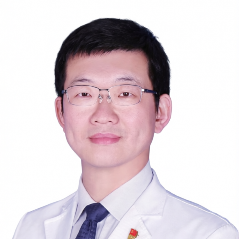

<!-- AUTO-GENERATED-BY: work/generate_obsidian_profiles.py -->

<!-- TEMPLATE: D:\workspace\信息收集整理\医生画像仓库\模板\医生画像模板.md -->

# 武日东

## 基础信息

| 字段 | 内容 |
|---|---|
| 姓名 | 武日东 |
| 医院 | 中山大学附属第一医院 |
| 科室 | 血管外科 |
| 职称/身份 | 主任医师 |
| 来源链接 | [官网原文](https://www.fahsysu.org.cn/node/25317) |
| 采集日期 | 2026-08-13 |

## 简介/擅长

主动脉弓部分支动脉的重建； 内脏动脉区分支动脉的重建； 主动脉夹层/动脉瘤/溃疡/狭窄等主动脉疾病的腔内介入和外科手术治疗； 下肢动脉闭塞性疾病（动脉硬化闭塞症、脉管炎等）的腔内介入和外科手术治疗； 颈动脉、锁骨下动脉、内脏动脉（肾动脉、肠系膜上动脉、腹腔干动脉、脾动脉等）夹层/动脉瘤/闭塞的腔内介入和外科手术治疗； 下肢静脉曲张的微创治疗； 下肢深静脉血栓以及血栓形成后综合征的微创治疗； 血液透析通路的建立。 研究方向： 主动脉及周围血管疾病的腔内介入和外科手术治疗； 下肢动脉粥样硬化及主动脉瘤发病机制的研究。 主要教育和工作经历： 2025年12月-至今 中山大学附属第一医院 血管外科 主任医师 2019年12月-2025年12月 中山大学附属第一医院 血管外科 副主任医师 2017年12月-2019年12月 中山大学附属第一医院 血管外科 主治医师 2014年07月-2017年12月 中山大学附属第一医院 血管外科 住院医师 2011年09月-2014年06月 中山大学附属第一医院 外科学 博士研究生 2007年09月-2010年06月 中山大学附属第一医院 外科学 硕士研究生 2002年09月-2007年06月...

## 科研项目与成果

- 主持国家自然科学基金青年基金一项，广东省自然科学基金一项，参与国家自然科学基金三项。

## 论文与学术产出

- 主编国家级著作一部《导管相关血栓与肿瘤》，科学技术文献出版社，2024年12月；

## 可包装亮点

- 主要教育和工作经历： 2025年12月-至今 中山大学附属第一医院 血管外科 主任医师 2019年12月-2025年12月 中山大学附属第一医院 血管外科 副主任医师 2017年12月-2019年12月 中山大学附属第一医院 血管外科 主治医师 2014年07月-2017年12月 中山大学附属第一医院 血管外科 住院医师 2011年09月-2014年06月…

## 重点疾病/人群标签

- 慢性病：动脉粥样硬化、肿瘤、瘤
- 肿瘤：动脉粥样硬化、肿瘤、瘤
- 生殖疾病：
- 免疫/风湿：
- 术后恢复/康复：
- 疑难重症：

## 证据摘录

> 只摘录官网公开信息中的短句或关键字段，不复制大段原文。

- 官网身份字段：主任医师
- 官网简介/擅长：主动脉弓部分支动脉的重建； 内脏动脉区分支动脉的重建； 主动脉夹层/动脉瘤/溃疡/狭窄等主动脉疾病的腔内介入和外科手术治疗； 下肢动脉闭塞性疾病（动脉硬化闭塞症、脉管炎等）的腔内介入和外科手术治疗； 颈动脉、锁骨下动脉、内脏动脉（肾动脉、肠系膜上动脉、腹腔干动脉、脾动脉等）夹层/动脉瘤/闭塞的腔内介入和外科手术治疗； 下肢静脉曲张的微创治疗； 下肢深静脉血栓以及血栓形成后综合征的微创治疗； 血液透析通路的建立。 研究方向： 主动脉及周…
- 官网亮眼经历线索：主要教育和工作经历： 2025年12月-至今 中山大学附属第一医院 血管外科 主任医师 2019年12月-2025年12月 中山大学附属第一医院 血管外科 副主任医师 2017年12月-2019年12月 中山大学附属第一医院 血管外科 主治医师 2014年07月-2017年12月 中山大学附属第一医院 血管外科 住院医师 2011年09月-2014年06月 中山大学附属第一医院 外科学 博士研究生 2007年09月-2010年06月…
- 来源链接：https://www.fahsysu.org.cn/node/25317

## BD 画像摘要

武日东医生可作为慢性病、肿瘤方向的基础画像候选。后续 BD 使用应继续以官网来源和人工复核为准，不添加疗效承诺或无来源包装。

## 合规边界

- 仅使用医院官网、官方公众号、官方小程序等公开渠道。
- 不采集私人电话、私人微信、家庭住址、患者隐私或非公开排班信息。
- 不写“保证治愈”“疗效第一”“包治疑难杂症”等无法由官网证明的表述。
