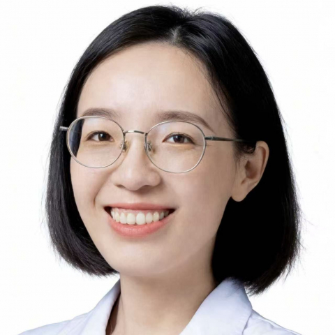

<!-- AUTO-GENERATED-BY: work/generate_obsidian_profiles.py -->

<!-- TEMPLATE: D:\workspace\信息收集整理\医生画像仓库\模板\医生画像模板.md -->

# 段妤

## 基础信息

| 字段 | 内容 |
|---|---|
| 姓名 | 段妤 |
| 医院 | 中山大学附属第一医院 |
| 科室 | 超声医学科 |
| 职称/身份 | 副主任医师 |
| 来源链接 | [官网原文](https://www.fahsysu.org.cn/node/38208) |
| 采集日期 | 2026-08-13 |

## 简介/擅长

专业技术全面，包括：腹部、血管、浅表器官的超声诊断，擅长肌骨神经、小儿超声、消化系统、泌尿系统疾病的超声诊断及评估。 教育经历： 2008-09 至 2016-06 中山大学临床医学八年制 博士； 2016-12 至 2018-12 哈佛大学麻省总院 博士后。 工作经历： 2016-07 至2019-12 中山大学附属第一医院 医师； 2019-12 至 2022-12 中山大学附属第一医院 助理研究员； 2022-12 至 2025-12 中山大学附属第一医院 主治医师； 2025-12 至今 中山大学附属第一医院 副主任医师。 科研经历： 主持/参与3项国家自然科学基金项目，以第一/通讯作者在European Radiology，Ultrasound in Medicine and Biology等主流期刊上发表SCI论文数篇。 社会任职： 中国民族卫生协会超声医学分会人工智能与分子影像专家委员会委员。

## 教育与进修经历

- 2016-12 至 2018-12 哈佛大学麻省总院 博士后。

## 科研项目与成果

- 科研经历： 主持/参与3项国家自然科学基金项目，以第一/通讯作者在European Radiology，Ultrasound in Medicine and Biology等主流期刊上发表SCI论文数篇。

## 论文与学术产出

- 科研经历： 主持/参与3项国家自然科学基金项目，以第一/通讯作者在European Radiology，Ultrasound in Medicine and Biology等主流期刊上发表SCI论文数篇。

## 可包装亮点

- 2025-12 至今 中山大学附属第一医院 副主任医师。
- 科研经历： 主持/参与3项国家自然科学基金项目，以第一/通讯作者在European Radiology，Ultrasound in Medicine and Biology等主流期刊上发表SCI论文数篇。
- 社会任职： 中国民族卫生协会超声医学分会人工智能与分子影像专家委员会委员。

## 重点疾病/人群标签

- 慢性病：
- 肿瘤：
- 生殖疾病：
- 免疫/风湿：
- 术后恢复/康复：
- 疑难重症：

## 证据摘录

> 只摘录官网公开信息中的短句或关键字段，不复制大段原文。

- 官网身份字段：副主任医师
- 官网简介/擅长：专业技术全面，包括：腹部、血管、浅表器官的超声诊断，擅长肌骨神经、小儿超声、消化系统、泌尿系统疾病的超声诊断及评估。 教育经历： 2008-09 至 2016-06 中山大学临床医学八年制 博士； 2016-12 至 2018-12 哈佛大学麻省总院 博士后。 工作经历： 2016-07 至2019-12 中山大学附属第一医院 医师； 2019-12 至 2022-12 中山大学附属第一医院 助理研究员； 2022-12 至 2025…
- 官网亮眼经历线索：2025-12 至今 中山大学附属第一医院 副主任医师。 科研经历： 主持/参与3项国家自然科学基金项目，以第一/通讯作者在European Radiology，Ultrasound in Medicine and Biology等主流期刊上发表SCI论文数篇。 社会任职： 中国民族卫生协会超声医学分会人工智能与分子影像专家委员会委员。
- 来源链接：https://www.fahsysu.org.cn/node/38208

## BD 画像摘要

段妤医生可作为中山大学附属第一医院超声医学科的基础医生资料入库。当前重点方向以总底表标签为准，官网未展示的信息保持空白。

## 合规边界

- 仅使用医院官网、官方公众号、官方小程序等公开渠道。
- 不采集私人电话、私人微信、家庭住址、患者隐私或非公开排班信息。
- 不写“保证治愈”“疗效第一”“包治疑难杂症”等无法由官网证明的表述。
