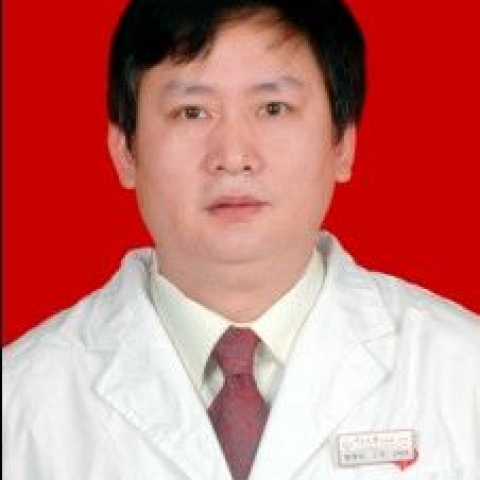

<!-- AUTO-GENERATED-BY: work/generate_obsidian_profiles.py -->

<!-- TEMPLATE: D:\workspace\信息收集整理\医生画像仓库\模板\医生画像模板.md -->

# 殷胜利

## 基础信息

| 字段 | 内容 |
|---|---|
| 姓名 | 殷胜利 |
| 医院 | 中山大学附属第一医院 |
| 科室 | 心脏外科 |
| 职称/身份 | 主任医师 |
| 来源链接 | [官网原文](https://www.fahsysu.org.cn/node/952) |
| 采集日期 | 2026-08-13 |

## 简介/擅长

## 教育与进修经历

- 1988年毕业一直从事心外科工作，1995年心脏外科研究生毕业。
- 医疗特长（限400字内）： 1988年毕业一直从事心外科工作，1995年心脏外科研究生毕业。
- 2003月11月-2004年6月—美国UCSF儿童心脏中心婴儿胸心外科学习—访问学者（临床学习） 1999年12月-2006年11月目前--心外科副教授，副主任医师， ‘ 社会兼职： 中华器官移植学会心肺移植学组委员，广东省器官移植委员，中国医师协会腔内介入委员会委员，广东省大血管外科分会委员，广东医院管理学会血管分会常委，广东省中西结合学会心外学会常委 论著：发表第一著者文章25篇 专著： 参编5本本专业的专著 其他主要工作成绩（比如获奖情况）： 中山医科大学医疗三等奖一项

## 科研项目与成果

- 1988年毕业一直从事心外科工作，1995年心脏外科研究生毕业。
- 医疗特长（限400字内）： 1988年毕业一直从事心外科工作，1995年心脏外科研究生毕业。

## 论文与学术产出

- 2003月11月-2004年6月—美国UCSF儿童心脏中心婴儿胸心外科学习—访问学者（临床学习） 1999年12月-2006年11月目前--心外科副教授，副主任医师， ‘ 社会兼职： 中华器官移植学会心肺移植学组委员，广东省器官移植委员，中国医师协会腔内介入委员会委员，广东省大血管外科分会委员，广东医院管理学会血管分会常委，广东省中西结合学会心外学会常委 论著：发表第一著者文章25篇 专著： 参编5本本专业的专著 其他主要工作成绩（比如获奖情况）： 中山医科大学医疗三等奖一项

## 可包装亮点

- 2001年在德国柏林心脏中心学习心脏移植，师从翁渝国教授；
- 2003年11月-2004年6月在美国UCSF儿童心脏中心从事复杂先天性心脏病的外科治疗的学习和心脏移植与心肺联合移植的学习，师从美国著名婴幼儿心脏外科治疗专家-Tom R. karl和移植专家-HOOPS教授。

## 重点疾病/人群标签

- 慢性病：
- 肿瘤：瘤、复杂
- 生殖疾病：
- 免疫/风湿：
- 术后恢复/康复：
- 疑难重症：瘤、复杂

## 证据摘录

> 只摘录官网公开信息中的短句或关键字段，不复制大段原文。

- 官网身份字段：主任医师
- 官网亮眼经历线索：2001年在德国柏林心脏中心学习心脏移植，师从翁渝国教授； 2003年11月-2004年6月在美国UCSF儿童心脏中心从事复杂先天性心脏病的外科治疗的学习和心脏移植与心肺联合移植的学习，师从美国著名婴幼儿心脏外科治疗专家-Tom R. karl和移植专家-HOOPS教授。 2001年在德国柏林心脏中心学习心脏移植，师从翁渝国教授； 2003年11月-2004年6月在美国UCSF儿童心脏中心从事复杂先天性心脏病的外科治疗的学习和心脏移植…
- 来源链接：https://www.fahsysu.org.cn/node/952

## BD 画像摘要

殷胜利医生可作为肿瘤、疑难重症方向的基础画像候选。后续 BD 使用应继续以官网来源和人工复核为准，不添加疗效承诺或无来源包装。

## 合规边界

- 仅使用医院官网、官方公众号、官方小程序等公开渠道。
- 不采集私人电话、私人微信、家庭住址、患者隐私或非公开排班信息。
- 不写“保证治愈”“疗效第一”“包治疑难杂症”等无法由官网证明的表述。
