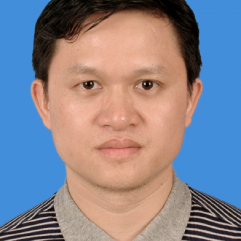

<!-- AUTO-GENERATED-BY: work/generate_obsidian_profiles.py -->

<!-- TEMPLATE: D:\workspace\信息收集整理\医生画像仓库\模板\医生画像模板.md -->

# 江广理

## 基础信息

| 字段 | 内容 |
|---|---|
| 姓名 | 江广理 |
| 医院 | 中山大学附属第一医院 |
| 科室 | 耳专科 |
| 职称/身份 | 副主任医师 |
| 来源链接 | [官网原文](https://www.fahsysu.org.cn/node/5683) |
| 采集日期 | 2026-08-13 |

## 简介/擅长

## 教育与进修经历

- 主要教育和工作经历：1993年毕业于中山大学临床医学系，留附属一院从事医教研工作至今。
- 2004年临床医学硕士毕业（耳科专业，导师陈锡辉教授），2010年临床医学博士毕业（鼻窦内窥镜外科专业，导师许庚教授）。

## 科研项目与成果

- 举办国家级继续教育项目“颞骨解剖与耳显微外科学习班”，培养了较多的耳科专科医师。

## 论文与学术产出

- 论著与专著：主编《颞骨解剖与耳显微外科图谱》，编写《耳鼻咽喉科疾病临床诊断与治疗方案》、《耳鼻咽喉创伤学》等。

## 可包装亮点

- 2011年9月调任黄埔院区耳鼻咽喉科主任。
- 社会兼职：《耳鼻咽喉医学工程专业委员会》委员。

## 重点疾病/人群标签

- 慢性病：慢性、肿瘤
- 肿瘤：慢性、肿瘤
- 生殖疾病：
- 免疫/风湿：
- 术后恢复/康复：
- 疑难重症：

## 证据摘录

> 只摘录官网公开信息中的短句或关键字段，不复制大段原文。

- 官网身份字段：副主任医师
- 官网亮眼经历线索：2011年9月调任黄埔院区耳鼻咽喉科主任。 社会兼职：《耳鼻咽喉医学工程专业委员会》委员。
- 来源链接：https://www.fahsysu.org.cn/node/5683

## BD 画像摘要

江广理医生可作为慢性病、肿瘤方向的基础画像候选。后续 BD 使用应继续以官网来源和人工复核为准，不添加疗效承诺或无来源包装。

## 合规边界

- 仅使用医院官网、官方公众号、官方小程序等公开渠道。
- 不采集私人电话、私人微信、家庭住址、患者隐私或非公开排班信息。
- 不写“保证治愈”“疗效第一”“包治疑难杂症”等无法由官网证明的表述。
