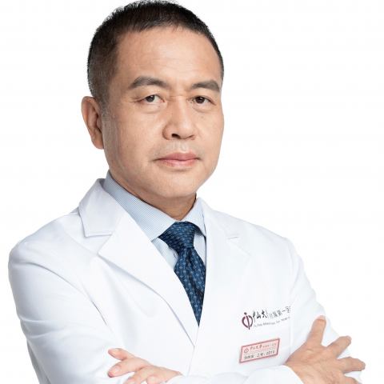

<!-- AUTO-GENERATED-BY: work/generate_obsidian_profiles.py -->

<!-- TEMPLATE: D:\workspace\信息收集整理\医生画像仓库\模板\医生画像模板.md -->

# 涂响安

## 基础信息

| 字段 | 内容 |
|---|---|
| 姓名 | 涂响安 |
| 医院 | 中山大学附属第一医院 |
| 科室 | 生殖男科专科 |
| 职称/身份 | 主任医师 |
| 来源链接 | [官网原文](https://www.fahsysu.org.cn/node/31481) |
| 采集日期 | 2026-08-13 |

## 简介/擅长

对男性不育症（少弱精子症、畸形精子症和无精子症），勃起功能和射精障碍，精索静脉曲张，慢性睾丸痛，男生殖系肿瘤，前列腺疾病(慢性前列腺炎、良性前列腺增生及前列腺癌)等的诊断和治疗有丰富的临床经验。 擅长男性不育症的显微手术（显微睾丸取精术、显微精索静脉结扎术、显微输精管附睾吻合术、显微输精管吻合术和显微精索去神经术等），射精管梗阻性无精子症的腔内手术（精囊镜手术和经尿道射精管切开术），包皮环切术及阴茎整形术等。 2010年2月至6月到美国维克森林大学医学院研修腔内泌尿外科和显微男科学，2012年8月和2016年3月两度到美国康奈尔大学威尔医学院行高级显微男科手术培训。 擅长男性不育症的显微手术（显微睾丸取精术、显微精索静脉结扎术、显微输精管附睾吻合术、显微输精管吻合术和显微精索去神经术等），射精管梗阻性无精子症的腔内手术（精囊镜手术和经尿道射精管切开术），包皮环切术及阴茎整形术等。 对男性不育症（少弱精子症、畸形精子症和无精子症），勃起功能和射精障碍，精索静脉曲张，慢性睾丸痛，男生殖系肿瘤，前列腺疾病(慢性前列腺炎、良性前列腺增生及前列腺癌)等的诊断和治疗有丰富的临床经验。 现任中国医师协会男科医师分会全国委员、中华医学...

## 教育与进修经历

- 2010年2月至6月到美国维克森林大学医学院研修腔内泌尿外科和显微男科学，2012年8月和2016年3月两度到美国康奈尔大学威尔医学院行高级显微男科手术培训。

## 科研项目与成果

- 主持国家自然科学基金1项和省部级科研基金10项，在国内外核心期刊发表论文100余篇，其中SCI收录20余篇。

## 论文与学术产出

- 主持国家自然科学基金1项和省部级科研基金10项，在国内外核心期刊发表论文100余篇，其中SCI收录20余篇。
- 主编有《显微男科手术学》、《泌尿男科罕少见病》、《包皮疾病诊疗手册》和副主编《男科手术学》等专著。

## 可包装亮点

- 2010年2月至6月到美国维克森林大学医学院研修腔内泌尿外科和显微男科学，2012年8月和2016年3月两度到美国康奈尔大学威尔医学院行高级显微男科手术培训。
- 现任中国医师协会男科医师分会全国委员、中华医学会男科学分会手术学组委员、广东省临床医学学会男性健康专业委员会主任委员、广东省医学会男科学分会副主任委员兼显微微创手术学组组长、广东省健康管理学会男性健康专业委员会副主任委员、广东省泌尿生殖协会男性健康管理学分会副主任委员和《中华男科学杂志》编委等。
- 主持国家自然科学基金1项和省部级科研基金10项，在国内外核心期刊发表论文100余篇，其中SCI收录20余篇。
- 主持和参与了多项男科疾病国内指南和共识的编写。

## 重点疾病/人群标签

- 慢性病：
- 肿瘤：
- 生殖疾病：
- 免疫/风湿：
- 术后恢复/康复：
- 疑难重症：

## 证据摘录

> 只摘录官网公开信息中的短句或关键字段，不复制大段原文。

- 官网身份字段：主任医师
- 官网简介/擅长：对男性不育症（少弱精子症、畸形精子症和无精子症），勃起功能和射精障碍，精索静脉曲张，慢性睾丸痛，男生殖系肿瘤，前列腺疾病(慢性前列腺炎、良性前列腺增生及前列腺癌)等的诊断和治疗有丰富的临床经验。 擅长男性不育症的显微手术（显微睾丸取精术、显微精索静脉结扎术、显微输精管附睾吻合术、显微输精管吻合术和显微精索去神经术等），射精管梗阻性无精子症的腔内手术（精囊镜手术和经尿道射精管切开术），包皮环切术及阴茎整形术等。 2010年2月至6月到美…
- 官网亮眼经历线索：2010年2月至6月到美国维克森林大学医学院研修腔内泌尿外科和显微男科学，2012年8月和2016年3月两度到美国康奈尔大学威尔医学院行高级显微男科手术培训。 现任中国医师协会男科医师分会全国委员、中华医学会男科学分会手术学组委员、广东省临床医学学会男性健康专业委员会主任委员、广东省医学会男科学分会副主任委员兼显微微创手术学组组长、广东省健康管理学会男性健康专业委员会副主任委员、广东省泌尿生殖协会男性健康管理学分会副主任委员和《中华男…
- 异常提示：同名待甄别
- 来源链接：https://www.fahsysu.org.cn/node/31481

## BD 画像摘要

涂响安医生可作为中山大学附属第一医院生殖男科专科的基础医生资料入库。当前重点方向以总底表标签为准，官网未展示的信息保持空白。

## 合规边界

- 仅使用医院官网、官方公众号、官方小程序等公开渠道。
- 不采集私人电话、私人微信、家庭住址、患者隐私或非公开排班信息。
- 不写“保证治愈”“疗效第一”“包治疑难杂症”等无法由官网证明的表述。
