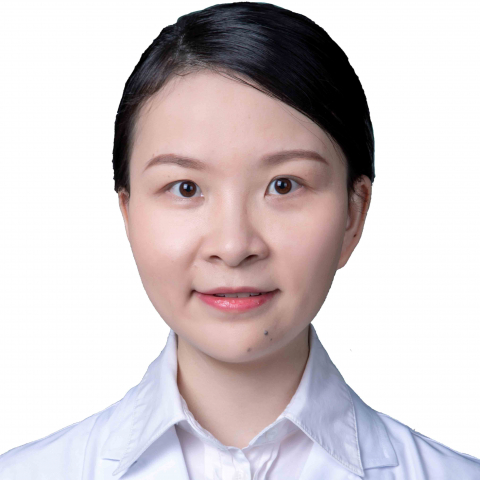

<!-- AUTO-GENERATED-BY: work/generate_obsidian_profiles.py -->

<!-- TEMPLATE: D:\workspace\信息收集整理\医生画像仓库\模板\医生画像模板.md -->

# 熊珊珊

## 基础信息

| 字段 | 内容 |
|---|---|
| 姓名 | 熊珊珊 |
| 医院 | 中山大学附属第一医院 |
| 科室 | 消化内科 |
| 职称/身份 | 副主任医师 |
| 来源链接 | [官网原文](https://www.fahsysu.org.cn/node/38455) |
| 采集日期 | 2026-08-13 |

## 简介/擅长

消化系统常见病、多发病的诊治，尤其在肠道溃疡性疾病（包括炎症性肠病）的诊疗中积累了较为丰富的经验。 医学博士，消化内科副主任医师，硕士研究生导师。 毕业于中山大学临床医学八年制专业，曾赴美国华盛顿大学(圣路易斯)医学院进行博士后研究3年，主要研究方向为炎症性肠病的基础与临床研究。 社会兼职：1、中国医师协会内镜医师分会第四届委员会结肠镜学组组员； 2、中华医学会消化内镜学分会第九届委员会消化道癌筛查协作组成员； 3、广东省医学会肝病学分会第五届委员会青年委员会副主任委员； 4、广东省健康管理学会消化及炎症性肠病多学科诊治专业委员会秘书长。 科研情况：主持国家自然科学基金1项、中山大学青年教师培育项目1项，获得中山大学附属第一医院柯麟新星、柯麟新苗人才项目资助。 以第一或通讯作者在Gut、Therapeutic Advances in Gastroenterology等杂志发表文章数篇。

## 教育与进修经历

- 毕业于中山大学临床医学八年制专业，曾赴美国华盛顿大学(圣路易斯)医学院进行博士后研究3年，主要研究方向为炎症性肠病的基础与临床研究。

## 科研项目与成果

- 科研情况：主持国家自然科学基金1项、中山大学青年教师培育项目1项，获得中山大学附属第一医院柯麟新星、柯麟新苗人才项目资助。

## 论文与学术产出

- 以第一或通讯作者在Gut、Therapeutic Advances in Gastroenterology等杂志发表文章数篇。

## 可包装亮点

- 医学博士，消化内科副主任医师，硕士研究生导师。
- 毕业于中山大学临床医学八年制专业，曾赴美国华盛顿大学(圣路易斯)医学院进行博士后研究3年，主要研究方向为炎症性肠病的基础与临床研究。
- 社会兼职：1、中国医师协会内镜医师分会第四届委员会结肠镜学组组员；
- 2、中华医学会消化内镜学分会第九届委员会消化道癌筛查协作组成员；

## 重点疾病/人群标签

- 慢性病：
- 肿瘤：癌、多学科
- 生殖疾病：
- 免疫/风湿：
- 术后恢复/康复：
- 疑难重症：癌、多学科

## 证据摘录

> 只摘录官网公开信息中的短句或关键字段，不复制大段原文。

- 官网身份字段：副主任医师
- 官网简介/擅长：消化系统常见病、多发病的诊治，尤其在肠道溃疡性疾病（包括炎症性肠病）的诊疗中积累了较为丰富的经验。 医学博士，消化内科副主任医师，硕士研究生导师。 毕业于中山大学临床医学八年制专业，曾赴美国华盛顿大学(圣路易斯)医学院进行博士后研究3年，主要研究方向为炎症性肠病的基础与临床研究。 社会兼职：1、中国医师协会内镜医师分会第四届委员会结肠镜学组组员； 2、中华医学会消化内镜学分会第九届委员会消化道癌筛查协作组成员； 3、广东省医学会肝病学…
- 官网亮眼经历线索：医学博士，消化内科副主任医师，硕士研究生导师。 毕业于中山大学临床医学八年制专业，曾赴美国华盛顿大学(圣路易斯)医学院进行博士后研究3年，主要研究方向为炎症性肠病的基础与临床研究。 社会兼职：1、中国医师协会内镜医师分会第四届委员会结肠镜学组组员； 2、中华医学会消化内镜学分会第九届委员会消化道癌筛查协作组成员；
- 来源链接：https://www.fahsysu.org.cn/node/38455

## BD 画像摘要

熊珊珊医生可作为肿瘤、疑难重症方向的基础画像候选。后续 BD 使用应继续以官网来源和人工复核为准，不添加疗效承诺或无来源包装。

## 合规边界

- 仅使用医院官网、官方公众号、官方小程序等公开渠道。
- 不采集私人电话、私人微信、家庭住址、患者隐私或非公开排班信息。
- 不写“保证治愈”“疗效第一”“包治疑难杂症”等无法由官网证明的表述。
