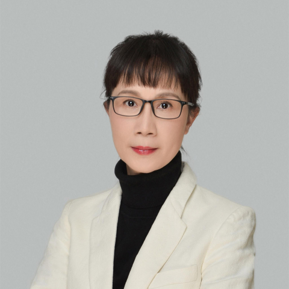

<!-- AUTO-GENERATED-BY: work/generate_obsidian_profiles.py -->

<!-- TEMPLATE: D:\workspace\信息收集整理\医生画像仓库\模板\医生画像模板.md -->

# 熊观霞

## 基础信息

| 字段 | 内容 |
|---|---|
| 姓名 | 熊观霞 |
| 医院 | 中山大学附属第一医院 |
| 科室 | 耳专科 |
| 职称/身份 | 主任医师 |
| 来源链接 | [官网原文](https://www.fahsysu.org.cn/node/5682) |
| 采集日期 | 2026-08-13 |

## 简介/擅长

耳科和听觉相关疾病的诊断与治疗，精于耳显微外科手术。 在中耳炎听力重建、耳鸣耳聋的系统处理、小耳畸形听觉康复、各种复杂类型的人工听觉植入上有丰富的临床经验。 对同期/分期的双耳听觉植入，畸形中耳内耳、鼻咽癌放疗后、老年性耳聋等情况的人工耳蜗植入有系统的手术和围手术期管理经验。 另外，对慢性中耳炎常规鼓室成型术后、听神经瘤术后听力损失的后续康复也有丰富的经验。 工作经历 ： 在中山医接受正规的系列培养，毕业后从事耳鼻咽喉科临床一线工作，一直保持接受国内外的继续教育。 主攻方向耳专科，擅长耳科和听觉相关疾病的诊断与治疗，有规范和全面的耳专科（包括听力学）的技能，尤其精于耳显微外科手术。 30年致力于听觉康复的临床和科研工作， 在中耳炎外科治疗、助听器（气导/骨导）验配、人工听觉植入（人工耳蜗/骨导助听装置）等领域有丰富的经验。 本人每年处理的人工耳蜗患者一百多例，是华南地区第一个开展Baha-Attract骨导助听器植入的手术医生，目前也是临床例数最多的医生。 在小耳畸形听觉康复，慢性中耳炎常规鼓室手术后听力损失的后续康复上也有开拓性临床研究，目前以独立研究者身份主持“Baha-Attract系统在慢性中耳炎相关性听力损失...

## 教育与进修经历

- 工作经历 ： 在中山医接受正规的系列培养，毕业后从事耳鼻咽喉科临床一线工作，一直保持接受国内外的继续教育。

## 科研项目与成果

- 30年致力于听觉康复的临床和科研工作， 在中耳炎外科治疗、助听器（气导/骨导）验配、人工听觉植入（人工耳蜗/骨导助听装置）等领域有丰富的经验。
- 社会任职： 中华医学会耳鼻咽喉头颈外科分会耳科组委员、国家听力残疾儿童人工耳蜗康复救助项目专家组成员、广东省医学会耳鼻咽喉科分会耳科组副组长、广东省医师学会耳鼻咽喉科分会常委、《中华耳科杂志》编委。
- 科研情况： 近五年获得多项政府资助的防聋治聋专项临床科研基金，带领的团队已经获得多项专利并开发了相关产品应用于临床，并发表了系列的科研论文。

## 论文与学术产出

- 科研情况： 近五年获得多项政府资助的防聋治聋专项临床科研基金，带领的团队已经获得多项专利并开发了相关产品应用于临床，并发表了系列的科研论文。

## 可包装亮点

- 社会任职： 中华医学会耳鼻咽喉头颈外科分会耳科组委员、国家听力残疾儿童人工耳蜗康复救助项目专家组成员、广东省医学会耳鼻咽喉科分会耳科组副组长、广东省医师学会耳鼻咽喉科分会常委、《中华耳科杂志》编委。
- 科研情况： 近五年获得多项政府资助的防聋治聋专项临床科研基金，带领的团队已经获得多项专利并开发了相关产品应用于临床，并发表了系列的科研论文。

## 重点疾病/人群标签

- 慢性病：慢性、瘤、放疗、鼻咽癌、术后、康复、复杂
- 肿瘤：慢性、瘤、放疗、鼻咽癌、术后、康复、复杂
- 生殖疾病：
- 免疫/风湿：
- 术后恢复/康复：慢性、瘤、放疗、鼻咽癌、术后、康复、复杂
- 疑难重症：慢性、瘤、放疗、鼻咽癌、术后、康复、复杂

## 证据摘录

> 只摘录官网公开信息中的短句或关键字段，不复制大段原文。

- 官网身份字段：主任医师
- 官网简介/擅长：耳科和听觉相关疾病的诊断与治疗，精于耳显微外科手术。 在中耳炎听力重建、耳鸣耳聋的系统处理、小耳畸形听觉康复、各种复杂类型的人工听觉植入上有丰富的临床经验。 对同期/分期的双耳听觉植入，畸形中耳内耳、鼻咽癌放疗后、老年性耳聋等情况的人工耳蜗植入有系统的手术和围手术期管理经验。 另外，对慢性中耳炎常规鼓室成型术后、听神经瘤术后听力损失的后续康复也有丰富的经验。 工作经历 ： 在中山医接受正规的系列培养，毕业后从事耳鼻咽喉科临床一线工作…
- 官网亮眼经历线索：社会任职： 中华医学会耳鼻咽喉头颈外科分会耳科组委员、国家听力残疾儿童人工耳蜗康复救助项目专家组成员、广东省医学会耳鼻咽喉科分会耳科组副组长、广东省医师学会耳鼻咽喉科分会常委、《中华耳科杂志》编委。 科研情况： 近五年获得多项政府资助的防聋治聋专项临床科研基金，带领的团队已经获得多项专利并开发了相关产品应用于临床，并发表了系列的科研论文。
- 来源链接：https://www.fahsysu.org.cn/node/5682

## BD 画像摘要

熊观霞医生可作为慢性病、肿瘤、术后恢复/康复、疑难重症方向的基础画像候选。后续 BD 使用应继续以官网来源和人工复核为准，不添加疗效承诺或无来源包装。

## 合规边界

- 仅使用医院官网、官方公众号、官方小程序等公开渠道。
- 不采集私人电话、私人微信、家庭住址、患者隐私或非公开排班信息。
- 不写“保证治愈”“疗效第一”“包治疑难杂症”等无法由官网证明的表述。
