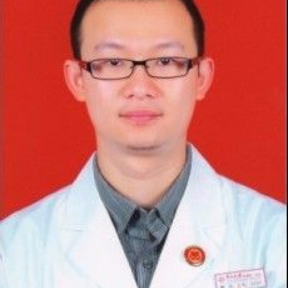

<!-- AUTO-GENERATED-BY: work/generate_obsidian_profiles.py -->

<!-- TEMPLATE: D:\workspace\信息收集整理\医生画像仓库\模板\医生画像模板.md -->

# 熊迈

## 基础信息

| 字段 | 内容 |
|---|---|
| 姓名 | 熊迈 |
| 医院 | 中山大学附属第一医院 |
| 科室 | 心脏外科 |
| 职称/身份 | 副主任医师 |
| 来源链接 | [官网原文](https://www.fahsysu.org.cn/node/5538) |
| 采集日期 | 2026-08-13 |

## 简介/擅长

1998年始进入心脏外科专业，接受硕士、博士规范化培训，主要从事先天性心脏病、成人瓣膜疾病、心脏移植及心肺移植的诊断治疗和围术期处理工作。 研究方向： 先天性心脏病，肺动脉高压，体外循环器官保护，瓣膜疾病外科治疗 主要教育和工作经历： 1993年9月~2000年7月 中山医科大学七年制硕士研究生班 2000年7月~2003年12月 中山大学附属第一医院心胸外科住院医师 2003年8月~2004年4月 参与贵阳医学院附属医院心脏外科建设 2003年12月~2009年12月 中山大学附属第一医院心胸外科、心脏外科主治医师 2005年9月~2008年12月 中山大学附属第一医院心脏外科博士研究生 2009年12月至今 中山大学附属第一医院心脏外科副主任医师 2010年11月~2012年1月 中组部第11批博士服务团，挂职宁夏医科大学总医院及心脑血管病医院 社会兼职： 论著： 近5年第一作者发表SCI文章4篇，最高影响因子4.7 专著： 参编本专业专著5篇

## 教育与进修经历

- 1998年始进入心脏外科专业，接受硕士、博士规范化培训，主要从事先天性心脏病、成人瓣膜疾病、心脏移植及心肺移植的诊断治疗和围术期处理工作。
- 医疗特长： 1998年始进入心脏外科专业，接受硕士、博士规范化培训，主要从事先天性心脏病、成人瓣膜疾病、心脏移植及心肺移植的诊断治疗和围术期处理工作。

## 可包装亮点

- 研究方向： 先天性心脏病，肺动脉高压，体外循环器官保护，瓣膜疾病外科治疗 主要教育和工作经历： 1993年9月~2000年7月 中山医科大学七年制硕士研究生班 2000年7月~2003年12月 中山大学附属第一医院心胸外科住院医师 2003年8月~2004年4月 参与贵阳医学院附属医院心脏外科建设 2003年12月~2009年12月 中山大学附属第一医院心…

## 重点疾病/人群标签

- 慢性病：
- 肿瘤：
- 生殖疾病：
- 免疫/风湿：
- 术后恢复/康复：
- 疑难重症：

## 证据摘录

> 只摘录官网公开信息中的短句或关键字段，不复制大段原文。

- 官网身份字段：副主任医师
- 官网简介/擅长：1998年始进入心脏外科专业，接受硕士、博士规范化培训，主要从事先天性心脏病、成人瓣膜疾病、心脏移植及心肺移植的诊断治疗和围术期处理工作。 研究方向： 先天性心脏病，肺动脉高压，体外循环器官保护，瓣膜疾病外科治疗 主要教育和工作经历： 1993年9月~2000年7月 中山医科大学七年制硕士研究生班 2000年7月~2003年12月 中山大学附属第一医院心胸外科住院医师 2003年8月~2004年4月 参与贵阳医学院附属医院心脏外科建设…
- 官网亮眼经历线索：研究方向： 先天性心脏病，肺动脉高压，体外循环器官保护，瓣膜疾病外科治疗 主要教育和工作经历： 1993年9月~2000年7月 中山医科大学七年制硕士研究生班 2000年7月~2003年12月 中山大学附属第一医院心胸外科住院医师 2003年8月~2004年4月 参与贵阳医学院附属医院心脏外科建设 2003年12月~2009年12月 中山大学附属第一医院心胸外科、心脏外科主治医师 2005年9月~2008年12月 中山大学附属第一医院…
- 来源链接：https://www.fahsysu.org.cn/node/5538

## BD 画像摘要

熊迈医生可作为中山大学附属第一医院心脏外科的基础医生资料入库。当前重点方向以总底表标签为准，官网未展示的信息保持空白。

## 合规边界

- 仅使用医院官网、官方公众号、官方小程序等公开渠道。
- 不采集私人电话、私人微信、家庭住址、患者隐私或非公开排班信息。
- 不写“保证治愈”“疗效第一”“包治疑难杂症”等无法由官网证明的表述。
