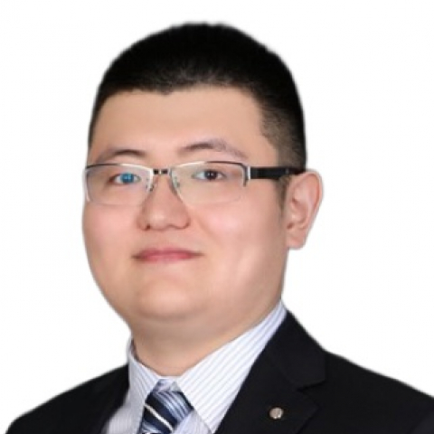

<!-- AUTO-GENERATED-BY: work/generate_obsidian_profiles.py -->

<!-- TEMPLATE: D:\workspace\信息收集整理\医生画像仓库\模板\医生画像模板.md -->

# 王乐

## 基础信息

| 字段 | 内容 |
|---|---|
| 姓名 | 王乐 |
| 医院 | 中山大学附属第一医院 |
| 科室 | 脊柱外科 |
| 职称/身份 | 副主任医师 |
| 来源链接 | [官网原文](https://www.fahsysu.org.cn/node/29146) |
| 采集日期 | 2026-08-13 |

## 简介/擅长

专注脊柱外科疾患诊疗十余年，对脊柱外科常见病、多发病的诊断与治疗上积累了丰富的临床经验，主攻脊柱退行性疾病与脊柱畸形的诊治，包括腰椎间盘突出症、腰椎管狭窄症、腰椎滑脱症、颈椎病、脊柱畸形、脊髓损伤等。 对于脊柱疾病，主张防病在前，治病在后，适宜诊疗，康复与外科治疗相结合。 擅长腰椎间盘突出症的微创治疗、骨质疏松骨折的微创治疗、腰椎神经减压及内固定、颈椎前后路减压及脊柱矫形等手术。 研究方向：脊柱退变性疾病的微创治疗（颈椎病、腰椎间盘突出症，腰椎管狭窄症），脊柱畸形的诊治，脊髓损伤的临床和基础研究。 主要教育和工作经历： 2010/09 --- 2015/07 中山大学附属第一医院 脊柱外科 硕博连读 2013/10 --- 2015/03 美国得州大学医学分部UTMB 国家公派联合培养 2015/07 --- 至今 中山大学附属第一医院 脊柱外科 从医从教 社会兼职： 中国康复医学会颈椎病专业委员会科普学组 委员 广东省医学会脊柱外科学分会腰椎学组 秘书 广东省中西医结合学会脊柱医学专业委员会 成员 《中华创伤杂志》青年学术委员会 委员 论著： 主持及参与国家自然科学基金、广东省自然科学基金等多项科学研究。 以第一作者...

## 科研项目与成果

- 主要教育和工作经历： 2010/09 --- 2015/07 中山大学附属第一医院 脊柱外科 硕博连读 2013/10 --- 2015/03 美国得州大学医学分部UTMB 国家公派联合培养 2015/07 --- 至今 中山大学附属第一医院 脊柱外科 从医从教 社会兼职： 中国康复医学会颈椎病专业委员会科普学组 委员 广东省医学会脊柱外科学分会腰椎学组 秘书 广东省中西医结合学会脊柱医学专业委员会 成员 《中华创伤杂志》青年学术委员会 委员 论著： 主持及参与国家自然科学基金、广东省自然科学基金等多项科学研究。

## 论文与学术产出

- 以第一作者或通讯作者在骨科相关权威杂志发表SCI及中文核心期刊论文二十余篇。

## 可包装亮点

- 主要教育和工作经历： 2010/09 --- 2015/07 中山大学附属第一医院 脊柱外科 硕博连读 2013/10 --- 2015/03 美国得州大学医学分部UTMB 国家公派联合培养 2015/07 --- 至今 中山大学附属第一医院 脊柱外科 从医从教 社会兼职： 中国康复医学会颈椎病专业委员会科普学组 委员 广东省医学会脊柱外科学分会腰椎学组…
- 以第一作者或通讯作者在骨科相关权威杂志发表SCI及中文核心期刊论文二十余篇。
- 其他主要工作成绩（比如获奖情况）： 2019年获广东省青年医师优秀病例演讲比赛二等奖 2019年作为参与者获广东省科技进步二等奖

## 重点疾病/人群标签

- 慢性病：
- 肿瘤：
- 生殖疾病：
- 免疫/风湿：
- 术后恢复/康复：康复
- 疑难重症：

## 证据摘录

> 只摘录官网公开信息中的短句或关键字段，不复制大段原文。

- 官网身份字段：副主任医师
- 官网简介/擅长：专注脊柱外科疾患诊疗十余年，对脊柱外科常见病、多发病的诊断与治疗上积累了丰富的临床经验，主攻脊柱退行性疾病与脊柱畸形的诊治，包括腰椎间盘突出症、腰椎管狭窄症、腰椎滑脱症、颈椎病、脊柱畸形、脊髓损伤等。 对于脊柱疾病，主张防病在前，治病在后，适宜诊疗，康复与外科治疗相结合。 擅长腰椎间盘突出症的微创治疗、骨质疏松骨折的微创治疗、腰椎神经减压及内固定、颈椎前后路减压及脊柱矫形等手术。 研究方向：脊柱退变性疾病的微创治疗（颈椎病、腰椎间盘突…
- 官网亮眼经历线索：主要教育和工作经历： 2010/09 --- 2015/07 中山大学附属第一医院 脊柱外科 硕博连读 2013/10 --- 2015/03 美国得州大学医学分部UTMB 国家公派联合培养 2015/07 --- 至今 中山大学附属第一医院 脊柱外科 从医从教 社会兼职： 中国康复医学会颈椎病专业委员会科普学组 委员 广东省医学会脊柱外科学分会腰椎学组 秘书 广东省中西医结合学会脊柱医学专业委员会 成员 《中华创伤杂志》青年学术委员…
- 来源链接：https://www.fahsysu.org.cn/node/29146

## BD 画像摘要

王乐医生可作为术后恢复/康复方向的基础画像候选。后续 BD 使用应继续以官网来源和人工复核为准，不添加疗效承诺或无来源包装。

## 合规边界

- 仅使用医院官网、官方公众号、官方小程序等公开渠道。
- 不采集私人电话、私人微信、家庭住址、患者隐私或非公开排班信息。
- 不写“保证治愈”“疗效第一”“包治疑难杂症”等无法由官网证明的表述。
