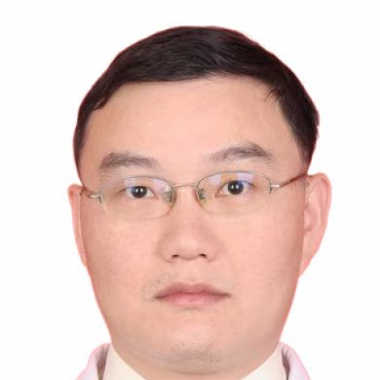

<!-- AUTO-GENERATED-BY: work/generate_obsidian_profiles.py -->

<!-- TEMPLATE: D:\workspace\信息收集整理\医生画像仓库\模板\医生画像模板.md -->

# 王仙仁

## 基础信息

| 字段 | 内容 |
|---|---|
| 姓名 | 王仙仁 |
| 医院 | 中山大学附属第一医院 |
| 科室 | 耳专科 |
| 职称/身份 | 副主任医师 |
| 来源链接 | [官网原文](https://www.fahsysu.org.cn/node/30448) |
| 采集日期 | 2026-08-13 |

## 简介/擅长

眩晕、耳聋的综合诊治，尤其是梅尼埃病、耳石症，突发性耳聋等病的治疗与康复； 有国家助听器验配师资格，擅长助听器的验配与佩戴指导； 对慢性中耳炎的微创治疗有自己的特长。 研究方向：内耳病病理，研究内耳损伤机制，保护方法，内耳临床成像。 老年性聋的流行病学调查及人群干预策略。 主要教育和工作经历： 中山大学博士毕业后留院至今，期间美国南卡罗莱罗那州医科大学访学一年半。 社会兼职：广东省残疾人康复协会（ 听力 ）专业委员会常委，广东省医疗行业协会耳鼻咽喉科分会常委，广东省医院协会眩晕中心建设管理专业委员会常委等兼职 论著：发表耳科相关论文30余篇，其中SCI论文30篇。 专著：无 其他主要工作成绩（比如获奖情况）：

## 教育与进修经历

- 主要教育和工作经历： 中山大学博士毕业后留院至今，期间美国南卡罗莱罗那州医科大学访学一年半。

## 论文与学术产出

- 社会兼职：广东省残疾人康复协会（ 听力 ）专业委员会常委，广东省医疗行业协会耳鼻咽喉科分会常委，广东省医院协会眩晕中心建设管理专业委员会常委等兼职 论著：发表耳科相关论文30余篇，其中SCI论文30篇。

## 可包装亮点

- 主要教育和工作经历： 中山大学博士毕业后留院至今，期间美国南卡罗莱罗那州医科大学访学一年半。
- 社会兼职：广东省残疾人康复协会（ 听力 ）专业委员会常委，广东省医疗行业协会耳鼻咽喉科分会常委，广东省医院协会眩晕中心建设管理专业委员会常委等兼职 论著：发表耳科相关论文30余篇，其中SCI论文30篇。
- 专著：无 其他主要工作成绩（比如获奖情况）：

## 重点疾病/人群标签

- 慢性病：慢性、康复
- 肿瘤：
- 生殖疾病：
- 免疫/风湿：
- 术后恢复/康复：慢性、康复
- 疑难重症：

## 证据摘录

> 只摘录官网公开信息中的短句或关键字段，不复制大段原文。

- 官网身份字段：副主任医师
- 官网简介/擅长：眩晕、耳聋的综合诊治，尤其是梅尼埃病、耳石症，突发性耳聋等病的治疗与康复； 有国家助听器验配师资格，擅长助听器的验配与佩戴指导； 对慢性中耳炎的微创治疗有自己的特长。 研究方向：内耳病病理，研究内耳损伤机制，保护方法，内耳临床成像。 老年性聋的流行病学调查及人群干预策略。 主要教育和工作经历： 中山大学博士毕业后留院至今，期间美国南卡罗莱罗那州医科大学访学一年半。 社会兼职：广东省残疾人康复协会（ 听力 ）专业委员会常委，广东省医疗行…
- 官网亮眼经历线索：主要教育和工作经历： 中山大学博士毕业后留院至今，期间美国南卡罗莱罗那州医科大学访学一年半。 社会兼职：广东省残疾人康复协会（ 听力 ）专业委员会常委，广东省医疗行业协会耳鼻咽喉科分会常委，广东省医院协会眩晕中心建设管理专业委员会常委等兼职 论著：发表耳科相关论文30余篇，其中SCI论文30篇。 专著：无 其他主要工作成绩（比如获奖情况）：
- 来源链接：https://www.fahsysu.org.cn/node/30448

## BD 画像摘要

王仙仁医生可作为慢性病、术后恢复/康复方向的基础画像候选。后续 BD 使用应继续以官网来源和人工复核为准，不添加疗效承诺或无来源包装。

## 合规边界

- 仅使用医院官网、官方公众号、官方小程序等公开渠道。
- 不采集私人电话、私人微信、家庭住址、患者隐私或非公开排班信息。
- 不写“保证治愈”“疗效第一”“包治疑难杂症”等无法由官网证明的表述。
