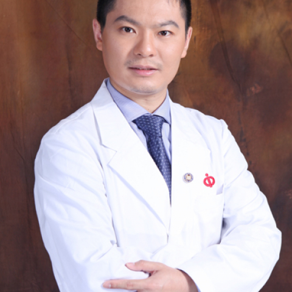

<!-- AUTO-GENERATED-BY: work/generate_obsidian_profiles.py -->

<!-- TEMPLATE: D:\workspace\信息收集整理\医生画像仓库\模板\医生画像模板.md -->

# 王冕

## 基础信息

| 字段 | 内容 |
|---|---|
| 姓名 | 王冕 |
| 医院 | 中山大学附属第一医院 |
| 科室 | 血管外科 |
| 职称/身份 | 主任医师 |
| 来源链接 | [官网原文](https://www.fahsysu.org.cn/node/627) |
| 采集日期 | 2026-08-13 |

## 简介/擅长

主动脉夹层、腹主动脉瘤、下肢动脉硬化闭塞、下肢深静脉血栓、下肢深静脉血栓后遗综合征、下肢静脉曲张、内脏血管疾病的临床诊治 研究方向： 动脉硬化性周围血管疾病的发病机制 主要教育和工作经历： 2006.9-2011.7 中山大学附属第一医院硕博连读 2011.7至今中山大学附属第一医院血管外科 社会兼职： 国际脉管联盟（IUA）中国青年委员会委员 中国医师协会腔内血管外科学分会静脉血栓栓塞症专家委员会委员 广东省健康管理学会血管病学专业委员会委员 论著： 升主动脉-颈动脉旁路联合腔内修复术治疗主动脉弓部病变，中华外科杂志，2015.3 杂交技术治疗主动脉弓部病变的经验分析，中华外科杂志，2015.11 Stanford A型主动脉夹层的腔内修复术后并发症分析，中国血管外科杂志，2013.3 专著： 其他主要工作成绩（比如获奖情况）： 荣获中国血管病青年学者论坛“汪忠镐”奖，中山大学附属第一医院优秀共产党员，国际血管外科协会年会优秀论文奖，全国血管外科学术会议青年擂台赛三等奖

## 可包装亮点

- 擅长主动脉夹层、腹主动脉瘤、下肢动脉硬化闭塞、下肢深静脉血栓、下肢深静脉血栓后遗综合征、下肢静脉曲张、内脏血管疾病的临床诊治 医疗特长： 擅长主动脉夹层、腹主动脉瘤、下肢动脉硬化闭塞、下肢深静脉血栓、下肢深静脉血栓后遗综合征、下肢静脉曲张、内脏血管疾病的临床诊治 研究方向： 动脉硬化性周围血管疾病的发病机制 主要教育和工作经历： 2006.9-2011.7…

## 重点疾病/人群标签

- 慢性病：
- 肿瘤：瘤、术后
- 生殖疾病：
- 免疫/风湿：
- 术后恢复/康复：瘤、术后
- 疑难重症：

## 证据摘录

> 只摘录官网公开信息中的短句或关键字段，不复制大段原文。

- 官网身份字段：主任医师
- 官网简介/擅长：主动脉夹层、腹主动脉瘤、下肢动脉硬化闭塞、下肢深静脉血栓、下肢深静脉血栓后遗综合征、下肢静脉曲张、内脏血管疾病的临床诊治 研究方向： 动脉硬化性周围血管疾病的发病机制 主要教育和工作经历： 2006.9-2011.7 中山大学附属第一医院硕博连读 2011.7至今中山大学附属第一医院血管外科 社会兼职： 国际脉管联盟（IUA）中国青年委员会委员 中国医师协会腔内血管外科学分会静脉血栓栓塞症专家委员会委员 广东省健康管理学会血管病学专业…
- 官网亮眼经历线索：擅长主动脉夹层、腹主动脉瘤、下肢动脉硬化闭塞、下肢深静脉血栓、下肢深静脉血栓后遗综合征、下肢静脉曲张、内脏血管疾病的临床诊治 医疗特长： 擅长主动脉夹层、腹主动脉瘤、下肢动脉硬化闭塞、下肢深静脉血栓、下肢深静脉血栓后遗综合征、下肢静脉曲张、内脏血管疾病的临床诊治 研究方向： 动脉硬化性周围血管疾病的发病机制 主要教育和工作经历： 2006.9-2011.7 中山大学附属第一医院硕博连读 2011.7至今中山大学附属第一医院血管外科 社…
- 来源链接：https://www.fahsysu.org.cn/node/627

## BD 画像摘要

王冕医生可作为肿瘤、术后恢复/康复方向的基础画像候选。后续 BD 使用应继续以官网来源和人工复核为准，不添加疗效承诺或无来源包装。

## 合规边界

- 仅使用医院官网、官方公众号、官方小程序等公开渠道。
- 不采集私人电话、私人微信、家庭住址、患者隐私或非公开排班信息。
- 不写“保证治愈”“疗效第一”“包治疑难杂症”等无法由官网证明的表述。
