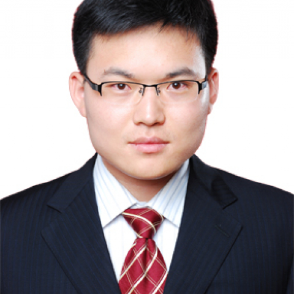

<!-- AUTO-GENERATED-BY: work/generate_obsidian_profiles.py -->

<!-- TEMPLATE: D:\workspace\信息收集整理\医生画像仓库\模板\医生画像模板.md -->

# 王华

## 基础信息

| 字段 | 内容 |
|---|---|
| 姓名 | 王华 |
| 医院 | 中山大学附属第一医院 |
| 科室 | 脊柱外科 |
| 职称/身份 | 副主任医师 |
| 来源链接 | [官网原文](https://www.fahsysu.org.cn/node/5616) |
| 采集日期 | 2026-08-13 |

## 简介/擅长

专注脊柱外科疾患的诊疗，对脊柱外科常见病、多发病的诊断与治疗上积累了丰富的临床经验，主攻脊柱退行性疾病与脊柱畸形的诊治，尤其在颈椎病、胸椎管狭窄症、腰椎管狭窄症、腰椎间盘突出症、脊柱畸形、脊柱骨折、脊髓损伤、脊柱结核和脊柱肿瘤的诊断治疗方面具有较丰富临床经验。 擅长脊柱退行性疾患的微创手术治疗。 研究方向： 脊柱退变性疾病的微创治疗（颈椎病、腰椎间盘突出症，腰椎管狭窄症）以及脊柱畸形矫形。 主要教育和工作经历： 2013/07 --- 至今 中山大学附属第一医院 脊柱外科 2009/08 --- 2013/07 中山大学第一附属医院 博士 2007/07 --- 2009/07 北京肿瘤医院 2000/09 --- 2007/07 北京大学 临床七年制 社会兼职： 中国康复医学会广东分会脊柱专业委员会微创学组 委员兼秘书 广东省健康管理学会脊柱专业委员会 委员兼秘书 《脊柱外科》杂志 通信编委 论著： 主持及参与国家自然科学基金、粤港合作基金、广东省自然科学基金等多项科学研究。 以第一作者或通讯作者在骨科相关权威杂志发表SCI及中文核心期刊论文二十余篇。 参编《椎间盘》《儿童脊柱外科学》等 其他主要工作成绩（比如获奖情况）：

## 科研项目与成果

- 主要教育和工作经历： 2013/07 --- 至今 中山大学附属第一医院 脊柱外科 2009/08 --- 2013/07 中山大学第一附属医院 博士 2007/07 --- 2009/07 北京肿瘤医院 2000/09 --- 2007/07 北京大学 临床七年制 社会兼职： 中国康复医学会广东分会脊柱专业委员会微创学组 委员兼秘书 广东省健康管理学会脊柱专业委员会 委员兼秘书 《脊柱外科》杂志 通信编委 论著： 主持及参与国家自然科学基金、粤港合作基金、广东省自然科学基金等多项科学研究。

## 论文与学术产出

- 以第一作者或通讯作者在骨科相关权威杂志发表SCI及中文核心期刊论文二十余篇。
- 参编《椎间盘》《儿童脊柱外科学》等 其他主要工作成绩（比如获奖情况）：

## 可包装亮点

- 主要教育和工作经历： 2013/07 --- 至今 中山大学附属第一医院 脊柱外科 2009/08 --- 2013/07 中山大学第一附属医院 博士 2007/07 --- 2009/07 北京肿瘤医院 2000/09 --- 2007/07 北京大学 临床七年制 社会兼职： 中国康复医学会广东分会脊柱专业委员会微创学组 委员兼秘书 广东省健康管理学会脊…
- 以第一作者或通讯作者在骨科相关权威杂志发表SCI及中文核心期刊论文二十余篇。
- 参编《椎间盘》《儿童脊柱外科学》等 其他主要工作成绩（比如获奖情况）：

## 重点疾病/人群标签

- 慢性病：
- 肿瘤：肿瘤、康复
- 生殖疾病：
- 免疫/风湿：
- 术后恢复/康复：肿瘤、康复
- 疑难重症：

## 证据摘录

> 只摘录官网公开信息中的短句或关键字段，不复制大段原文。

- 官网身份字段：副主任医师
- 官网简介/擅长：专注脊柱外科疾患的诊疗，对脊柱外科常见病、多发病的诊断与治疗上积累了丰富的临床经验，主攻脊柱退行性疾病与脊柱畸形的诊治，尤其在颈椎病、胸椎管狭窄症、腰椎管狭窄症、腰椎间盘突出症、脊柱畸形、脊柱骨折、脊髓损伤、脊柱结核和脊柱肿瘤的诊断治疗方面具有较丰富临床经验。 擅长脊柱退行性疾患的微创手术治疗。 研究方向： 脊柱退变性疾病的微创治疗（颈椎病、腰椎间盘突出症，腰椎管狭窄症）以及脊柱畸形矫形。 主要教育和工作经历： 2013/07 ---…
- 官网亮眼经历线索：主要教育和工作经历： 2013/07 --- 至今 中山大学附属第一医院 脊柱外科 2009/08 --- 2013/07 中山大学第一附属医院 博士 2007/07 --- 2009/07 北京肿瘤医院 2000/09 --- 2007/07 北京大学 临床七年制 社会兼职： 中国康复医学会广东分会脊柱专业委员会微创学组 委员兼秘书 广东省健康管理学会脊柱专业委员会 委员兼秘书 《脊柱外科》杂志 通信编委 论著： 主持及参与国家自然…
- 来源链接：https://www.fahsysu.org.cn/node/5616

## BD 画像摘要

王华医生可作为肿瘤、术后恢复/康复方向的基础画像候选。后续 BD 使用应继续以官网来源和人工复核为准，不添加疗效承诺或无来源包装。

## 合规边界

- 仅使用医院官网、官方公众号、官方小程序等公开渠道。
- 不采集私人电话、私人微信、家庭住址、患者隐私或非公开排班信息。
- 不写“保证治愈”“疗效第一”“包治疑难杂症”等无法由官网证明的表述。
