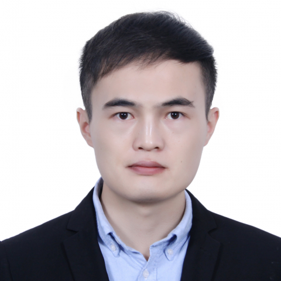

<!-- AUTO-GENERATED-BY: work/generate_obsidian_profiles.py -->

<!-- TEMPLATE: D:\workspace\信息收集整理\医生画像仓库\模板\医生画像模板.md -->

# 王子洋

## 基础信息

| 字段 | 内容 |
|---|---|
| 姓名 | 王子洋 |
| 医院 | 中山大学附属第一医院 |
| 科室 | 转化医学研究中心 |
| 职称/身份 | 副研究员 |
| 来源链接 | [官网原文](https://www.fahsysu.org.cn/node/38111) |
| 采集日期 | 2026-08-13 |

## 简介/擅长

中山大学附属第一医院转化医学研究中心副研究员，林水宾研究员团队。 入选“广东特支计划”青年拔尖人才。 从事代谢重编程与翻译异常调控肿瘤进展的功能和机制研究，以（共同）通讯/第一作者在Science Translational Medicine (封面文章), Science Advances, EMBO Journal, Cell Reports (2篇), Drug Resistance Updates, Advanced Science (2篇)等期刊发表多篇研究论文。 代表性成果 1. Wang Z(#), Di Y(#), Wen X(#), Liu Y(#), Ye L, Zhang X, Qin J, Wang Y, Chu H, Li G(*), Zhang W(*), Wang X(*), He W(*). NIT2 dampens BRD1 phase separation and restrains oxidative phosphorylation to enhance chemosensitivity in gastric cancer. Science Translational Medici...

## 科研项目与成果

- 代表性成果 1. Wang Z(#), Di Y(#), Wen X(#), Liu Y(#), Ye L, Zhang X, Qin J, Wang Y, Chu H, Li G(*), Zhang W(*), Wang X(*), He W(*). NIT2 dampens BRD1 phase separation and restrains oxidative phosphorylation to enhance chemosensitivity in gastric cancer. Science Tr…

## 论文与学术产出

- 从事代谢重编程与翻译异常调控肿瘤进展的功能和机制研究，以（共同）通讯/第一作者在Science Translational Medicine (封面文章), Science Advances, EMBO Journal, Cell Reports (2篇), Drug Resistance Updates, Advanced Science (2篇)等期刊发表多篇研究论文。
- 代表性成果 1. Wang Z(#), Di Y(#), Wen X(#), Liu Y(#), Ye L, Zhang X, Qin J, Wang Y, Chu H, Li G(*), Zhang W(*), Wang X(*), He W(*). NIT2 dampens BRD1 phase separation and restrains oxidative phosphorylation to enhance chemosensitivity in gastric cancer. Science Tr…

## 可包装亮点

- 入选“广东特支计划”青年拔尖人才。
- 从事代谢重编程与翻译异常调控肿瘤进展的功能和机制研究，以（共同）通讯/第一作者在Science Translational Medicine (封面文章), Science Advances, EMBO Journal, Cell Reports (2篇), Drug Resistance Updates, Advanced Science (2篇)等期刊…

## 重点疾病/人群标签

- 慢性病：代谢、肿瘤
- 肿瘤：代谢、肿瘤
- 生殖疾病：
- 免疫/风湿：
- 术后恢复/康复：
- 疑难重症：

## 证据摘录

> 只摘录官网公开信息中的短句或关键字段，不复制大段原文。

- 官网身份字段：副研究员
- 官网简介/擅长：中山大学附属第一医院转化医学研究中心副研究员，林水宾研究员团队。 入选“广东特支计划”青年拔尖人才。 从事代谢重编程与翻译异常调控肿瘤进展的功能和机制研究，以（共同）通讯/第一作者在Science Translational Medicine (封面文章), Science Advances, EMBO Journal, Cell Reports (2篇), Drug Resistance Updates, Advanced Scie…
- 官网亮眼经历线索：入选“广东特支计划”青年拔尖人才。 从事代谢重编程与翻译异常调控肿瘤进展的功能和机制研究，以（共同）通讯/第一作者在Science Translational Medicine (封面文章), Science Advances, EMBO Journal, Cell Reports (2篇), Drug Resistance Updates, Advanced Science (2篇)等期刊发表多篇研究论文。 入选“广东特支计划”青年…
- 来源链接：https://www.fahsysu.org.cn/node/38111

## BD 画像摘要

王子洋医生可作为慢性病、肿瘤方向的基础画像候选。后续 BD 使用应继续以官网来源和人工复核为准，不添加疗效承诺或无来源包装。

## 合规边界

- 仅使用医院官网、官方公众号、官方小程序等公开渠道。
- 不采集私人电话、私人微信、家庭住址、患者隐私或非公开排班信息。
- 不写“保证治愈”“疗效第一”“包治疑难杂症”等无法由官网证明的表述。
