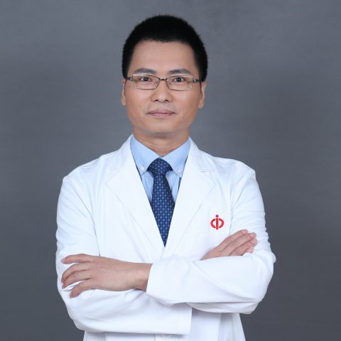

<!-- AUTO-GENERATED-BY: work/generate_obsidian_profiles.py -->

<!-- TEMPLATE: D:\workspace\信息收集整理\医生画像仓库\模板\医生画像模板.md -->

# 王安训

## 基础信息

| 字段 | 内容 |
|---|---|
| 姓名 | 王安训 |
| 医院 | 中山大学附属第一医院 |
| 科室 | 口腔科 |
| 职称/身份 | 主任医师/教授 |
| 来源链接 | [官网原文](https://www.fahsysu.org.cn/node/5705) |
| 采集日期 | 2026-08-13 |

## 简介/擅长

口腔颌面外科各种常见病和疑难病的诊断和治疗，如：口腔颌面部恶性肿瘤的综合治疗、唇腭裂序列治疗、正颌外科手术、牙槽外科手术、颌面部损伤的急救和处理、颞下颌关节病的诊治、口腔颌面部神经疾病的诊治、涎腺疾病的诊治、以及口腔颌面部各种软硬组织缺损的重建术。 开展多项临床新技术及临床研究，包括口腔癌患者术后快速康复新技术，口腔颌面部脉管畸形的微创治疗、以及口腔鳞癌靶免治疗的临床研究。 主要教育和工作经历： 大学以上学历 1988.9-1993.7 中山医科大学口腔系， 获学士学位 1996.9-2001.7 中山大学口腔医学院， 获博士学位 2005.8-2007.1 美国南加州大学， 博士后研究 主要工作经历/国外进修 1993.7-1998.12 中山大学附属第一医院口腔科， 住院医师 1999.1-2003.12 中山大学附属第一医院口腔科， 主治医师 2004.1-2008.12 中山大学附属第一医院口腔科， 副教授/硕士生导师 2009.1-至今 中山大学附属第一医院口腔科， 教授/主任医师， 博士生导师， 口腔颌面外科主任 2007.1-2007.5 美国南加州大学洛杉矶儿童医院整形外科， 进修 2009.8 美国太...

## 教育与进修经历

- 主要教育和工作经历： 大学以上学历 1988.9-1993.7 中山医科大学口腔系， 获学士学位 1996.9-2001.7 中山大学口腔医学院， 获博士学位 2005.8-2007.1 美国南加州大学， 博士后研究 主要工作经历/国外进修 1993.7-1998.12 中山大学附属第一医院口腔科， 住院医师 1999.1-2003.12 中山大学附属第一医院口腔科， 主治医师 2004.1-2008.12 中山大学附属第一医院口腔科， 副教授/硕士生导师 2009.1-至今 中山大学附属第一医院口腔科， 教授/…
- 负责多项省部级及国家级基金项目的研究，包括国家自然基金面上项目（6项）、广东省自然基金重点项目、广东省自然科学基金、广东省科技厅国际合作项目、高等学校博士学科点专项科研基金、广州市科委民生科技项目、教育部留学回国人员科研启动基金等。

## 科研项目与成果

- 负责多项省部级及国家级基金项目的研究，包括国家自然基金面上项目（6项）、广东省自然基金重点项目、广东省自然科学基金、广东省科技厅国际合作项目、高等学校博士学科点专项科研基金、广州市科委民生科技项目、教育部留学回国人员科研启动基金等。
- 2019、2022年中山大学优秀博士生导师 发明专利 种植体表面处理及仿生种植体的研发（2022年获批） 社会兼职： 美国伊利诺伊大学芝加哥校区牙学院 客座教授 国际牙医师学院 中国区院士 广东省健康管理学会颌面头颈肿瘤多学科诊疗专委会 主委 广东省口腔医学会口腔颌面外科专业委员会 主委 广东省医学会颌面头颈外科学分会 主委 广东省精准医学应用学会口腔修复种植分会 副主委 中国抗癌协会肿瘤微创治疗专业委员会肿瘤外科微创委员会 副主委 广东省抗癌协会头颈肿瘤专业委员会 副主委 中国抗癌协会口腔肿瘤整合专委会 常委…

## 论文与学术产出

- 目前已公开发表论文 190余篇，SCI论文90余篇，包括Cancer Commun (Lond)，Bioact Mater，Mol Ther，Oncogene，Cancer Lett，Int J Oral Sci，Int J Biol Sci，Mol Oncol，Free Radical Bio Med，等国际知名期刊，H指数33，被引次数超3000。
- 培养的多名研究生荣获广东省优秀研究生和优秀研究生论文。
- 主编并参与了多本著作的编写，包括口腔疾病（副主编，科学技术文献出版社）、牙槽外科手术视听教材（主编，人民卫生电子音像出版社，“十五”国家重点音像出版规划）等。

## 可包装亮点

- 擅长口腔颌面外科各种常见病和疑难病的诊断和治疗，如：口腔颌面部恶性肿瘤的综合治疗、唇腭裂序列治疗、正颌外科手术、牙槽外科手术、颌面部损伤的急救和处理、颞下颌关节病的诊治、口腔颌面部神经疾病的诊治、涎腺疾病的诊治、以及口腔颌面部各种软硬组织缺损的重建术。
- 医疗特长： 擅长口腔颌面外科各种常见病和疑难病的诊断和治疗，如：口腔颌面部恶性肿瘤的综合治疗、唇腭裂序列治疗、正颌外科手术、牙槽外科手术、颌面部损伤的急救和处理、颞下颌关节病的诊治、口腔颌面部神经疾病的诊治、涎腺疾病的诊治、以及口腔颌面部各种软硬组织缺损的重建术。
- 主要教育和工作经历： 大学以上学历 1988.9-1993.7 中山医科大学口腔系， 获学士学位 1996.9-2001.7 中山大学口腔医学院， 获博士学位 2005.8-2007.1 美国南加州大学， 博士后研究 主要工作经历/国外进修 1993.7-1998.12 中山大学附属第一医院口腔科， 住院医师 1...

## 重点疾病/人群标签

- 慢性病：
- 肿瘤：肿瘤、癌、术后、康复、疑难、多学科
- 生殖疾病：
- 免疫/风湿：
- 术后恢复/康复：肿瘤、癌、术后、康复、疑难、多学科
- 疑难重症：肿瘤、癌、术后、康复、疑难、多学科

## 证据摘录

> 只摘录官网公开信息中的短句或关键字段，不复制大段原文。

- 官网身份字段：主任医师/教授
- 官网简介/擅长：口腔颌面外科各种常见病和疑难病的诊断和治疗，如：口腔颌面部恶性肿瘤的综合治疗、唇腭裂序列治疗、正颌外科手术、牙槽外科手术、颌面部损伤的急救和处理、颞下颌关节病的诊治、口腔颌面部神经疾病的诊治、涎腺疾病的诊治、以及口腔颌面部各种软硬组织缺损的重建术。 开展多项临床新技术及临床研究，包括口腔癌患者术后快速康复新技术，口腔颌面部脉管畸形的微创治疗、以及口腔鳞癌靶免治疗的临床研究。 主要教育和工作经历： 大学以上学历 1988.9-1993.…
- 官网亮眼经历线索：擅长口腔颌面外科各种常见病和疑难病的诊断和治疗，如：口腔颌面部恶性肿瘤的综合治疗、唇腭裂序列治疗、正颌外科手术、牙槽外科手术、颌面部损伤的急救和处理、颞下颌关节病的诊治、口腔颌面部神经疾病的诊治、涎腺疾病的诊治、以及口腔颌面部各种软硬组织缺损的重建术。 医疗特长： 擅长口腔颌面外科各种常见病和疑难病的诊断和治疗，如：口腔颌面部恶性肿瘤的综合治疗、唇腭裂序列治疗、正颌外科手术、牙槽外科手术、颌面部损伤的急救和处理、颞下颌关节病的诊治、口…
- 来源链接：https://www.fahsysu.org.cn/node/5705

## BD 画像摘要

王安训医生可作为肿瘤、术后恢复/康复、疑难重症方向的基础画像候选。后续 BD 使用应继续以官网来源和人工复核为准，不添加疗效承诺或无来源包装。

## 合规边界

- 仅使用医院官网、官方公众号、官方小程序等公开渠道。
- 不采集私人电话、私人微信、家庭住址、患者隐私或非公开排班信息。
- 不写“保证治愈”“疗效第一”“包治疑难杂症”等无法由官网证明的表述。
