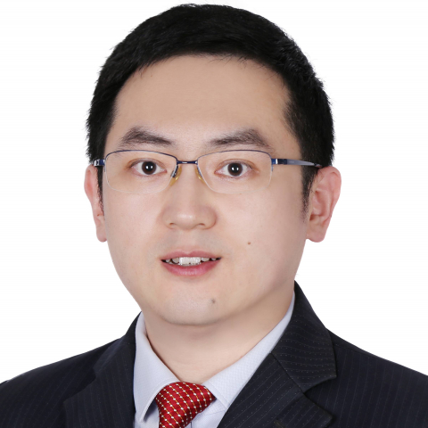

<!-- AUTO-GENERATED-BY: work/generate_obsidian_profiles.py -->

<!-- TEMPLATE: D:\workspace\信息收集整理\医生画像仓库\模板\医生画像模板.md -->

# 王恕同

## 基础信息

| 字段 | 内容 |
|---|---|
| 姓名 | 王恕同 |
| 医院 | 中山大学附属第一医院 |
| 科室 | 肝外科 |
| 职称/身份 | 副主任医师 |
| 来源链接 | [官网原文](https://www.fahsysu.org.cn/node/35707) |
| 采集日期 | 2026-08-13 |

## 简介/擅长

肝、胆、胰疾病 诊疗，专注于： 1. 肝癌 精准 治疗 2. 胆石症微创治疗 特色技术： （1）单孔或双孔 腹腔镜胆囊切除术 ——肚脐 隐蔽切口 、免拆线 （2） 经皮经肝胆道镜取石术（PTCS） ——5mm小切口治疗 肝内 外胆管 结石 （3）磁导航荧光染色流域解剖肝切除——精准肝脏外科、保护余肝功能 （4） ERCP子母镜 —— 经自然腔道 无创 治疗 肝 胆胰 相关 疾病 （5）多 镜联合 微创手术——微创治疗肝 胆胰 相关 疾病 （6）肝癌的新辅助和辅助治疗——降低术后复发率 2008年起在中山大学附属第一医院肝胆外科攻读临床型硕士、博士，毕业后留院工作。 学会任职： 广东省健康管理学会肝胆胰微创专业委员会 常务委员 广东省健康管理学会肝胆病学专业委员会 委员 广东省健康管理学会胰腺疾病专业委员会 委员 广东省肝胆管结石联盟秘书 科研： 主持广东省科技计划基金，发表SCI文章多篇

## 科研项目与成果

- 学会任职： 广东省健康管理学会肝胆胰微创专业委员会 常务委员 广东省健康管理学会肝胆病学专业委员会 委员 广东省健康管理学会胰腺疾病专业委员会 委员 广东省肝胆管结石联盟秘书 科研： 主持广东省科技计划基金，发表SCI文章多篇

## 论文与学术产出

- 学会任职： 广东省健康管理学会肝胆胰微创专业委员会 常务委员 广东省健康管理学会肝胆病学专业委员会 委员 广东省健康管理学会胰腺疾病专业委员会 委员 广东省肝胆管结石联盟秘书 科研： 主持广东省科技计划基金，发表SCI文章多篇

## 可包装亮点

- 肝、胆、胰疾病诊疗，专注于： 1.肝癌精准治疗 2.胆石症微创治疗 特色技术： （1）单孔或双孔腹腔镜胆囊切除术——肚脐隐蔽切口、免拆线 （2）经皮经肝胆道镜取石术（PTCS）——5mm小切口治疗肝内外胆管结石 （3）磁导航荧光染色流域解剖肝切除——精准肝脏外科、保护余肝功能 （4）ERCP子母镜——经自然腔道无创治疗肝胆胰相关疾病 （5）多镜联合微创手术…

## 重点疾病/人群标签

- 慢性病：
- 肿瘤：肝癌、术后
- 生殖疾病：
- 免疫/风湿：
- 术后恢复/康复：肝癌、术后
- 疑难重症：

## 证据摘录

> 只摘录官网公开信息中的短句或关键字段，不复制大段原文。

- 官网身份字段：副主任医师
- 官网简介/擅长：肝、胆、胰疾病 诊疗，专注于： 1. 肝癌 精准 治疗 2. 胆石症微创治疗 特色技术： （1）单孔或双孔 腹腔镜胆囊切除术 ——肚脐 隐蔽切口 、免拆线 （2） 经皮经肝胆道镜取石术（PTCS） ——5mm小切口治疗 肝内 外胆管 结石 （3）磁导航荧光染色流域解剖肝切除——精准肝脏外科、保护余肝功能 （4） ERCP子母镜 —— 经自然腔道 无创 治疗 肝 胆胰 相关 疾病 （5）多 镜联合 微创手术——微创治疗肝 胆胰 相关 疾…
- 官网亮眼经历线索：肝、胆、胰疾病诊疗，专注于： 1.肝癌精准治疗 2.胆石症微创治疗 特色技术： （1）单孔或双孔腹腔镜胆囊切除术——肚脐隐蔽切口、免拆线 （2）经皮经肝胆道镜取石术（PTCS）——5mm小切口治疗肝内外胆管结石 （3）磁导航荧光染色流域解剖肝切除——精准肝脏外科、保护余肝功能 （4）ERCP子母镜——经自然腔道无创治疗肝胆胰相关疾病 （5）多镜联合微创手术——微创治疗肝胆胰相关疾病 （6）肝癌的新辅助和辅助治疗——降低术后复发率 医疗…
- 来源链接：https://www.fahsysu.org.cn/node/35707

## BD 画像摘要

王恕同医生可作为肿瘤、术后恢复/康复方向的基础画像候选。后续 BD 使用应继续以官网来源和人工复核为准，不添加疗效承诺或无来源包装。

## 合规边界

- 仅使用医院官网、官方公众号、官方小程序等公开渠道。
- 不采集私人电话、私人微信、家庭住址、患者隐私或非公开排班信息。
- 不写“保证治愈”“疗效第一”“包治疑难杂症”等无法由官网证明的表述。
