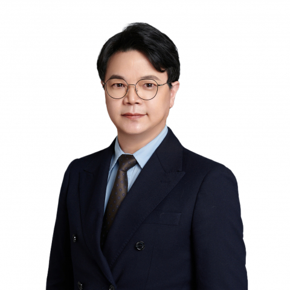

<!-- AUTO-GENERATED-BY: work/generate_obsidian_profiles.py -->

<!-- TEMPLATE: D:\workspace\信息收集整理\医生画像仓库\模板\医生画像模板.md -->

# 王昭

## 基础信息

| 字段 | 内容 |
|---|---|
| 姓名 | 王昭 |
| 医院 | 中山大学附属第一医院 |
| 科室 | 胃肠外科二科 |
| 职称/身份 | 主任医师 |
| 来源链接 | [官网原文](https://www.fahsysu.org.cn/node/752) |
| 采集日期 | 2026-08-13 |

## 简介/擅长

对消化道恶性肿瘤（结直肠癌、胃癌、神经内分泌肿瘤）的外科处理具有丰富的临床经验，擅长以下手术治疗：①直肠癌、结肠癌规范化手术治疗（腹腔镜微创根治手术、TME、CME、超低位保肛、保功能、保留左结肠动脉的253组淋巴结清扫、盆侧方淋巴结清扫、D3根治、扩大根治）； ②胃癌规范化手术治疗（腹腔镜微创根治手术、D2、D2+淋巴结清扫、淋巴结立体化清扫和鞘内清扫、腹主动脉旁淋巴结清扫）； ③消化系统神经内分泌肿瘤（NEN）的规范化根治手术和减瘤手术； ④胰腺肿瘤手术（胰十二指肠切除、胰体尾切除）； ⑤胃肠间质瘤手术。 1995年参加临床工作，期间获得外科学博士学位、完成了胃肠外科临床博士后工作、晋升了主任医师。 对胃肠道恶性肿瘤（特别是结直肠癌、胃癌和神经内分泌肿瘤）的临床手术治疗和生物学行为进行了深入研究，研究结果发表在《Int J Cancer》、《Ann Surg Oncol》、《Cancer Research》、《Cancer Letter》等国际权威杂志上。 研究成果先后获得省和国家科技进步奖。 研究方向： 1. 提高结直肠癌和胃癌病人远期生存率的外科手术方式研究； 2. 消化系统神经内分泌肿瘤（NENs）的手术治疗...

## 教育与进修经历

- 1995年参加临床工作，期间获得外科学博士学位、完成了胃肠外科临床博士后工作、晋升了主任医师。
- 主要教育和工作经历： 1999.9-2004.7 四川大学华西临床医学院 外科学硕博连读，获临床医学博士学位，期间获得“卫生部·日本第一制药”优秀研究生、“优秀博士研究生”称号 2004.8-2006.12 中山大学附属第一医院 临床医学博士后、讲师/主治医师 2006.12-2021.12 中山大学附属第一医院 副教授/副主任医师 2021.12-现在 中山大学附属第一医院 主任医师 社会兼职： 国际胃癌协会（IGCA）会员 中国抗癌协会康复会胃肠肿瘤分会委员 广东省临床医学学会微创外科专业委员会常委 广东省抗…

## 科研项目与成果

- 研究成果先后获得省和国家科技进步奖。
- 专著： 参与编写专业书籍《胃癌外科学》和《胃癌淋巴转移》 其他主要工作成绩： 1. “直肠癌TME微创化保肛术式与肿瘤微转移的临床应用研究”项目获得国家科技进步二等奖和四川省科技进步一等奖。
- 2. “胃癌个体化治疗关键技术的创新与推广运用”项目获得广东省科技进步一等奖。
- 3. “进展期胃癌外科治疗及应用基础研究”项目获得广东省科技进步二等奖和中华医学科技三等奖。

## 论文与学术产出

- 对胃肠道恶性肿瘤（特别是结直肠癌、胃癌和神经内分泌肿瘤）的临床手术治疗和生物学行为进行了深入研究，研究结果发表在《Int J Cancer》、《Ann Surg Oncol》、《Cancer Research》、《Cancer Letter》等国际权威杂志上。
- 论著： 在对结直肠癌、胃癌、神经内分泌肿瘤和胃肠间质瘤等消化道肿瘤的生物学行为和临床手术治疗进行深入研究的基础上，分别在《Int J Cancer》、《Ann Surg Oncol》、《Cancer Research》、《Cancer Letter》等国际上具有高影响因子SCI收录期刊以及国内中华系列等权威杂志上发表文章100余篇。

## 可包装亮点

- 1995年参加临床工作，期间获得外科学博士学位、完成了胃肠外科临床博士后工作、晋升了主任医师。
- 对胃肠道恶性肿瘤（特别是结直肠癌、胃癌和神经内分泌肿瘤）的临床手术治疗和生物学行为进行了深入研究，研究结果发表在《Int J Cancer》、《Ann Surg Oncol》、《Cancer Research》、《Cancer Letter》等国际权威杂志上。
- 研究成果先后获得省和国家科技进步奖。
- 主要教育和工作经历： 1999.9-2004.7 四川大学华西临床医学院 外科学硕博连读，获临床医学博士学位，期间获得“卫生部·日本第一制药”优秀研究生、“优秀博士研究生”称号 2004.8-2006.12 中山大学附属第一医院 临床医学博士后、讲师/主治医师 2006.12-2021.12 中山大学附属第一医院 副教授/副主任医师 2021.12-现在…

## 重点疾病/人群标签

- 慢性病：
- 肿瘤：肿瘤、癌、瘤、胃癌、肠癌、康复
- 生殖疾病：
- 免疫/风湿：
- 术后恢复/康复：肿瘤、癌、瘤、胃癌、肠癌、康复
- 疑难重症：

## 证据摘录

> 只摘录官网公开信息中的短句或关键字段，不复制大段原文。

- 官网身份字段：主任医师
- 官网简介/擅长：对消化道恶性肿瘤（结直肠癌、胃癌、神经内分泌肿瘤）的外科处理具有丰富的临床经验，擅长以下手术治疗：①直肠癌、结肠癌规范化手术治疗（腹腔镜微创根治手术、TME、CME、超低位保肛、保功能、保留左结肠动脉的253组淋巴结清扫、盆侧方淋巴结清扫、D3根治、扩大根治）； ②胃癌规范化手术治疗（腹腔镜微创根治手术、D2、D2+淋巴结清扫、淋巴结立体化清扫和鞘内清扫、腹主动脉旁淋巴结清扫）； ③消化系统神经内分泌肿瘤（NEN）的规范化根治手术和减…
- 官网亮眼经历线索：1995年参加临床工作，期间获得外科学博士学位、完成了胃肠外科临床博士后工作、晋升了主任医师。 对胃肠道恶性肿瘤（特别是结直肠癌、胃癌和神经内分泌肿瘤）的临床手术治疗和生物学行为进行了深入研究，研究结果发表在《Int J Cancer》、《Ann Surg Oncol》、《Cancer Research》、《Cancer Letter》等国际权威杂志上。 研究成果先后获得省和国家科技进步奖。 主要教育和工作经历： 1999.9-200…
- 来源链接：https://www.fahsysu.org.cn/node/752

## BD 画像摘要

王昭医生可作为肿瘤、术后恢复/康复方向的基础画像候选。后续 BD 使用应继续以官网来源和人工复核为准，不添加疗效承诺或无来源包装。

## 合规边界

- 仅使用医院官网、官方公众号、官方小程序等公开渠道。
- 不采集私人电话、私人微信、家庭住址、患者隐私或非公开排班信息。
- 不写“保证治愈”“疗效第一”“包治疑难杂症”等无法由官网证明的表述。
