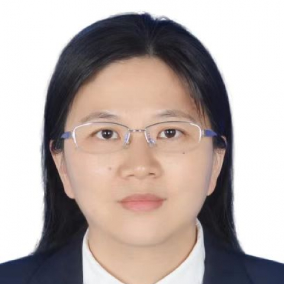

<!-- AUTO-GENERATED-BY: work/generate_obsidian_profiles.py -->

<!-- TEMPLATE: D:\workspace\信息收集整理\医生画像仓库\模板\医生画像模板.md -->

# 王晓燕

## 基础信息

| 字段 | 内容 |
|---|---|
| 姓名 | 王晓燕 |
| 医院 | 中山大学附属第一医院 |
| 科室 | 核医学科 |
| 职称/身份 | 主任医师 |
| 来源链接 | [官网原文](https://www.fahsysu.org.cn/node/30518) |
| 采集日期 | 2026-08-13 |

## 简介/擅长

全身各系统疾病的PET/CT&MR和SPECT/CT的影像诊断及鉴别，尤其对PET/CT恶性肿瘤有丰富的诊断经验。 擅长神经内分泌肿瘤、消化道肿瘤的诊断及鉴别。 2017年至今，多次参与胃肠外科、胸外科食管癌MDT会议，为胃肠间质瘤患者提供早期疗效评估，为食管癌病人提供精准治疗方案，为临床医生制定用药方案和手术方案提供依据。 其他情况： 担任广东省医学会核医学分会青年委员。 主持省科技计划2项，参与国自然科学基金3项，在国内外核心期刊发表多篇论著。 2022年，在核医学顶刊上《European Journal of Nuclear Medicine and Molecular Imaging》（中科院分区：医学1区，IF：10.057）发表《The role of 18F-FDG PET/CT in predicting the pathological response to neoadjuvant PD-1 blockade in combination with chemotherapy for resectable esophageal squamous cell carcinoma》，探讨了18-F FDG ...

## 科研项目与成果

- 主持省科技计划2项，参与国自然科学基金3项，在国内外核心期刊发表多篇论著。

## 论文与学术产出

- 主持省科技计划2项，参与国自然科学基金3项，在国内外核心期刊发表多篇论著。
- 2022年，在核医学顶刊上《European Journal of Nuclear Medicine and Molecular Imaging》（中科院分区：医学1区，IF：10.057）发表《The role of 18F-FDG PET/CT in predicting the pathological response to neoadjuvant PD-1 blockade in combination with chemotherapy for resectable esophageal squamo…
- 同年发表《[ 18F]FAPI 42 PET/CT versus [ 18F]FDG PET/CT for imaging of recurrent or metastatic gastrointestinal stromal tumors》，证明FAPI PET/CT在诊断GIST复发/转移方面有着更高识别率，为GIST的诊断和疗效评估提供了新方法。

## 可包装亮点

- 2017年至今，多次参与胃肠外科、胸外科食管癌MDT会议，为胃肠间质瘤患者提供早期疗效评估，为食管癌病人提供精准治疗方案，为临床医生制定用药方案和手术方案提供依据。
- 其他情况： 担任广东省医学会核医学分会青年委员。
- 主持省科技计划2项，参与国自然科学基金3项，在国内外核心期刊发表多篇论著。

## 重点疾病/人群标签

- 慢性病：
- 肿瘤：肿瘤、癌、瘤、化疗、免疫、MDT
- 生殖疾病：
- 免疫/风湿：肿瘤、癌、瘤、化疗、免疫、MDT
- 术后恢复/康复：
- 疑难重症：肿瘤、癌、瘤、化疗、免疫、MDT

## 证据摘录

> 只摘录官网公开信息中的短句或关键字段，不复制大段原文。

- 官网身份字段：主任医师
- 官网简介/擅长：全身各系统疾病的PET/CT&MR和SPECT/CT的影像诊断及鉴别，尤其对PET/CT恶性肿瘤有丰富的诊断经验。 擅长神经内分泌肿瘤、消化道肿瘤的诊断及鉴别。 2017年至今，多次参与胃肠外科、胸外科食管癌MDT会议，为胃肠间质瘤患者提供早期疗效评估，为食管癌病人提供精准治疗方案，为临床医生制定用药方案和手术方案提供依据。 其他情况： 担任广东省医学会核医学分会青年委员。 主持省科技计划2项，参与国自然科学基金3项，在国内外核心期刊…
- 官网亮眼经历线索：2017年至今，多次参与胃肠外科、胸外科食管癌MDT会议，为胃肠间质瘤患者提供早期疗效评估，为食管癌病人提供精准治疗方案，为临床医生制定用药方案和手术方案提供依据。 2017年至今，多次参与胃肠外科、胸外科食管癌MDT会议，为胃肠间质瘤患者提供早期疗效评估，为食管癌病人提供精准治疗方案，为临床医生制定用药方案和手术方案提供依据。 其他情况： 担任广东省医学会核医学分会青年委员。 主持省科技计划2项，参与国自然科学基金3项，在国内外核心…
- 来源链接：https://www.fahsysu.org.cn/node/30518

## BD 画像摘要

王晓燕医生可作为肿瘤、免疫/风湿/感染、疑难重症方向的基础画像候选。后续 BD 使用应继续以官网来源和人工复核为准，不添加疗效承诺或无来源包装。

## 合规边界

- 仅使用医院官网、官方公众号、官方小程序等公开渠道。
- 不采集私人电话、私人微信、家庭住址、患者隐私或非公开排班信息。
- 不写“保证治愈”“疗效第一”“包治疑难杂症”等无法由官网证明的表述。
