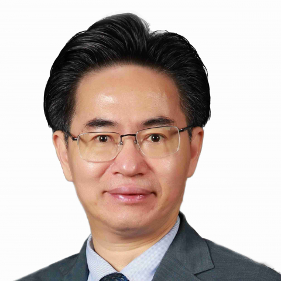

<!-- AUTO-GENERATED-BY: work/generate_obsidian_profiles.py -->

<!-- TEMPLATE: D:\workspace\信息收集整理\医生画像仓库\模板\医生画像模板.md -->

# 王楚怀

## 基础信息

| 字段 | 内容 |
|---|---|
| 姓名 | 王楚怀 |
| 医院 | 中山大学附属第一医院 |
| 科室 | 康复医学科 |
| 职称/身份 | 主任医师/教授 |
| 来源链接 | [官网原文](https://www.fahsysu.org.cn/node/5802) |
| 采集日期 | 2026-08-13 |

## 简介/擅长

自1990年以来一直从事康复医学专业临床医疗、教学培训与科研学术工作。 擅长脊柱与骨关节肌肉疾患、神经系统伤病的临床康复医疗。 包括颈椎病、腰腿痛、骨骼肌肉疼痛、骨关节炎、骨质疏松； 运动损伤、脊柱脊髓损伤、颅脑损伤、脑卒中、周围神经损伤、骨科术后、关节置换术后； 脊柱侧弯、扁平足或足踝生物力学异常、步态不良、姿势不良； 义肢及各类矫形器的装配咨询等。 对本专科罕见及疑难病例的康复诊疗有丰富经验。 教育 与 工作经历： 1984.09-1990.07 中山医科大学临床医学系（六年制） 学士学位 1994.09-1997.07 中山医科大学康复医学与理疗学专业 硕士学位 2001.03-2004.6. 先后赴香港、德国、美国进修学习创伤与骨科康复 1990.07 至今 中山大学附属第一医院康复医学科工作。 现任康复医学科主任、康复医学教研室主任、康复医学住培基地主任； 主任医师、教授、博士研究生导师、博士后合作导师。 学术任职： 现任 中华医学会物理医学与康复分会副主任委员、中华医学会物理医学与康复分会康复教育学组组长； 中国医师协会康复医师分会副会长、中国医师协会康复医师分会骨科康复学组组长； 中华预防医学会健康生活方...

## 教育与进修经历

- 自1990年以来一直从事康复医学专业临床医疗、教学培训与科研学术工作。
- 医疗特长： 自1990年以来一直从事康复医学专业临床医疗、教学培训与科研学术工作。
- 教育 与 工作经历： 1984.09-1990.07 中山医科大学临床医学系（六年制） 学士学位 1994.09-1997.07 中山医科大学康复医学与理疗学专业 硕士学位 2001.03-2004.6. 先后赴香港、德国、美国进修学习创伤与骨科康复 1990.07 至今 中山大学附属第一医院康复医学科工作。
- 主任医师、教授、博士研究生导师、博士后合作导师。

## 科研项目与成果

- 自1990年以来一直从事康复医学专业临床医疗、教学培训与科研学术工作。
- 医疗特长： 自1990年以来一直从事康复医学专业临床医疗、教学培训与科研学术工作。

## 可包装亮点

- 对本专科罕见及疑难病例的康复诊疗有丰富经验。
- 教育 与 工作经历： 1984.09-1990.07 中山医科大学临床医学系（六年制） 学士学位 1994.09-1997.07 中山医科大学康复医学与理疗学专业 硕士学位 2001.03-2004.6. 先后赴香港、德国、美国进修学习创伤与骨科康复 1990.07 至今 中山大学附属第一医院康复医学科工作。
- 现任康复医学科主任、康复医学教研室主任、康复医学住培基地主任；

## 重点疾病/人群标签

- 慢性病：
- 肿瘤：
- 生殖疾病：
- 免疫/风湿：
- 术后恢复/康复：术后、康复、疼痛、疑难、复杂、罕见
- 疑难重症：术后、康复、疼痛、疑难、复杂、罕见

## 证据摘录

> 只摘录官网公开信息中的短句或关键字段，不复制大段原文。

- 官网身份字段：主任医师/教授
- 官网简介/擅长：自1990年以来一直从事康复医学专业临床医疗、教学培训与科研学术工作。 擅长脊柱与骨关节肌肉疾患、神经系统伤病的临床康复医疗。 包括颈椎病、腰腿痛、骨骼肌肉疼痛、骨关节炎、骨质疏松； 运动损伤、脊柱脊髓损伤、颅脑损伤、脑卒中、周围神经损伤、骨科术后、关节置换术后； 脊柱侧弯、扁平足或足踝生物力学异常、步态不良、姿势不良； 义肢及各类矫形器的装配咨询等。 对本专科罕见及疑难病例的康复诊疗有丰富经验。 教育 与 工作经历： 1984.09…
- 官网亮眼经历线索：对本专科罕见及疑难病例的康复诊疗有丰富经验。 对本专科罕见及疑难病例的康复诊疗有丰富经验。 教育 与 工作经历： 1984.09-1990.07 中山医科大学临床医学系（六年制） 学士学位 1994.09-1997.07 中山医科大学康复医学与理疗学专业 硕士学位 2001.03-2004.6. 先后赴香港、德国、美国进修学习创伤与骨科康复 1990.07 至今 中山大学附属第一医院康复医学科工作。 现任康复医学科主任、康复医学教研室…
- 来源链接：https://www.fahsysu.org.cn/node/5802

## BD 画像摘要

王楚怀医生可作为术后恢复/康复、疑难重症方向的基础画像候选。后续 BD 使用应继续以官网来源和人工复核为准，不添加疗效承诺或无来源包装。

## 合规边界

- 仅使用医院官网、官方公众号、官方小程序等公开渠道。
- 不采集私人电话、私人微信、家庭住址、患者隐私或非公开排班信息。
- 不写“保证治愈”“疗效第一”“包治疑难杂症”等无法由官网证明的表述。
