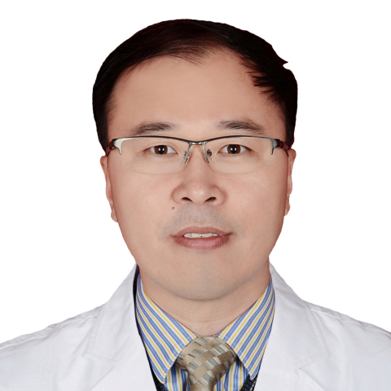

<!-- AUTO-GENERATED-BY: work/generate_obsidian_profiles.py -->

<!-- TEMPLATE: D:\workspace\信息收集整理\医生画像仓库\模板\医生画像模板.md -->

# 王洪刚

## 基础信息

| 字段 | 内容 |
|---|---|
| 姓名 | 王洪刚 |
| 医院 | 中山大学附属第一医院 |
| 科室 | 显微创伤外手科 |
| 职称/身份 | 副主任医师 |
| 来源链接 | [官网原文](https://www.fahsysu.org.cn/node/5643) |
| 采集日期 | 2026-08-13 |

## 简介/擅长

一直从事骨科-显微外科临床诊疗工作20余年，尤其在痉挛性瘫痪的评估与治疗、周围神经损伤与修复、四肢骨折与损伤、手足部先天性/后天性畸形矫正、以及神经损伤后肢体运动功能的重建方面积累丰富的诊疗经验。 能够结合多种最新诊疗技术的优势，实现综合治疗。 学习经历： 1.美国，California Hospital Medical Center-访问学者 2.加拿大，McGill University Health Centre -AO Fellow 社会兼职： 中华医学会显微外科学分会第十一届委员会委员 中华医学会手外科学分会第八届委员会手部先天畸形学组委员 中国医师协会显微外科医师分会开放性骨折显微修复专业委员会副主任委员 中华医学会骨科学分会第十一届委员会足踝外科学组委员 广东省医学会显微外科学分会第七届委员会常委 科研情况： 主要开展与痉挛性瘫痪的诊治、周围神经损伤与修复、四肢畸形矫正与运动功能重建等临床紧密相关的科研工作，已发表论文30余篇，其中SCI收录10余篇，主持和参与国家重点研发计划项目、国家自然科学基金项目、广东省自然科学基金项目、广东省科技计划项目等国家级/省部级课题10余项。

## 教育与进修经历

- 学习经历： 1.美国，California Hospital Medical Center-访问学者 2.加拿大，McGill University Health Centre -AO Fellow 社会兼职： 中华医学会显微外科学分会第十一届委员会委员 中华医学会手外科学分会第八届委员会手部先天畸形学组委员 中国医师协会显微外科医师分会开放性骨折显微修复专业委员会副主任委员 中华医学会骨科学分会第十一届委员会足踝外科学组委员 广东省医学会显微外科学分会第七届委员会常委 科研情况： 主要开展与痉挛性瘫痪的诊治、周…

## 科研项目与成果

- 学习经历： 1.美国，California Hospital Medical Center-访问学者 2.加拿大，McGill University Health Centre -AO Fellow 社会兼职： 中华医学会显微外科学分会第十一届委员会委员 中华医学会手外科学分会第八届委员会手部先天畸形学组委员 中国医师协会显微外科医师分会开放性骨折显微修复专业委员会副主任委员 中华医学会骨科学分会第十一届委员会足踝外科学组委员 广东省医学会显微外科学分会第七届委员会常委 科研情况： 主要开展与痉挛性瘫痪的诊治、周…

## 可包装亮点

- 学习经历： 1.美国，California Hospital Medical Center-访问学者 2.加拿大，McGill University Health Centre -AO Fellow 社会兼职： 中华医学会显微外科学分会第十一届委员会委员 中华医学会手外科学分会第八届委员会手部先天畸形学组委员 中国医师协会显微外科医师分会开放性骨折显微修复…

## 重点疾病/人群标签

- 慢性病：
- 肿瘤：
- 生殖疾病：
- 免疫/风湿：
- 术后恢复/康复：
- 疑难重症：

## 证据摘录

> 只摘录官网公开信息中的短句或关键字段，不复制大段原文。

- 官网身份字段：副主任医师
- 官网简介/擅长：一直从事骨科-显微外科临床诊疗工作20余年，尤其在痉挛性瘫痪的评估与治疗、周围神经损伤与修复、四肢骨折与损伤、手足部先天性/后天性畸形矫正、以及神经损伤后肢体运动功能的重建方面积累丰富的诊疗经验。 能够结合多种最新诊疗技术的优势，实现综合治疗。 学习经历： 1.美国，California Hospital Medical Center-访问学者 2.加拿大，McGill University Health Centre -AO Fel…
- 官网亮眼经历线索：学习经历： 1.美国，California Hospital Medical Center-访问学者 2.加拿大，McGill University Health Centre -AO Fellow 社会兼职： 中华医学会显微外科学分会第十一届委员会委员 中华医学会手外科学分会第八届委员会手部先天畸形学组委员 中国医师协会显微外科医师分会开放性骨折显微修复专业委员会副主任委员 中华医学会骨科学分会第十一届委员会足踝外科学组委员 广东省…
- 来源链接：https://www.fahsysu.org.cn/node/5643

## BD 画像摘要

王洪刚医生可作为中山大学附属第一医院显微创伤外手科的基础医生资料入库。当前重点方向以总底表标签为准，官网未展示的信息保持空白。

## 合规边界

- 仅使用医院官网、官方公众号、官方小程序等公开渠道。
- 不采集私人电话、私人微信、家庭住址、患者隐私或非公开排班信息。
- 不写“保证治愈”“疗效第一”“包治疑难杂症”等无法由官网证明的表述。
