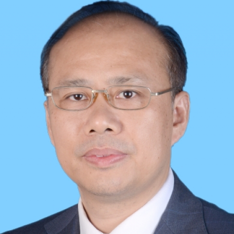

<!-- AUTO-GENERATED-BY: work/generate_obsidian_profiles.py -->

<!-- TEMPLATE: D:\workspace\信息收集整理\医生画像仓库\模板\医生画像模板.md -->

# 王礼春

## 基础信息

| 字段 | 内容 |
|---|---|
| 姓名 | 王礼春 |
| 医院 | 中山大学附属第一医院 |
| 科室 | 心内一科 |
| 职称/身份 | 主任医师 |
| 来源链接 | [官网原文](https://www.fahsysu.org.cn/node/941) |
| 采集日期 | 2026-08-13 |

## 简介/擅长

从事心血管内科心脏起搏与电生理专业20多年，专注于心律失常、晕厥、遗传性心脏病，心肌病，心力衰竭等疾病诊治，并有丰富的经验。 曾在德国Dresden心脏中心研修心律失常的诊治。 擅长各类心律失常（房颤/房扑，室早/室速，室上速）的导管消融，左心耳封堵，与人工心脏起搏器、心脏转复除颤器（ICD）以及心脏再同步治疗装置（CRT）的植入。 是国家卫生健康委、及中国医师协会心律失常介入培训导师， 是全国心血管疾病管理能力评估与提升工程（CDQI）一级房颤术者（卓越级）。 研究方向： 1、 心律失常的诊断与治疗 2、 晕厥的诊断与治疗 3、 遗传性心脏病的诊治 4、 肥厚性心肌病的诊治 5、 心电信息的分析与心脏性猝死的预防 主要教育和工作经历： 主要教育经历： 1989.09-1994.06同济医科大学，临床医学，本科 1998.09-2001.06中山大学，心血管内科学，硕士研究生 2001.09-2004.12中山大学，心血管内科，博士研究生 主要工作经历： 1994.07-2000.06中山医科大学附属第一医院内科，住院医生 2000.07-2006.12中山大学附属第一医院心血管内科，主治医师 2004.12-2005...

## 教育与进修经历

- 是国家卫生健康委、及中国医师协会心律失常介入培训导师， 是全国心血管疾病管理能力评估与提升工程（CDQI）一级房颤术者（卓越级）。

## 科研项目与成果

- 作为合作单位负责人参与广东省重点领域研发计划项目1项，参与心房颤动风险预测以及诊疗策略的精准化研究。

## 可包装亮点

- 曾在德国Dresden心脏中心研修心律失常的诊治。
- 是国家卫生健康委、及中国医师协会心律失常介入培训导师， 是全国心血管疾病管理能力评估与提升工程（CDQI）一级房颤术者（卓越级）。

## 重点疾病/人群标签

- 慢性病：高血压、心力衰竭、康复
- 肿瘤：
- 生殖疾病：
- 免疫/风湿：
- 术后恢复/康复：高血压、心力衰竭、康复
- 疑难重症：

## 证据摘录

> 只摘录官网公开信息中的短句或关键字段，不复制大段原文。

- 官网身份字段：主任医师
- 官网简介/擅长：从事心血管内科心脏起搏与电生理专业20多年，专注于心律失常、晕厥、遗传性心脏病，心肌病，心力衰竭等疾病诊治，并有丰富的经验。 曾在德国Dresden心脏中心研修心律失常的诊治。 擅长各类心律失常（房颤/房扑，室早/室速，室上速）的导管消融，左心耳封堵，与人工心脏起搏器、心脏转复除颤器（ICD）以及心脏再同步治疗装置（CRT）的植入。 是国家卫生健康委、及中国医师协会心律失常介入培训导师， 是全国心血管疾病管理能力评估与提升工程（CDQ…
- 官网亮眼经历线索：曾在德国Dresden心脏中心研修心律失常的诊治。 是国家卫生健康委、及中国医师协会心律失常介入培训导师， 是全国心血管疾病管理能力评估与提升工程（CDQI）一级房颤术者（卓越级）。 曾在德国Dresden心脏中心研修心律失常的诊治。 是国家卫生健康委、及中国医师协会心律失常介入培训导师， 是全国心血管疾病管理能力评估与提升工程（CDQI）一级房颤术者（卓越级）。
- 来源链接：https://www.fahsysu.org.cn/node/941

## BD 画像摘要

王礼春医生可作为慢性病、术后恢复/康复方向的基础画像候选。后续 BD 使用应继续以官网来源和人工复核为准，不添加疗效承诺或无来源包装。

## 合规边界

- 仅使用医院官网、官方公众号、官方小程序等公开渠道。
- 不采集私人电话、私人微信、家庭住址、患者隐私或非公开排班信息。
- 不写“保证治愈”“疗效第一”“包治疑难杂症”等无法由官网证明的表述。
