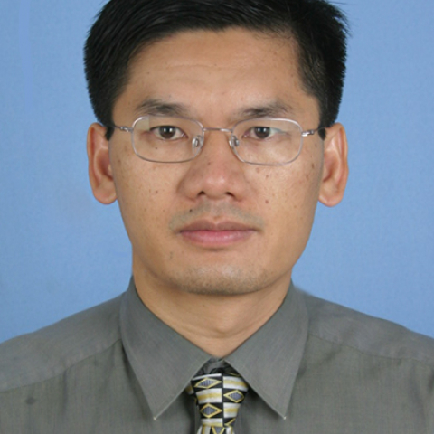

<!-- AUTO-GENERATED-BY: work/generate_obsidian_profiles.py -->

<!-- TEMPLATE: D:\workspace\信息收集整理\医生画像仓库\模板\医生画像模板.md -->

# 王章锋

## 基础信息

| 字段 | 内容 |
|---|---|
| 姓名 | 王章锋 |
| 医院 | 中山大学附属第一医院 |
| 科室 | 咽喉专科 |
| 职称/身份 | 副主任医师 |
| 来源链接 | [官网原文](https://www.fahsysu.org.cn/node/5680) |
| 采集日期 | 2026-08-13 |

## 简介/擅长

1995年6月毕业于中山医科大学医疗系临床医学专业。 20多年来一直在临床一线工作，专注于疾病的诊断治疗，注重病人身体和心理的同步康复。 在耳鼻咽喉—头颈部肿瘤、嗓音疾病、鼾症诊治方面有较深造诣，能熟练处理耳鼻咽喉科常见病多发病，对耳鼻咽喉科急危重症及疑难病例的处理也积累了丰富的经验。 手术操作精细，能熟练完成喉癌激光微创手术，喉癌各种保喉功能手术，全喉切除手术，下咽癌保喉功能综合治疗，颈部转移癌颈淋巴结清扫术，颈部肿物切除术，颈部复杂瘘管切除术，鼾症各种手术治疗，嗓音疾病各种微创手术，气管食管异物取出术，喉—气管狭窄手术治疗，鼻内镜治疗鼻窦炎鼻息肉及鼻内镜下鼻腔鼻窦肿物切除术，上颌骨切除术。 研究方向：耳鼻咽喉—头颈部肿瘤，嗓音疾病，鼾症，耳鼻咽喉炎症 主要教育和工作经历： 1990年9月—1995年6月，中山医科大学医疗系就读本科 1995年7月—目前，中山大学附属第一医院耳鼻咽喉科医生 2000年9月—2003年6月，中山大学附属肿瘤医院就读硕士研究生 2010年8月—2011年6月，美国MERCER大学，宾夕法尼亚大学医院进修 社会兼职：广东省中西医结合学会嗓音专业委员会常委

## 教育与进修经历

- 1995年6月毕业于中山医科大学医疗系临床医学专业。
- 医疗特长：1995年6月毕业于中山医科大学医疗系临床医学专业。
- 研究方向：耳鼻咽喉—头颈部肿瘤，嗓音疾病，鼾症，耳鼻咽喉炎症 主要教育和工作经历： 1990年9月—1995年6月，中山医科大学医疗系就读本科 1995年7月—目前，中山大学附属第一医院耳鼻咽喉科医生 2000年9月—2003年6月，中山大学附属肿瘤医院就读硕士研究生 2010年8月—2011年6月，美国MERCER大学，宾夕法尼亚大学医院进修 社会兼职：广东省中西医结合学会嗓音专业委员会常委

## 可包装亮点

- 在耳鼻咽喉—头颈部肿瘤、嗓音疾病、鼾症诊治方面有较深造诣，能熟练处理耳鼻咽喉科常见病多发病，对耳鼻咽喉科急危重症及疑难病例的处理也积累了丰富的经验。
- 研究方向：耳鼻咽喉—头颈部肿瘤，嗓音疾病，鼾症，耳鼻咽喉炎症 主要教育和工作经历： 1990年9月—1995年6月，中山医科大学医疗系就读本科 1995年7月—目前，中山大学附属第一医院耳鼻咽喉科医生 2000年9月—2003年6月，中山大学附属肿瘤医院就读硕士研究生 2010年8月—2011年6月，美国MERCER大学，宾夕法尼亚大学医院进修 社会兼职：…

## 重点疾病/人群标签

- 慢性病：
- 肿瘤：肿瘤、癌、康复、疑难、急危重、复杂
- 生殖疾病：
- 免疫/风湿：
- 术后恢复/康复：肿瘤、癌、康复、疑难、急危重、复杂
- 疑难重症：肿瘤、癌、康复、疑难、急危重、复杂

## 证据摘录

> 只摘录官网公开信息中的短句或关键字段，不复制大段原文。

- 官网身份字段：副主任医师
- 官网简介/擅长：1995年6月毕业于中山医科大学医疗系临床医学专业。 20多年来一直在临床一线工作，专注于疾病的诊断治疗，注重病人身体和心理的同步康复。 在耳鼻咽喉—头颈部肿瘤、嗓音疾病、鼾症诊治方面有较深造诣，能熟练处理耳鼻咽喉科常见病多发病，对耳鼻咽喉科急危重症及疑难病例的处理也积累了丰富的经验。 手术操作精细，能熟练完成喉癌激光微创手术，喉癌各种保喉功能手术，全喉切除手术，下咽癌保喉功能综合治疗，颈部转移癌颈淋巴结清扫术，颈部肿物切除术，颈部复…
- 官网亮眼经历线索：在耳鼻咽喉—头颈部肿瘤、嗓音疾病、鼾症诊治方面有较深造诣，能熟练处理耳鼻咽喉科常见病多发病，对耳鼻咽喉科急危重症及疑难病例的处理也积累了丰富的经验。 在耳鼻咽喉—头颈部肿瘤、嗓音疾病、鼾症诊治方面有较深造诣，能熟练处理耳鼻咽喉科常见病多发病，对耳鼻咽喉科急危重症及疑难病例的处理也积累了丰富的经验。 研究方向：耳鼻咽喉—头颈部肿瘤，嗓音疾病，鼾症，耳鼻咽喉炎症 主要教育和工作经历： 1990年9月—1995年6月，中山医科大学医疗系就读…
- 来源链接：https://www.fahsysu.org.cn/node/5680

## BD 画像摘要

王章锋医生可作为肿瘤、术后恢复/康复、疑难重症方向的基础画像候选。后续 BD 使用应继续以官网来源和人工复核为准，不添加疗效承诺或无来源包装。

## 合规边界

- 仅使用医院官网、官方公众号、官方小程序等公开渠道。
- 不采集私人电话、私人微信、家庭住址、患者隐私或非公开排班信息。
- 不写“保证治愈”“疗效第一”“包治疑难杂症”等无法由官网证明的表述。
