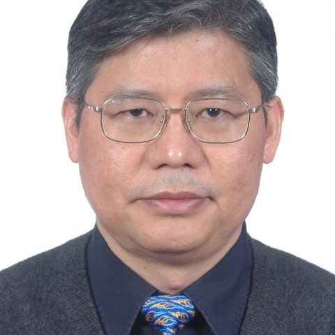

<!-- AUTO-GENERATED-BY: work/generate_obsidian_profiles.py -->

<!-- TEMPLATE: D:\workspace\信息收集整理\医生画像仓库\模板\医生画像模板.md -->

# 盛文利

## 基础信息

| 字段 | 内容 |
|---|---|
| 姓名 | 盛文利 |
| 医院 | 中山大学附属第一医院 |
| 科室 | 神经二科（脑血管病专科） |
| 职称/身份 | 主任医师/教授 |
| 来源链接 | [官网原文](https://www.fahsysu.org.cn/node/898) |
| 采集日期 | 2026-08-13 |

## 简介/擅长

1986年临床医学本科毕业后一直从事神经科临床工作。 1995年获中山医科大学神经病学博士学位，2002年至2003年在美国哈佛大学附属McLean医院进修一年。 从事神经科临床工作近26年来，对神经科常见病和多发病的诊治有丰富的临床经验，擅长诊治脑血管病（脑梗塞、短暂性脑缺血发作、脑出血）、眩晕（脑血管病相关性眩晕和其他类型眩晕）、脑部疾病（感染性、炎症性和脱髓鞘疾病）、肌肉疾病（肌炎、肌营养不良症、肌萎缩侧索硬化）和周围神经疾病（急性和慢性周围神经病变）。 对脑血管病的个体化治疗、重症脑血管病的监护和脑血管病的预防有自己的特长。 对各种眩晕症的分类、诊断、治疗和预防有丰富的临床经验。 对各种脑部疾病、肌肉和周围神经疾病的诊治有自己的专长。 研究方向： 脑卒中后的理想血压研究、住院脑血管病患者的临床登记和临床资料分析、脑血管的分子发病机制。 承担国家自然科学基金、教育部博士点基金、广东省自然科学基金和广东省科技攻关基金。 主要教育和工作经历： 2002.2-2003.2 美国哈佛大学附属McLean医院访问学者。 1992.9-1995.7 中山医科大学神经病学博士毕业。 1989.9-1992.7 广西医科大学神经...

## 教育与进修经历

- 1986年临床医学本科毕业后一直从事神经科临床工作。
- 1995年获中山医科大学神经病学博士学位，2002年至2003年在美国哈佛大学附属McLean医院进修一年。
- 医疗特长： 1986年临床医学本科毕业后一直从事神经科临床工作。
- 主要教育和工作经历： 2002.2-2003.2 美国哈佛大学附属McLean医院访问学者。

## 科研项目与成果

- 承担国家自然科学基金、教育部博士点基金、广东省自然科学基金和广东省科技攻关基金。

## 论文与学术产出

- 论著： 已在中华系列医学杂志和核心期刊上以第一作者发表论文36篇，其中SCI论文5篇。
- 近5年发表的论文见附页。
- 专著： 参编《心血管危重症监护治疗学》、《神经遗传病学》、《神经病学之神经系统遗传性疾病（第19卷）》、《基因诊断与基因治疗进展》、《全科医学临床诊断学》。

## 可包装亮点

- 1995年获中山医科大学神经病学博士学位，2002年至2003年在美国哈佛大学附属McLean医院进修一年。
- 承担国家自然科学基金、教育部博士点基金、广东省自然科学基金和广东省科技攻关基金。
- 主要教育和工作经历： 2002.2-2003.2 美国哈佛大学附属McLean医院访问学者。

## 重点疾病/人群标签

- 慢性病：慢性、感染、营养、危重、重症
- 肿瘤：
- 生殖疾病：
- 免疫/风湿：慢性、感染、营养、危重、重症
- 术后恢复/康复：慢性、感染、营养、危重、重症
- 疑难重症：慢性、感染、营养、危重、重症

## 证据摘录

> 只摘录官网公开信息中的短句或关键字段，不复制大段原文。

- 官网身份字段：主任医师/教授
- 官网简介/擅长：1986年临床医学本科毕业后一直从事神经科临床工作。 1995年获中山医科大学神经病学博士学位，2002年至2003年在美国哈佛大学附属McLean医院进修一年。 从事神经科临床工作近26年来，对神经科常见病和多发病的诊治有丰富的临床经验，擅长诊治脑血管病（脑梗塞、短暂性脑缺血发作、脑出血）、眩晕（脑血管病相关性眩晕和其他类型眩晕）、脑部疾病（感染性、炎症性和脱髓鞘疾病）、肌肉疾病（肌炎、肌营养不良症、肌萎缩侧索硬化）和周围神经疾病（…
- 官网亮眼经历线索：1995年获中山医科大学神经病学博士学位，2002年至2003年在美国哈佛大学附属McLean医院进修一年。 1995年获中山医科大学神经病学博士学位，2002年至2003年在美国哈佛大学附属McLean医院进修一年。 承担国家自然科学基金、教育部博士点基金、广东省自然科学基金和广东省科技攻关基金。 主要教育和工作经历： 2002.2-2003.2 美国哈佛大学附属McLean医院访问学者。
- 来源链接：https://www.fahsysu.org.cn/node/898

## BD 画像摘要

盛文利医生可作为慢性病、免疫/风湿/感染、术后恢复/康复、疑难重症方向的基础画像候选。后续 BD 使用应继续以官网来源和人工复核为准，不添加疗效承诺或无来源包装。

## 合规边界

- 仅使用医院官网、官方公众号、官方小程序等公开渠道。
- 不采集私人电话、私人微信、家庭住址、患者隐私或非公开排班信息。
- 不写“保证治愈”“疗效第一”“包治疑难杂症”等无法由官网证明的表述。
