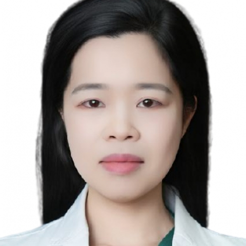

<!-- AUTO-GENERATED-BY: work/generate_obsidian_profiles.py -->

<!-- TEMPLATE: D:\workspace\信息收集整理\医生画像仓库\模板\医生画像模板.md -->

# 祝彩霞

## 基础信息

| 字段 | 内容 |
|---|---|
| 姓名 | 祝彩霞 |
| 医院 | 中山大学附属第一医院 |
| 科室 | 产科 |
| 职称/身份 | 副主任医师 |
| 来源链接 | [官网原文](https://www.fahsysu.org.cn/node/35590) |
| 采集日期 | 2026-08-13 |

## 简介/擅长

长期从事产科临床工作，在围产医学尤其在高危妊娠监护、围生期并发症和病理产科方面有丰富的临床经验。 主攻子痫前期和胎儿医学领域，擅长产科相关疾病的综合治疗、母胎监护和产程管理，如妊娠合并内外科疾病、子痫前期、胎儿生长受限等。 对高危妊娠的孕前咨询和诊断、孕期用药咨询、遗传病的生育指导具有丰富的临床经验。 研究方向：子痫前期和胎儿生受限的发病机制。 教育经历和工作经历： 2006-2014 华中科技大学同济医学院 临床医学博士 2014-至今 中山大学附属第一医院 妇产科 2018-2020 德国慕尼黑工业大学 博士后 学会任职：广东省健康管理学会母胎医学专委会 副秘书长 荣誉获奖： 林芝市人民医院 优秀援藏工作者（2017） 中山大学附属第一医院 “优秀教师”（2022） 中山大学附属第一医院 “十佳优秀教师”（2023） 中山大学 “叶任高-李幼姬”夫妇优秀临床医学中青年教师奖（2023） 中山大学附属第一医院 “优秀住培轮科导师”（2024） 主持项目： 国家自然科学基金（青年科学基金项目，2024） 广东省自然科学基金（面上基金项目，2025） 广东省自然科学基金（区域联合基金项目，2023） 论著：近5年发表SC...

## 教育与进修经历

- 教育经历和工作经历： 2006-2014 华中科技大学同济医学院 临床医学博士 2014-至今 中山大学附属第一医院 妇产科 2018-2020 德国慕尼黑工业大学 博士后 学会任职：广东省健康管理学会母胎医学专委会 副秘书长 荣誉获奖： 林芝市人民医院 优秀援藏工作者（2017） 中山大学附属第一医院 “优秀教师”（2022） 中山大学附属第一医院 “十佳优秀教师”（2023） 中山大学 “叶任高-李幼姬”夫妇优秀临床医学中青年教师奖（2023） 中山大学附属第一医院 “优秀住培轮科导师”（2024） 主持项目…

## 科研项目与成果

- 教育经历和工作经历： 2006-2014 华中科技大学同济医学院 临床医学博士 2014-至今 中山大学附属第一医院 妇产科 2018-2020 德国慕尼黑工业大学 博士后 学会任职：广东省健康管理学会母胎医学专委会 副秘书长 荣誉获奖： 林芝市人民医院 优秀援藏工作者（2017） 中山大学附属第一医院 “优秀教师”（2022） 中山大学附属第一医院 “十佳优秀教师”（2023） 中山大学 “叶任高-李幼姬”夫妇优秀临床医学中青年教师奖（2023） 中山大学附属第一医院 “优秀住培轮科导师”（2024） 主持项目…

## 可包装亮点

- 教育经历和工作经历： 2006-2014 华中科技大学同济医学院 临床医学博士 2014-至今 中山大学附属第一医院 妇产科 2018-2020 德国慕尼黑工业大学 博士后 学会任职：广东省健康管理学会母胎医学专委会 副秘书长 荣誉获奖： 林芝市人民医院 优秀援藏工作者（2017） 中山大学附属第一医院 “优秀教师”（2022） 中山大学附属第一医院 “十…

## 重点疾病/人群标签

- 慢性病：
- 肿瘤：
- 生殖疾病：
- 免疫/风湿：
- 术后恢复/康复：
- 疑难重症：高危

## 证据摘录

> 只摘录官网公开信息中的短句或关键字段，不复制大段原文。

- 官网身份字段：副主任医师
- 官网简介/擅长：长期从事产科临床工作，在围产医学尤其在高危妊娠监护、围生期并发症和病理产科方面有丰富的临床经验。 主攻子痫前期和胎儿医学领域，擅长产科相关疾病的综合治疗、母胎监护和产程管理，如妊娠合并内外科疾病、子痫前期、胎儿生长受限等。 对高危妊娠的孕前咨询和诊断、孕期用药咨询、遗传病的生育指导具有丰富的临床经验。 研究方向：子痫前期和胎儿生受限的发病机制。 教育经历和工作经历： 2006-2014 华中科技大学同济医学院 临床医学博士 2014-…
- 官网亮眼经历线索：教育经历和工作经历： 2006-2014 华中科技大学同济医学院 临床医学博士 2014-至今 中山大学附属第一医院 妇产科 2018-2020 德国慕尼黑工业大学 博士后 学会任职：广东省健康管理学会母胎医学专委会 副秘书长 荣誉获奖： 林芝市人民医院 优秀援藏工作者（2017） 中山大学附属第一医院 “优秀教师”（2022） 中山大学附属第一医院 “十佳优秀教师”（2023） 中山大学 “叶任高-李幼姬”夫妇优秀临床医学中青年教师…
- 来源链接：https://www.fahsysu.org.cn/node/35590

## BD 画像摘要

祝彩霞医生可作为疑难重症方向的基础画像候选。后续 BD 使用应继续以官网来源和人工复核为准，不添加疗效承诺或无来源包装。

## 合规边界

- 仅使用医院官网、官方公众号、官方小程序等公开渠道。
- 不采集私人电话、私人微信、家庭住址、患者隐私或非公开排班信息。
- 不写“保证治愈”“疗效第一”“包治疑难杂症”等无法由官网证明的表述。
