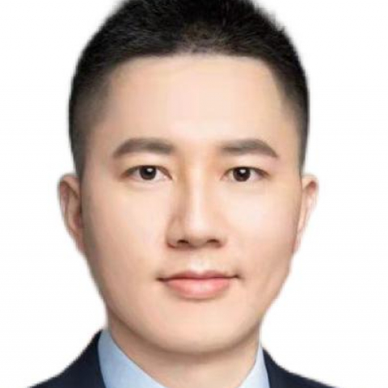

<!-- AUTO-GENERATED-BY: work/generate_obsidian_profiles.py -->

<!-- TEMPLATE: D:\workspace\信息收集整理\医生画像仓库\模板\医生画像模板.md -->

# 章昌明

## 基础信息

| 字段 | 内容 |
|---|---|
| 姓名 | 章昌明 |
| 医院 | 中山大学附属第一医院 |
| 科室 | 神经外科 |
| 职称/身份 | 副主任医师 |
| 来源链接 | [官网原文](https://www.fahsysu.org.cn/node/35650) |
| 采集日期 | 2026-08-13 |

## 简介/擅长

具有丰富的神经外科常见病及多发疾病的诊疗经验。 擅长神经外科常见病多发病如脑肿瘤，脑积水，颅脑外伤，脑出血等诊治。 专注于颅脑肿瘤（如胶质瘤、脑膜瘤、转移瘤等）的手术治疗，颅神经疾病（如三叉神经痛、面肌痉挛等）的微血管减压手术治疗，运动障碍疾病如（帕金森病，特发性震颤，肌张力障碍等）的脑深部电刺激手术治疗等综合治疗。 （1）教育经历：中南大学湘雅医学院与美国Emory University联合培养临床医学八年制博士。 2014年-2016年美国Emory University访问学习。 （2）工作经历:2017年入职于中山大学附属第一医院神经外科。 （3）社会兼职： 广东省精准医学应用学会神经肿瘤分会委员, 广东省精准医学应用学会颅神经分会委员, 广东省健康管理学会疼痛多学科协作与管理专业委员会委员等, AMEE Specialist in Medical Education（AMEE医学教育专家）, 国家神经外科住培导师，广东省神经外科住培骨干导师。 （4）科研情况：专注于神经肿瘤、运动障碍疾病脑深部电刺激术、脑积水等的基础及临床研究。 主持国家自然科学基金、广州市科技等项目，发表SCI论文多篇。 获第二届中国神经外...

## 科研项目与成果

- （4）科研情况：专注于神经肿瘤、运动障碍疾病脑深部电刺激术、脑积水等的基础及临床研究。
- 主持国家自然科学基金、广州市科技等项目，发表SCI论文多篇。

## 论文与学术产出

- 主持国家自然科学基金、广州市科技等项目，发表SCI论文多篇。

## 可包装亮点

- （1）教育经历：中南大学湘雅医学院与美国Emory University联合培养临床医学八年制博士。
- 2014年-2016年美国Emory University访问学习。
- （3）社会兼职： 广东省精准医学应用学会神经肿瘤分会委员, 广东省精准医学应用学会颅神经分会委员, 广东省健康管理学会疼痛多学科协作与管理专业委员会委员等, AMEE Specialist in Medical Education（AMEE医学教育专家）, 国家神经外科住培导师，广东省神经外科住培骨干导师。
- 主持国家自然科学基金、广州市科技等项目，发表SCI论文多篇。

## 重点疾病/人群标签

- 慢性病：
- 肿瘤：肿瘤、瘤、疼痛、多学科
- 生殖疾病：
- 免疫/风湿：
- 术后恢复/康复：肿瘤、瘤、疼痛、多学科
- 疑难重症：肿瘤、瘤、疼痛、多学科

## 证据摘录

> 只摘录官网公开信息中的短句或关键字段，不复制大段原文。

- 官网身份字段：副主任医师
- 官网简介/擅长：具有丰富的神经外科常见病及多发疾病的诊疗经验。 擅长神经外科常见病多发病如脑肿瘤，脑积水，颅脑外伤，脑出血等诊治。 专注于颅脑肿瘤（如胶质瘤、脑膜瘤、转移瘤等）的手术治疗，颅神经疾病（如三叉神经痛、面肌痉挛等）的微血管减压手术治疗，运动障碍疾病如（帕金森病，特发性震颤，肌张力障碍等）的脑深部电刺激手术治疗等综合治疗。 （1）教育经历：中南大学湘雅医学院与美国Emory University联合培养临床医学八年制博士。 2014年-20…
- 官网亮眼经历线索：（1）教育经历：中南大学湘雅医学院与美国Emory University联合培养临床医学八年制博士。 2014年-2016年美国Emory University访问学习。 （3）社会兼职： 广东省精准医学应用学会神经肿瘤分会委员, 广东省精准医学应用学会颅神经分会委员, 广东省健康管理学会疼痛多学科协作与管理专业委员会委员等, AMEE Specialist in Medical Education（AMEE医学教育专家）, 国家神经…
- 来源链接：https://www.fahsysu.org.cn/node/35650

## BD 画像摘要

章昌明医生可作为肿瘤、术后恢复/康复、疑难重症方向的基础画像候选。后续 BD 使用应继续以官网来源和人工复核为准，不添加疗效承诺或无来源包装。

## 合规边界

- 仅使用医院官网、官方公众号、官方小程序等公开渠道。
- 不采集私人电话、私人微信、家庭住址、患者隐私或非公开排班信息。
- 不写“保证治愈”“疗效第一”“包治疑难杂症”等无法由官网证明的表述。
