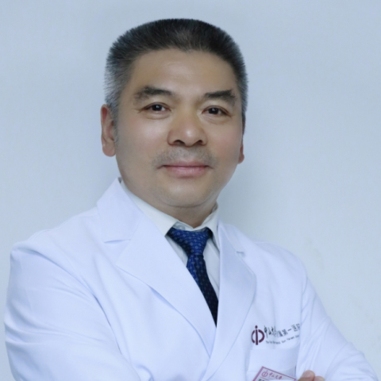

<!-- AUTO-GENERATED-BY: work/generate_obsidian_profiles.py -->

<!-- TEMPLATE: D:\workspace\信息收集整理\医生画像仓库\模板\医生画像模板.md -->

# 罗迪青

## 基础信息

| 字段 | 内容 |
|---|---|
| 姓名 | 罗迪青 |
| 医院 | 中山大学附属第一医院 |
| 科室 | 皮肤科 |
| 职称/身份 | 主任医师/教授 |
| 来源链接 | [官网原文](https://www.fahsysu.org.cn/node/5737) |
| 采集日期 | 2026-08-13 |

## 简介/擅长

一直在临床第一线工作，擅长皮肤科疾病的临床诊断与治疗，尤其擅长银屑病、皮炎湿疹、特应性皮炎、化脓性汗腺炎等疾病的诊治工作，对少见病、罕见病、疑难病的诊治具有丰富的临床经验和钻研精神； 对红斑疼痛性皮肤病的诊断与治疗很有经验，对嵌甲手术治疗具有较高的水平。 研究方向： 1. 银屑病、化脓性汗腺炎、湿疹、特应性皮炎的的治疗 2. 红斑疼痛性皮肤病的诊断与治疗 3. 嵌甲手术矫正 主要教育和工作经历： 1982.9～1988.7 中山医科大学 本科 1991.9～1994.7 中山医科大学皮肤病专业硕士研究生 1994.7～1998.8 广州市第二人民医院皮肤科医师、主治医师 1998.9～2000.12 广州市第二人民医院内科主治医师 2000.12～至今 中山大学附属第一医院东院皮肤科主治医师、副主任医师、主任医师、教授 社会兼职： 广东省药学会皮肤病专家委员会 主任委员 亚洲支原体学会理事 论著： 论文：发表SCI论文60余篇，中文论文近60篇 SCI 收录第一作者和/或通讯作者论文. 1. Luo DQ, Li Y, Huang YB, Wu LC, He DY. Aquagenic syringeal acroke...

## 可包装亮点

- 一直在临床第一线工作，擅长皮肤科疾病的临床诊断与治疗，尤其擅长银屑病、皮炎湿疹、特应性皮炎、化脓性汗腺炎等疾病的诊治工作，对少见病、罕见病、疑难病的诊治具有丰富的临床经验和钻研精神；
- 医疗特长：一直在临床第一线工作，擅长皮肤科疾病的临床诊断与治疗，尤其擅长银屑病、皮炎湿疹、特应性皮炎、化脓性汗腺炎等疾病的诊治工作，对少见病、罕见病、疑难病的诊治具有丰富的临床经验和钻研精神；
- 研究方向： 1. 银屑病、化脓性汗腺炎、湿疹、特应性皮炎的的治疗 2. 红斑疼痛性皮肤病的诊断与治疗 3. 嵌甲手术矫正 主要教育和工作经历： 1982.9～1988.7 中山医科大学 本科 1991.9～1994.7 中山医科大学皮肤病专业硕士研究生 1994.7～1998.8 广州市第二人民医院皮肤科医师、主治医师 1998.9～2000.12 广州市…

## 重点疾病/人群标签

- 慢性病：
- 肿瘤：
- 生殖疾病：
- 免疫/风湿：
- 术后恢复/康复：疼痛、疑难、罕见
- 疑难重症：疼痛、疑难、罕见

## 证据摘录

> 只摘录官网公开信息中的短句或关键字段，不复制大段原文。

- 官网身份字段：主任医师/教授
- 官网简介/擅长：一直在临床第一线工作，擅长皮肤科疾病的临床诊断与治疗，尤其擅长银屑病、皮炎湿疹、特应性皮炎、化脓性汗腺炎等疾病的诊治工作，对少见病、罕见病、疑难病的诊治具有丰富的临床经验和钻研精神； 对红斑疼痛性皮肤病的诊断与治疗很有经验，对嵌甲手术治疗具有较高的水平。 研究方向： 1. 银屑病、化脓性汗腺炎、湿疹、特应性皮炎的的治疗 2. 红斑疼痛性皮肤病的诊断与治疗 3. 嵌甲手术矫正 主要教育和工作经历： 1982.9～1988.7 中山医科大…
- 官网亮眼经历线索：一直在临床第一线工作，擅长皮肤科疾病的临床诊断与治疗，尤其擅长银屑病、皮炎湿疹、特应性皮炎、化脓性汗腺炎等疾病的诊治工作，对少见病、罕见病、疑难病的诊治具有丰富的临床经验和钻研精神； 医疗特长：一直在临床第一线工作，擅长皮肤科疾病的临床诊断与治疗，尤其擅长银屑病、皮炎湿疹、特应性皮炎、化脓性汗腺炎等疾病的诊治工作，对少见病、罕见病、疑难病的诊治具有丰富的临床经验和钻研精神； 研究方向： 1. 银屑病、化脓性汗腺炎、湿疹、特应性皮炎的的…
- 来源链接：https://www.fahsysu.org.cn/node/5737

## BD 画像摘要

罗迪青医生可作为术后恢复/康复、疑难重症方向的基础画像候选。后续 BD 使用应继续以官网来源和人工复核为准，不添加疗效承诺或无来源包装。

## 合规边界

- 仅使用医院官网、官方公众号、官方小程序等公开渠道。
- 不采集私人电话、私人微信、家庭住址、患者隐私或非公开排班信息。
- 不写“保证治愈”“疗效第一”“包治疑难杂症”等无法由官网证明的表述。
