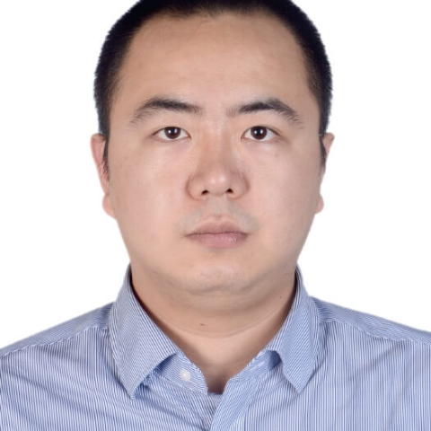

<!-- AUTO-GENERATED-BY: work/generate_obsidian_profiles.py -->

<!-- TEMPLATE: D:\workspace\信息收集整理\医生画像仓库\模板\医生画像模板.md -->

# 翟二涛

## 基础信息

| 字段 | 内容 |
|---|---|
| 姓名 | 翟二涛 |
| 医院 | 中山大学附属第一医院 |
| 科室 | 胃肠外科一科 |
| 职称/身份 | 副主任医师 |
| 来源链接 | [官网原文](https://www.fahsysu.org.cn/node/33099) |
| 采集日期 | 2026-08-13 |

## 简介/擅长

从事胃肠道恶性肿瘤的临床与基础研究等工作。 擅长胃、小肠、结直肠等消化道常见肿瘤以及腹膜后肿瘤的规范化手术（开放手术和腹腔镜手术等）及综合治疗。 擅长腹外疝（腹股沟疝、切口疝、白线疝等）、肛瘘、痔疮等良性疾病的诊疗。 尤为擅长Borrmann IV型或硬化性胃癌的临床诊治。 工作经历： 2016年-2018年于中山大学附属第一医院胃肠外科中心从事博士后研究工作，后留院从事胃肠外科临床工作至今； 2024年获聘副主任医师。 社会兼职：广东省基层医药学会胃肠病专委会 常委 研究方向：胃肠道恶性肿瘤（胃癌、小肠癌、结直肠癌、胃肠道间质瘤）的基础与临床研究。 Borrmann IV型或硬化性胃癌以外科手术为核心的临床研究。 科研情况：主持国家自然科学基金项目1项、省部级科研项目3项、地厅级基金项目1项。 于IntJ Caner、Oncogenesis、Cancer Commun等杂志发表SCI学术论著多篇。

## 教育与进修经历

- 工作经历： 2016年-2018年于中山大学附属第一医院胃肠外科中心从事博士后研究工作，后留院从事胃肠外科临床工作至今；

## 科研项目与成果

- 科研情况：主持国家自然科学基金项目1项、省部级科研项目3项、地厅级基金项目1项。

## 论文与学术产出

- 于IntJ Caner、Oncogenesis、Cancer Commun等杂志发表SCI学术论著多篇。

## 可包装亮点

- 2024年获聘副主任医师。
- 社会兼职：广东省基层医药学会胃肠病专委会 常委 研究方向：胃肠道恶性肿瘤（胃癌、小肠癌、结直肠癌、胃肠道间质瘤）的基础与临床研究。
- 科研情况：主持国家自然科学基金项目1项、省部级科研项目3项、地厅级基金项目1项。
- 于IntJ Caner、Oncogenesis、Cancer Commun等杂志发表SCI学术论著多篇。

## 重点疾病/人群标签

- 慢性病：
- 肿瘤：肿瘤、瘤、胃癌、肠癌
- 生殖疾病：
- 免疫/风湿：
- 术后恢复/康复：
- 疑难重症：

## 证据摘录

> 只摘录官网公开信息中的短句或关键字段，不复制大段原文。

- 官网身份字段：副主任医师
- 官网简介/擅长：从事胃肠道恶性肿瘤的临床与基础研究等工作。 擅长胃、小肠、结直肠等消化道常见肿瘤以及腹膜后肿瘤的规范化手术（开放手术和腹腔镜手术等）及综合治疗。 擅长腹外疝（腹股沟疝、切口疝、白线疝等）、肛瘘、痔疮等良性疾病的诊疗。 尤为擅长Borrmann IV型或硬化性胃癌的临床诊治。 工作经历： 2016年-2018年于中山大学附属第一医院胃肠外科中心从事博士后研究工作，后留院从事胃肠外科临床工作至今； 2024年获聘副主任医师。 社会兼职：广…
- 官网亮眼经历线索：2024年获聘副主任医师。 社会兼职：广东省基层医药学会胃肠病专委会 常委 研究方向：胃肠道恶性肿瘤（胃癌、小肠癌、结直肠癌、胃肠道间质瘤）的基础与临床研究。 科研情况：主持国家自然科学基金项目1项、省部级科研项目3项、地厅级基金项目1项。 于IntJ Caner、Oncogenesis、Cancer Commun等杂志发表SCI学术论著多篇。
- 来源链接：https://www.fahsysu.org.cn/node/33099

## BD 画像摘要

翟二涛医生可作为肿瘤方向的基础画像候选。后续 BD 使用应继续以官网来源和人工复核为准，不添加疗效承诺或无来源包装。

## 合规边界

- 仅使用医院官网、官方公众号、官方小程序等公开渠道。
- 不采集私人电话、私人微信、家庭住址、患者隐私或非公开排班信息。
- 不写“保证治愈”“疗效第一”“包治疑难杂症”等无法由官网证明的表述。
