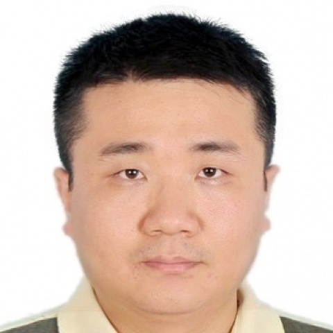

<!-- AUTO-GENERATED-BY: work/generate_obsidian_profiles.py -->

<!-- TEMPLATE: D:\workspace\信息收集整理\医生画像仓库\模板\医生画像模板.md -->

# 聂二民

## 基础信息

| 字段 | 内容 |
|---|---|
| 姓名 | 聂二民 |
| 医院 | 中山大学附属第一医院 |
| 科室 | 口内修复科 |
| 职称/身份 | 副主任医师 |
| 来源链接 | [官网原文](https://www.fahsysu.org.cn/node/29071) |
| 采集日期 | 2026-08-13 |

## 简介/擅长

## 论文与学术产出

- 主要教育和工作经历：1999.09-2004-07 郑州大学医学院 本科 2004.09-2007.07 中山大学口腔临床医学 硕士 2007.09-至今 中山大学附属第一医院工作 社会兼职：无 论著：在国内外期刊发表论著二十余篇 专著：参与编写专著数本

## 可包装亮点

- 主要教育和工作经历：1999.09-2004-07 郑州大学医学院 本科 2004.09-2007.07 中山大学口腔临床医学 硕士 2007.09-至今 中山大学附属第一医院工作 社会兼职：无 论著：在国内外期刊发表论著二十余篇 专著：参与编写专著数本

## 重点疾病/人群标签

- 慢性病：
- 肿瘤：
- 生殖疾病：
- 免疫/风湿：
- 术后恢复/康复：
- 疑难重症：

## 证据摘录

> 只摘录官网公开信息中的短句或关键字段，不复制大段原文。

- 官网身份字段：副主任医师
- 官网亮眼经历线索：主要教育和工作经历：1999.09-2004-07 郑州大学医学院 本科 2004.09-2007.07 中山大学口腔临床医学 硕士 2007.09-至今 中山大学附属第一医院工作 社会兼职：无 论著：在国内外期刊发表论著二十余篇 专著：参与编写专著数本
- 来源链接：https://www.fahsysu.org.cn/node/29071

## BD 画像摘要

聂二民医生可作为中山大学附属第一医院口内修复科的基础医生资料入库。当前重点方向以总底表标签为准，官网未展示的信息保持空白。

## 合规边界

- 仅使用医院官网、官方公众号、官方小程序等公开渠道。
- 不采集私人电话、私人微信、家庭住址、患者隐私或非公开排班信息。
- 不写“保证治愈”“疗效第一”“包治疑难杂症”等无法由官网证明的表述。
