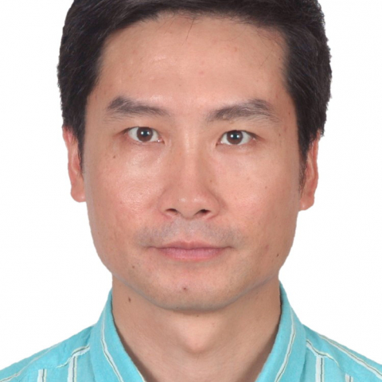

<!-- AUTO-GENERATED-BY: work/generate_obsidian_profiles.py -->

<!-- TEMPLATE: D:\workspace\信息收集整理\医生画像仓库\模板\医生画像模板.md -->

# 肖亮灿

## 基础信息

| 字段 | 内容 |
|---|---|
| 姓名 | 肖亮灿 |
| 医院 | 中山大学附属第一医院 |
| 科室 | 麻醉科 |
| 职称/身份 | 主任医师 |
| 来源链接 | [官网原文](https://www.fahsysu.org.cn/node/5782) |
| 采集日期 | 2026-08-13 |

## 简介/擅长

1990年毕业于中山医科大学，在中山大学附属第一医院从事临床麻醉工作22年。 积累了丰富的临床麻醉经验。 能独立处理疑难、危重及重大手术的麻醉，擅长于神经外科手术、心血管手术、腹部手术麻醉。 参与了亚洲首例联头婴分离术、本院首例心脏移植、首例心肺联合移植术的麻醉。 在肝移植、肾移植等器官移植手术的麻醉方面也积累了丰富的临床经验。 研究方向：1.神经外科手术的临床麻醉 2.心血管手术的临床麻醉 主要教育和工作经历：1990年本科毕业于原中山医科大学医学系； 2006年毕业于中山大学公共卫生学院获硕士学位； 1990年至今一直工作于中山大学附属第一医院麻醉科，历任住院医师、主治医师、副主任医师，2000年至今任麻醉科副主任。 社会兼职：中华医学会广东省麻醉学分会骨科与创伤外科学组副组长； 广州市医疗事故鉴定委员会专家库成员 论著： 专著：麻醉耗材学（主编：徐康清 肖亮灿） 高等教育出版社 临床医生用药大全（参编） 广东科技出版社

## 教育与进修经历

- 1990年毕业于中山医科大学，在中山大学附属第一医院从事临床麻醉工作22年。
- 医疗特长： 1990年毕业于中山医科大学，在中山大学附属第一医院从事临床麻醉工作22年。
- 研究方向：1.神经外科手术的临床麻醉 2.心血管手术的临床麻醉 主要教育和工作经历：1990年本科毕业于原中山医科大学医学系；
- 2006年毕业于中山大学公共卫生学院获硕士学位；

## 论文与学术产出

- 广州市医疗事故鉴定委员会专家库成员 论著： 专著：麻醉耗材学（主编：徐康清 肖亮灿） 高等教育出版社 临床医生用药大全（参编） 广东科技出版社

## 可包装亮点

- 能独立处理疑难、危重及重大手术的麻醉，擅长于神经外科手术、心血管手术、腹部手术麻醉。
- 1990年至今一直工作于中山大学附属第一医院麻醉科，历任住院医师、主治医师、副主任医师，2000年至今任麻醉科副主任。
- 社会兼职：中华医学会广东省麻醉学分会骨科与创伤外科学组副组长；

## 重点疾病/人群标签

- 慢性病：
- 肿瘤：
- 生殖疾病：
- 免疫/风湿：
- 术后恢复/康复：
- 疑难重症：疑难、危重

## 证据摘录

> 只摘录官网公开信息中的短句或关键字段，不复制大段原文。

- 官网身份字段：主任医师
- 官网简介/擅长：1990年毕业于中山医科大学，在中山大学附属第一医院从事临床麻醉工作22年。 积累了丰富的临床麻醉经验。 能独立处理疑难、危重及重大手术的麻醉，擅长于神经外科手术、心血管手术、腹部手术麻醉。 参与了亚洲首例联头婴分离术、本院首例心脏移植、首例心肺联合移植术的麻醉。 在肝移植、肾移植等器官移植手术的麻醉方面也积累了丰富的临床经验。 研究方向：1.神经外科手术的临床麻醉 2.心血管手术的临床麻醉 主要教育和工作经历：1990年本科毕业于原…
- 官网亮眼经历线索：能独立处理疑难、危重及重大手术的麻醉，擅长于神经外科手术、心血管手术、腹部手术麻醉。 能独立处理疑难、危重及重大手术的麻醉，擅长于神经外科手术、心血管手术、腹部手术麻醉。 1990年至今一直工作于中山大学附属第一医院麻醉科，历任住院医师、主治医师、副主任医师，2000年至今任麻醉科副主任。 社会兼职：中华医学会广东省麻醉学分会骨科与创伤外科学组副组长；
- 来源链接：https://www.fahsysu.org.cn/node/5782

## BD 画像摘要

肖亮灿医生可作为疑难重症方向的基础画像候选。后续 BD 使用应继续以官网来源和人工复核为准，不添加疗效承诺或无来源包装。

## 合规边界

- 仅使用医院官网、官方公众号、官方小程序等公开渠道。
- 不采集私人电话、私人微信、家庭住址、患者隐私或非公开排班信息。
- 不写“保证治愈”“疗效第一”“包治疑难杂症”等无法由官网证明的表述。
