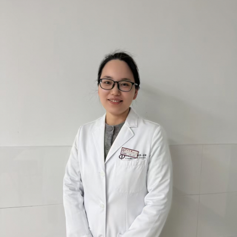

<!-- AUTO-GENERATED-BY: work/generate_obsidian_profiles.py -->

<!-- TEMPLATE: D:\workspace\信息收集整理\医生画像仓库\模板\医生画像模板.md -->

# 肖游君

## 基础信息

| 字段 | 内容 |
|---|---|
| 姓名 | 肖游君 |
| 医院 | 中山大学附属第一医院 |
| 科室 | 风湿免疫科 |
| 职称/身份 | 主任医师 |
| 来源链接 | [官网原文](https://www.fahsysu.org.cn/node/25886) |
| 采集日期 | 2026-08-13 |

## 简介/擅长

从事临床工作10余年，擅长诊治强直性脊柱炎、类风湿关节炎、系统性红斑狼疮、银屑病关节炎、痛风、多发性肌炎/皮肌炎、硬皮病、干燥综合征、系统性血管炎、白塞病、成人still病等常见风湿病。 对疑难危重病如各种狼疮危象、狼疮视神经脊髓炎、重症血管炎、结缔组织病相关间质性肺病、IgG4相关疾病、巨噬细胞活化综合症等有丰富的诊治经验。 擅长强直性脊柱炎、类风湿关节炎、痛风性关节炎等慢性病管理。 研究方向：类风湿关节炎、强直性脊柱炎、系统性红斑狼疮的发病机制与临床研究，尤其侧重于类风湿关节炎的研究。 主要教育和工作经历：医学博士，主任医师，硕士研究生导师。 2014年博士毕业于中山大学附属第一医院，同年留院工作。 2026年晋升中山大学附属第一医院风湿免疫科主任医师。 社会兼职：广东省健康管理学会风湿免疫学与康复 专业委员会 副秘书长，广东省健康管理学会脂肪肝多学科诊治专业委员会委员等。 科研业绩：主持国家级项目3项，省部级项目4项，市级项目1项。 以第一作者、共同第一作者和通讯作者在国际、国内重要医学学术期刊发表论著20余篇，包括ARD、AR等风湿免疫学顶刊。

## 教育与进修经历

- 2014年博士毕业于中山大学附属第一医院，同年留院工作。

## 科研项目与成果

- 科研业绩：主持国家级项目3项，省部级项目4项，市级项目1项。

## 论文与学术产出

- 以第一作者、共同第一作者和通讯作者在国际、国内重要医学学术期刊发表论著20余篇，包括ARD、AR等风湿免疫学顶刊。

## 可包装亮点

- 对疑难危重病如各种狼疮危象、狼疮视神经脊髓炎、重症血管炎、结缔组织病相关间质性肺病、IgG4相关疾病、巨噬细胞活化综合症等有丰富的诊治经验。
- 主要教育和工作经历：医学博士，主任医师，硕士研究生导师。
- 2026年晋升中山大学附属第一医院风湿免疫科主任医师。

## 重点疾病/人群标签

- 慢性病：慢性、风湿、免疫、红斑狼疮、类风湿、强直性脊柱炎、康复、疑难、危重、重症、多学科
- 肿瘤：
- 生殖疾病：
- 免疫/风湿：慢性、风湿、免疫、红斑狼疮、类风湿、强直性脊柱炎、康复、疑难、危重、重症、多学科
- 术后恢复/康复：慢性、风湿、免疫、红斑狼疮、类风湿、强直性脊柱炎、康复、疑难、危重、重症、多学科
- 疑难重症：慢性、风湿、免疫、红斑狼疮、类风湿、强直性脊柱炎、康复、疑难、危重、重症、多学科

## 证据摘录

> 只摘录官网公开信息中的短句或关键字段，不复制大段原文。

- 官网身份字段：主任医师
- 官网简介/擅长：从事临床工作10余年，擅长诊治强直性脊柱炎、类风湿关节炎、系统性红斑狼疮、银屑病关节炎、痛风、多发性肌炎/皮肌炎、硬皮病、干燥综合征、系统性血管炎、白塞病、成人still病等常见风湿病。 对疑难危重病如各种狼疮危象、狼疮视神经脊髓炎、重症血管炎、结缔组织病相关间质性肺病、IgG4相关疾病、巨噬细胞活化综合症等有丰富的诊治经验。 擅长强直性脊柱炎、类风湿关节炎、痛风性关节炎等慢性病管理。 研究方向：类风湿关节炎、强直性脊柱炎、系统性红斑…
- 官网亮眼经历线索：对疑难危重病如各种狼疮危象、狼疮视神经脊髓炎、重症血管炎、结缔组织病相关间质性肺病、IgG4相关疾病、巨噬细胞活化综合症等有丰富的诊治经验。 对疑难危重病如各种狼疮危象、狼疮视神经脊髓炎、重症血管炎、结缔组织病相关间质性肺病、IgG4相关疾病、巨噬细胞活化综合症等有丰富的诊治经验。 主要教育和工作经历：医学博士，主任医师，硕士研究生导师。 2026年晋升中山大学附属第一医院风湿免疫科主任医师。
- 来源链接：https://www.fahsysu.org.cn/node/25886

## BD 画像摘要

肖游君医生可作为慢性病、免疫/风湿/感染、术后恢复/康复、疑难重症方向的基础画像候选。后续 BD 使用应继续以官网来源和人工复核为准，不添加疗效承诺或无来源包装。

## 合规边界

- 仅使用医院官网、官方公众号、官方小程序等公开渠道。
- 不采集私人电话、私人微信、家庭住址、患者隐私或非公开排班信息。
- 不写“保证治愈”“疗效第一”“包治疑难杂症”等无法由官网证明的表述。
