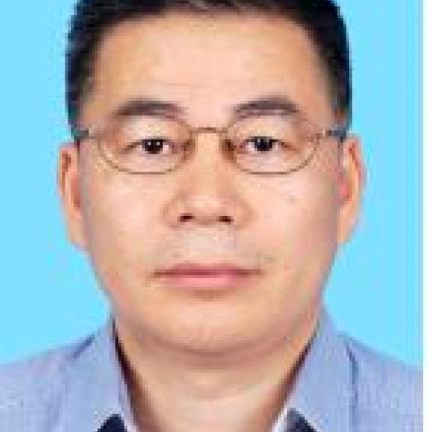

<!-- AUTO-GENERATED-BY: work/generate_obsidian_profiles.py -->

<!-- TEMPLATE: D:\workspace\信息收集整理\医生画像仓库\模板\医生画像模板.md -->

# 胡作军

## 基础信息

| 字段 | 内容 |
|---|---|
| 姓名 | 胡作军 |
| 医院 | 中山大学附属第一医院 |
| 科室 | 血管外科 |
| 职称/身份 | 主任医师 |
| 来源链接 | [官网原文](https://www.fahsysu.org.cn/node/622) |
| 采集日期 | 2026-08-13 |

## 简介/擅长

主动脉瘤、静脉功能不全等血管外科疾病的综合治疗； 擅长甲状腺肿瘤的手术及综合治疗。 研究方向： 外周血管疾病发病机制和人工血管新材料及新载体研究。 主要教育和工作经历： 中山大学博士研究生。 美国STANFORD大学、法国STRASBOURG大学、日本东京医科大学、澳洲皇家PERTH医院、香港大学玛丽医院学习和进修。 社会兼职： 中国医疗保健国际交流促进会专业委员会常委 广东省健康管理学会专业委员会委员 美国化学学会特邀年度委员 2011年度第五批国家医疗队队员 2011年度甲状腺癌全国管理联盟培训专家 国家级静脉外科新技术培训班专家 中山大学惠亚医院首任大外科主任 广东省水电总医院外科顾问教授 福建闽西永定县人民医院外科顾问教授 论著： 在《CellBiochem Biophys》、《J Vasc Surg》、《Ann Vasc Surg》、《AsianJ Surg》、《Ann Coll.Surg.H.K》、《CMJ》、《中华医学杂志》、《中华外科杂志》、《中华普通外科杂志》等核心期刊发表学术论文50余篇。 其他主要工作成绩（比如获奖情况）： 1、国家自然科学基金、国家863高技术基金获得者 2、教育部留学基金、教育...

## 教育与进修经历

- 美国STANFORD大学、法国STRASBOURG大学、日本东京医科大学、澳洲皇家PERTH医院、香港大学玛丽医院学习和进修。
- 社会兼职： 中国医疗保健国际交流促进会专业委员会常委 广东省健康管理学会专业委员会委员 美国化学学会特邀年度委员 2011年度第五批国家医疗队队员 2011年度甲状腺癌全国管理联盟培训专家 国家级静脉外科新技术培训班专家 中山大学惠亚医院首任大外科主任 广东省水电总医院外科顾问教授 福建闽西永定县人民医院外科顾问教授 论著： 在《CellBiochem Biophys》、《J Vasc Surg》、《Ann Vasc Surg》、《AsianJ Surg》、《Ann Coll.Surg.H.K》、《CMJ》、《中…
- 其他主要工作成绩（比如获奖情况）： 1、国家自然科学基金、国家863高技术基金获得者 2、教育部留学基金、教育部博士点基金、广东省科技/自然基金获得者 3、国家自然基金委、国家863项目、重大科技计划课题同行评议专家 4、专业领域SCI期刊特邀审稿专家 5、2010年度教育部科技进步二等奖共同获得者 6、2014年度广东省科技进步一等奖共同获得者。

## 科研项目与成果

- 其他主要工作成绩（比如获奖情况）： 1、国家自然科学基金、国家863高技术基金获得者 2、教育部留学基金、教育部博士点基金、广东省科技/自然基金获得者 3、国家自然基金委、国家863项目、重大科技计划课题同行评议专家 4、专业领域SCI期刊特邀审稿专家 5、2010年度教育部科技进步二等奖共同获得者 6、2014年度广东省科技进步一等奖共同获得者。

## 论文与学术产出

- 其他主要工作成绩（比如获奖情况）： 1、国家自然科学基金、国家863高技术基金获得者 2、教育部留学基金、教育部博士点基金、广东省科技/自然基金获得者 3、国家自然基金委、国家863项目、重大科技计划课题同行评议专家 4、专业领域SCI期刊特邀审稿专家 5、2010年度教育部科技进步二等奖共同获得者 6、2014年度广东省科技进步一等奖共同获得者。

## 可包装亮点

- 美国STANFORD大学、法国STRASBOURG大学、日本东京医科大学、澳洲皇家PERTH医院、香港大学玛丽医院学习和进修。
- 社会兼职： 中国医疗保健国际交流促进会专业委员会常委 广东省健康管理学会专业委员会委员 美国化学学会特邀年度委员 2011年度第五批国家医疗队队员 2011年度甲状腺癌全国管理联盟培训专家 国家级静脉外科新技术培训班专家 中山大学惠亚医院首任大外科主任 广东省水电总医院外科顾问教授 福建闽西永定县人民医院外科顾问教授 论著： 在《CellBiochem B…
- 其他主要工作成绩（比如获奖情况）： 1、国家自然科学基金、国家863高技术基金获得者 2、教育部留学基...

## 重点疾病/人群标签

- 慢性病：
- 肿瘤：肿瘤、癌、瘤
- 生殖疾病：
- 免疫/风湿：
- 术后恢复/康复：
- 疑难重症：

## 证据摘录

> 只摘录官网公开信息中的短句或关键字段，不复制大段原文。

- 官网身份字段：主任医师
- 官网简介/擅长：主动脉瘤、静脉功能不全等血管外科疾病的综合治疗； 擅长甲状腺肿瘤的手术及综合治疗。 研究方向： 外周血管疾病发病机制和人工血管新材料及新载体研究。 主要教育和工作经历： 中山大学博士研究生。 美国STANFORD大学、法国STRASBOURG大学、日本东京医科大学、澳洲皇家PERTH医院、香港大学玛丽医院学习和进修。 社会兼职： 中国医疗保健国际交流促进会专业委员会常委 广东省健康管理学会专业委员会委员 美国化学学会特邀年度委员 20…
- 官网亮眼经历线索：美国STANFORD大学、法国STRASBOURG大学、日本东京医科大学、澳洲皇家PERTH医院、香港大学玛丽医院学习和进修。 社会兼职： 中国医疗保健国际交流促进会专业委员会常委 广东省健康管理学会专业委员会委员 美国化学学会特邀年度委员 2011年度第五批国家医疗队队员 2011年度甲状腺癌全国管理联盟培训专家 国家级静脉外科新技术培训班专家 中山大学惠亚医院首任大外科主任 广东省水电总医院外科顾问教授 福建闽西永定县人民医院外科…
- 来源链接：https://www.fahsysu.org.cn/node/622

## BD 画像摘要

胡作军医生可作为肿瘤方向的基础画像候选。后续 BD 使用应继续以官网来源和人工复核为准，不添加疗效承诺或无来源包装。

## 合规边界

- 仅使用医院官网、官方公众号、官方小程序等公开渠道。
- 不采集私人电话、私人微信、家庭住址、患者隐私或非公开排班信息。
- 不写“保证治愈”“疗效第一”“包治疑难杂症”等无法由官网证明的表述。
