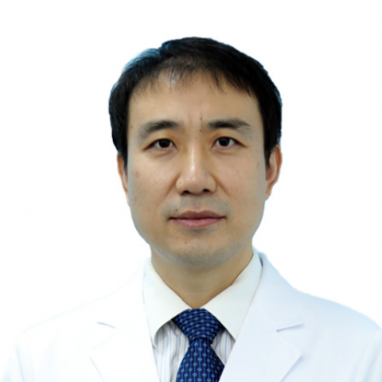

<!-- AUTO-GENERATED-BY: work/generate_obsidian_profiles.py -->

<!-- TEMPLATE: D:\workspace\信息收集整理\医生画像仓库\模板\医生画像模板.md -->

# 胡安斌

## 基础信息

| 字段 | 内容 |
|---|---|
| 姓名 | 胡安斌 |
| 医院 | 中山大学附属第一医院 |
| 科室 | 器官移植科 |
| 职称/身份 | 主任医师/教授 |
| 来源链接 | [官网原文](https://www.fahsysu.org.cn/node/5650) |
| 采集日期 | 2026-08-13 |

## 简介/擅长

主要进行肝脏移植/肝脏外科、胰岛/胰腺移植等工作，具体包括肝功能衰竭、肝脏肿瘤等肝移植或外科手术治疗疾病，糖尿病晚期等胰岛或胰腺移植治疗疾病，在国内外相关领域处于领先地位。 中山大学附属第一医院器官移植科教授，主任医师，博士生导师。 美国UCLA访问学者，广东省杰出青年医学人才，中山一院优秀青年人才，广东省器官医学与技术学会胰岛功能专委会主任委员，中国医师协会器官移植医师分会组织和细胞移植专委会委员，《中华器官移植杂志》通讯编委等。 主要进行肝脏移植、胰岛移植、胰腺移植、以及肝胆胰脾外科包括微创腔镜外科工作。 开展肝脏移植1000余例，开展我国华南地区首例胰岛移植已行40余例，开展胰腺移植100余例，在国内外相关领域处于领先地位。 共主持包括5项国家自然科学基金、1项863计划和1项广州市重大科技专项在内的14项课题； 发表SCI等论著50余篇； 申请专利4项； 获国家科技进步奖二等奖和广东省科技进步奖一等奖等6次； 获中山大学优秀党员、中山一院优秀党员等荣誉。

## 教育与进修经历

- 美国UCLA访问学者，广东省杰出青年医学人才，中山一院优秀青年人才，广东省器官医学与技术学会胰岛功能专委会主任委员，中国医师协会器官移植医师分会组织和细胞移植专委会委员，《中华器官移植杂志》通讯编委等。

## 科研项目与成果

- 共主持包括5项国家自然科学基金、1项863计划和1项广州市重大科技专项在内的14项课题；
- 申请专利4项；

## 论文与学术产出

- 发表SCI等论著50余篇；

## 可包装亮点

- 中山大学附属第一医院器官移植科教授，主任医师，博士生导师。
- 美国UCLA访问学者，广东省杰出青年医学人才，中山一院优秀青年人才，广东省器官医学与技术学会胰岛功能专委会主任委员，中国医师协会器官移植医师分会组织和细胞移植专委会委员，《中华器官移植杂志》通讯编委等。
- 共主持包括5项国家自然科学基金、1项863计划和1项广州市重大科技专项在内的14项课题；
- 发表SCI等论著50余篇；

## 重点疾病/人群标签

- 慢性病：糖尿病、肿瘤
- 肿瘤：糖尿病、肿瘤
- 生殖疾病：
- 免疫/风湿：
- 术后恢复/康复：
- 疑难重症：

## 证据摘录

> 只摘录官网公开信息中的短句或关键字段，不复制大段原文。

- 官网身份字段：主任医师/教授
- 官网简介/擅长：主要进行肝脏移植/肝脏外科、胰岛/胰腺移植等工作，具体包括肝功能衰竭、肝脏肿瘤等肝移植或外科手术治疗疾病，糖尿病晚期等胰岛或胰腺移植治疗疾病，在国内外相关领域处于领先地位。 中山大学附属第一医院器官移植科教授，主任医师，博士生导师。 美国UCLA访问学者，广东省杰出青年医学人才，中山一院优秀青年人才，广东省器官医学与技术学会胰岛功能专委会主任委员，中国医师协会器官移植医师分会组织和细胞移植专委会委员，《中华器官移植杂志》通讯编委等…
- 官网亮眼经历线索：中山大学附属第一医院器官移植科教授，主任医师，博士生导师。 美国UCLA访问学者，广东省杰出青年医学人才，中山一院优秀青年人才，广东省器官医学与技术学会胰岛功能专委会主任委员，中国医师协会器官移植医师分会组织和细胞移植专委会委员，《中华器官移植杂志》通讯编委等。 共主持包括5项国家自然科学基金、1项863计划和1项广州市重大科技专项在内的14项课题； 发表SCI等论著50余篇；
- 来源链接：https://www.fahsysu.org.cn/node/5650

## BD 画像摘要

胡安斌医生可作为慢性病、肿瘤方向的基础画像候选。后续 BD 使用应继续以官网来源和人工复核为准，不添加疗效承诺或无来源包装。

## 合规边界

- 仅使用医院官网、官方公众号、官方小程序等公开渠道。
- 不采集私人电话、私人微信、家庭住址、患者隐私或非公开排班信息。
- 不写“保证治愈”“疗效第一”“包治疑难杂症”等无法由官网证明的表述。
