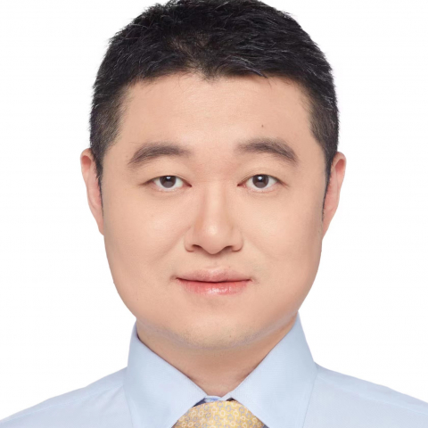

<!-- AUTO-GENERATED-BY: work/generate_obsidian_profiles.py -->

<!-- TEMPLATE: D:\workspace\信息收集整理\医生画像仓库\模板\医生画像模板.md -->

# 胡洵

## 基础信息

| 字段 | 内容 |
|---|---|
| 姓名 | 胡洵 |
| 医院 | 中山大学附属第一医院 |
| 科室 | 心内二科（心介科） |
| 职称/身份 | 副主任医师 |
| 来源链接 | [官网原文](https://www.fahsysu.org.cn/node/29234) |
| 采集日期 | 2026-08-13 |

## 简介/擅长

对冠心病、心脏瓣膜病、高血压、心力衰竭和心律失常等疾病有着丰富的治疗经验。 尤其擅长复杂高危冠心病介入手术及瓣膜病介入手术，每年完成近千例心血管介入手术。 工作经历： 2007.7~2019.6及2020.6~今：中山大学附属第一医院心内科从事临床工作 2019.7~2020.5：哥伦比亚大学纽约长老会医院心内科 冠心病介入手术进修 在中山一院率先开展生物可吸收支架植入，药物洗脱球囊治疗冠脉大血管病变等介入无植入技术； 率先广泛使用血管内超声、OCT、FFR等技术开展精准冠脉介入手术； 完成省内首例冲击波球囊治疗严重冠脉钙化病变。 2019亚太复杂介入病例大赛第一名。 多次在大型国际及国内学术会议上进行手术演示，并应邀赴国内20余家中心进行手术指导交流。 社会任职： 亚太介入心脏病学会委员（FAPSIC） 中国心血管医生创新俱乐部（CCI）执行委员 中国冠脉腔内影像学及功能学青年医师俱乐部（CCEC）会员 广东省药学会心血管联盟 常务委员 广东省介入性心脏病学会 理事 广东省医学会心血管病分会心血管影像学组 委员 广东省健康管理学会心血管病学专业委员会 委员

## 教育与进修经历

- 工作经历： 2007.7~2019.6及2020.6~今：中山大学附属第一医院心内科从事临床工作 2019.7~2020.5：哥伦比亚大学纽约长老会医院心内科 冠心病介入手术进修 在中山一院率先开展生物可吸收支架植入，药物洗脱球囊治疗冠脉大血管病变等介入无植入技术；

## 可包装亮点

- 工作经历： 2007.7~2019.6及2020.6~今：中山大学附属第一医院心内科从事临床工作 2019.7~2020.5：哥伦比亚大学纽约长老会医院心内科 冠心病介入手术进修 在中山一院率先开展生物可吸收支架植入，药物洗脱球囊治疗冠脉大血管病变等介入无植入技术；
- 率先广泛使用血管内超声、OCT、FFR等技术开展精准冠脉介入手术；
- 社会任职： 亚太介入心脏病学会委员（FAPSIC） 中国心血管医生创新俱乐部（CCI）执行委员 中国冠脉腔内影像学及功能学青年医师俱乐部（CCEC）会员 广东省药学会心血管联盟 常务委员 广东省介入性心脏病学会 理事 广东省医学会心血管病分会心血管影像学组 委员 广东省健康管理学会心血管病学专业委员会 委员

## 重点疾病/人群标签

- 慢性病：高血压、冠心病、心力衰竭、复杂、高危
- 肿瘤：
- 生殖疾病：
- 免疫/风湿：
- 术后恢复/康复：
- 疑难重症：高血压、冠心病、心力衰竭、复杂、高危

## 证据摘录

> 只摘录官网公开信息中的短句或关键字段，不复制大段原文。

- 官网身份字段：副主任医师
- 官网简介/擅长：对冠心病、心脏瓣膜病、高血压、心力衰竭和心律失常等疾病有着丰富的治疗经验。 尤其擅长复杂高危冠心病介入手术及瓣膜病介入手术，每年完成近千例心血管介入手术。 工作经历： 2007.7~2019.6及2020.6~今：中山大学附属第一医院心内科从事临床工作 2019.7~2020.5：哥伦比亚大学纽约长老会医院心内科 冠心病介入手术进修 在中山一院率先开展生物可吸收支架植入，药物洗脱球囊治疗冠脉大血管病变等介入无植入技术； 率先广泛使用血…
- 官网亮眼经历线索：工作经历： 2007.7~2019.6及2020.6~今：中山大学附属第一医院心内科从事临床工作 2019.7~2020.5：哥伦比亚大学纽约长老会医院心内科 冠心病介入手术进修 在中山一院率先开展生物可吸收支架植入，药物洗脱球囊治疗冠脉大血管病变等介入无植入技术； 率先广泛使用血管内超声、OCT、FFR等技术开展精准冠脉介入手术； 社会任职： 亚太介入心脏病学会委员（FAPSIC） 中国心血管医生创新俱乐部（CCI）执行委员 中国冠…
- 来源链接：https://www.fahsysu.org.cn/node/29234

## BD 画像摘要

胡洵医生可作为慢性病、疑难重症方向的基础画像候选。后续 BD 使用应继续以官网来源和人工复核为准，不添加疗效承诺或无来源包装。

## 合规边界

- 仅使用医院官网、官方公众号、官方小程序等公开渠道。
- 不采集私人电话、私人微信、家庭住址、患者隐私或非公开排班信息。
- 不写“保证治愈”“疗效第一”“包治疑难杂症”等无法由官网证明的表述。
