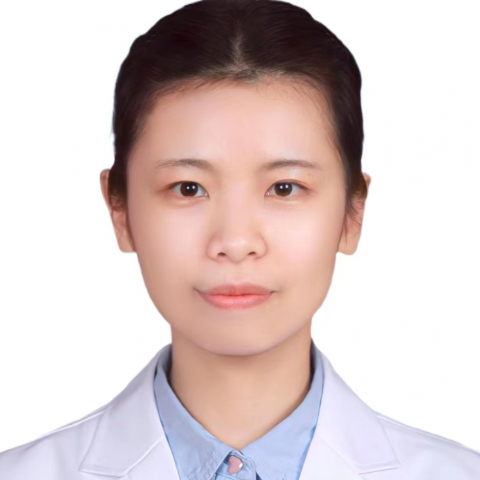

<!-- AUTO-GENERATED-BY: work/generate_obsidian_profiles.py -->

<!-- TEMPLATE: D:\workspace\信息收集整理\医生画像仓库\模板\医生画像模板.md -->

# 花蕊熙

## 基础信息

| 字段 | 内容 |
|---|---|
| 姓名 | 花蕊熙 |
| 医院 | 中山大学附属第一医院 |
| 科室 | 肿瘤科 |
| 职称/身份 | 副主任医师 |
| 来源链接 | [官网原文](https://www.fahsysu.org.cn/node/25605) |
| 采集日期 | 2026-08-13 |

## 简介/擅长

成人恶性肿瘤的内科治疗（化疗、靶向治疗、免疫治疗等）及病情评估。 从事肿瘤内科临床工作十余年，积累了丰富的临床经验。 工作经历： 2004年-2012年：复旦大学临床医学八年制专业（本硕博连读），获肿瘤学博士学位。 2012年至今：中山大学附属第一医院肿瘤科工作，历任住院医师、主治医师、副主任医师。 科研情况 ： 主持国家自然科学基金1项，广东省自然科学基金1项。 以第一作者身份发表肿瘤领域SCI论文多篇。 学术任职： 广东省医学会肿瘤学分会青年委员会委员。

## 教育与进修经历

- 工作经历： 2004年-2012年：复旦大学临床医学八年制专业（本硕博连读），获肿瘤学博士学位。

## 科研项目与成果

- 科研情况 ： 主持国家自然科学基金1项，广东省自然科学基金1项。

## 论文与学术产出

- 以第一作者身份发表肿瘤领域SCI论文多篇。

## 可包装亮点

- 2012年至今：中山大学附属第一医院肿瘤科工作，历任住院医师、主治医师、副主任医师。
- 科研情况 ： 主持国家自然科学基金1项，广东省自然科学基金1项。
- 以第一作者身份发表肿瘤领域SCI论文多篇。
- 学术任职： 广东省医学会肿瘤学分会青年委员会委员。

## 重点疾病/人群标签

- 慢性病：
- 肿瘤：肿瘤、化疗、靶向、免疫
- 生殖疾病：
- 免疫/风湿：肿瘤、化疗、靶向、免疫
- 术后恢复/康复：
- 疑难重症：

## 证据摘录

> 只摘录官网公开信息中的短句或关键字段，不复制大段原文。

- 官网身份字段：副主任医师
- 官网简介/擅长：成人恶性肿瘤的内科治疗（化疗、靶向治疗、免疫治疗等）及病情评估。 从事肿瘤内科临床工作十余年，积累了丰富的临床经验。 工作经历： 2004年-2012年：复旦大学临床医学八年制专业（本硕博连读），获肿瘤学博士学位。 2012年至今：中山大学附属第一医院肿瘤科工作，历任住院医师、主治医师、副主任医师。 科研情况 ： 主持国家自然科学基金1项，广东省自然科学基金1项。 以第一作者身份发表肿瘤领域SCI论文多篇。 学术任职： 广东省医学会肿…
- 官网亮眼经历线索：2012年至今：中山大学附属第一医院肿瘤科工作，历任住院医师、主治医师、副主任医师。 科研情况 ： 主持国家自然科学基金1项，广东省自然科学基金1项。 以第一作者身份发表肿瘤领域SCI论文多篇。 学术任职： 广东省医学会肿瘤学分会青年委员会委员。
- 来源链接：https://www.fahsysu.org.cn/node/25605

## BD 画像摘要

花蕊熙医生可作为肿瘤、免疫/风湿/感染方向的基础画像候选。后续 BD 使用应继续以官网来源和人工复核为准，不添加疗效承诺或无来源包装。

## 合规边界

- 仅使用医院官网、官方公众号、官方小程序等公开渠道。
- 不采集私人电话、私人微信、家庭住址、患者隐私或非公开排班信息。
- 不写“保证治愈”“疗效第一”“包治疑难杂症”等无法由官网证明的表述。
