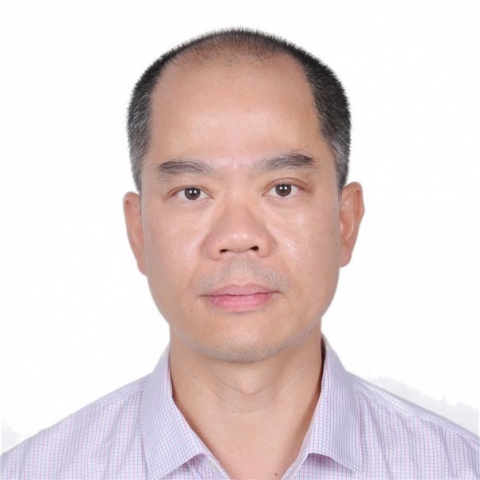

<!-- AUTO-GENERATED-BY: work/generate_obsidian_profiles.py -->

<!-- TEMPLATE: D:\workspace\信息收集整理\医生画像仓库\模板\医生画像模板.md -->

# 苏培强

## 基础信息

| 字段 | 内容 |
|---|---|
| 姓名 | 苏培强 |
| 医院 | 中山大学附属第一医院 |
| 科室 | 脊柱外科 |
| 职称/身份 | 主任医师/教授/研究员 |
| 来源链接 | [官网原文](https://www.fahsysu.org.cn/node/5609) |
| 采集日期 | 2026-08-13 |

## 简介/擅长

脊柱侧/后凸、颈椎病、胸腰椎管狭窄、腰椎滑脱、脊柱截骨矫形术、脊柱肿瘤完整切除、后路寰枢椎固定、脊柱微创手术等，尤其对脊柱外科核心技术--椎弓根螺钉精准置入有独到研究。 入选国家级高层次领军人才，长期与广东省教育厅、广东省疾病预防控制中心合作，在广东省内开展脊柱侧弯普查，并主导成立广东省儿童青少年脊柱侧弯科普基地。 科研工作上开展定位致病基因、研究发病机制，协助阻断疾病遗传至下一代等一系列工作。 研究方向:脊柱外科、 骨骼系统发育畸形及退行性病变 主要教育和工作经历: 教育经历: 2008 年毕业于中山大学获骨科学博士学位 2003 年毕业于中山大学获外科学硕士学位 1998 年毕业于中山医科大学获临床医学学士学位 工作经历: 现任中山大学附属第一医院 骨科-显微外科医学部副主任、 脊柱外科副主任、 骨显微教职工第一党支部 书记、 脊柱侧弯研究中心主任。 2017 年至今 中山大学附属第一医院 教授/主任医师/研究员 2016 年至今 中山大学附属第一医院 主任医师/研究员 2013 年至 2016 年 中山大学附属第一医院 研究员 2011 年至 2013 年 美国德州大学西南医学研究中心 联合博士后培训 2009 ...

## 教育与进修经历

- 研究方向:脊柱外科、 骨骼系统发育畸形及退行性病变 主要教育和工作经历: 教育经历: 2008 年毕业于中山大学获骨科学博士学位 2003 年毕业于中山大学获外科学硕士学位 1998 年毕业于中山医科大学获临床医学学士学位 工作经历: 现任中山大学附属第一医院 骨科-显微外科医学部副主任、 脊柱外科副主任、 骨显微教职工第一党支部 书记、 脊柱侧弯研究中心主任。
- 2017 年至今 中山大学附属第一医院 教授/主任医师/研究员 2016 年至今 中山大学附属第一医院 主任医师/研究员 2013 年至 2016 年 中山大学附属第一医院 研究员 2011 年至 2013 年 美国德州大学西南医学研究中心 联合博士后培训 2009 年至 2013 年 中山大学附属第一医院 副教授/副主任医师 2005 年 香港中文大学威尔斯亲王医院 进修临床医师 2003 年至 2009 年 中山大学附属第二医院 住院医师、 主治医师 1998 年至 2000 年 深圳沙井人民医院 住院医师…

## 科研项目与成果

- 科研工作上开展定位致病基因、研究发病机制，协助阻断疾病遗传至下一代等一系列工作。
- 其他主要工作成绩(比如获奖情况): 团队至今累计获批 30 余项国家自然科学基金项目， 苏培强教授作为项目负责人获得 1项国家自然科学基金重点项目、 1 项国家自然科学基金重大培育研究计划、 5 项国家自然科学基金面上项目、 1 项国家自然科学基金青年项目， 以及多项省市重点项目。
- 入选国家级高层次领军人才、 教育部新世纪优秀人才支持计划、 广东特支计划百千万工程领军人才项目、中山一院“三个三”及“五个五”人才支持项目。
- 研究成果获得广东省自然科学奖二等奖、 中华医学科技奖三等奖和广东省优秀医药成果奖。

## 可包装亮点

- 擅长脊柱侧/后凸、颈椎病、胸腰椎管狭窄、腰椎滑脱、脊柱截骨矫形术、脊柱肿瘤完整切除、后路寰枢椎固定、脊柱微创手术等，尤其对脊柱外科核心技术--椎弓根螺钉精准置入有独到研究。
- 入选国家级高层次领军人才，长期与广东省教育厅、广东省疾病预防控制中心合作，在广东省内开展脊柱侧弯普查，并主导成立广东省儿童青少年脊柱侧弯科普基地。
- 医疗特长： 擅长脊柱侧/后凸、颈椎病、胸腰椎管狭窄、腰椎滑脱、脊柱截骨矫形术、脊柱肿瘤完整切除、后路寰枢椎固定、脊柱微创手术等，尤其对脊柱外科核心技术--椎弓根螺钉精准置入有独到研究。

## 重点疾病/人群标签

- 慢性病：
- 肿瘤：肿瘤、康复
- 生殖疾病：
- 免疫/风湿：
- 术后恢复/康复：肿瘤、康复
- 疑难重症：

## 证据摘录

> 只摘录官网公开信息中的短句或关键字段，不复制大段原文。

- 官网身份字段：主任医师/教授/研究员
- 官网简介/擅长：脊柱侧/后凸、颈椎病、胸腰椎管狭窄、腰椎滑脱、脊柱截骨矫形术、脊柱肿瘤完整切除、后路寰枢椎固定、脊柱微创手术等，尤其对脊柱外科核心技术--椎弓根螺钉精准置入有独到研究。 入选国家级高层次领军人才，长期与广东省教育厅、广东省疾病预防控制中心合作，在广东省内开展脊柱侧弯普查，并主导成立广东省儿童青少年脊柱侧弯科普基地。 科研工作上开展定位致病基因、研究发病机制，协助阻断疾病遗传至下一代等一系列工作。 研究方向:脊柱外科、 骨骼系统发育畸形…
- 官网亮眼经历线索：擅长脊柱侧/后凸、颈椎病、胸腰椎管狭窄、腰椎滑脱、脊柱截骨矫形术、脊柱肿瘤完整切除、后路寰枢椎固定、脊柱微创手术等，尤其对脊柱外科核心技术--椎弓根螺钉精准置入有独到研究。 入选国家级高层次领军人才，长期与广东省教育厅、广东省疾病预防控制中心合作，在广东省内开展脊柱侧弯普查，并主导成立广东省儿童青少年脊柱侧弯科普基地。 医疗特长： 擅长脊柱侧/后凸、颈椎病、胸腰椎管狭窄、腰椎滑脱、脊柱截骨矫形术、脊柱肿瘤完整切除、后路寰枢椎固定、脊柱…
- 来源链接：https://www.fahsysu.org.cn/node/5609

## BD 画像摘要

苏培强医生可作为肿瘤、术后恢复/康复方向的基础画像候选。后续 BD 使用应继续以官网来源和人工复核为准，不添加疗效承诺或无来源包装。

## 合规边界

- 仅使用医院官网、官方公众号、官方小程序等公开渠道。
- 不采集私人电话、私人微信、家庭住址、患者隐私或非公开排班信息。
- 不写“保证治愈”“疗效第一”“包治疑难杂症”等无法由官网证明的表述。
