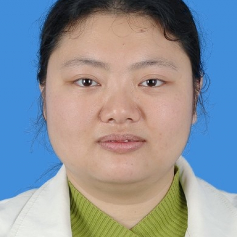

<!-- AUTO-GENERATED-BY: work/generate_obsidian_profiles.py -->

<!-- TEMPLATE: D:\workspace\信息收集整理\医生画像仓库\模板\医生画像模板.md -->

# 苏春华

## 基础信息

| 字段 | 内容 |
|---|---|
| 姓名 | 苏春华 |
| 医院 | 中山大学附属第一医院 |
| 科室 | 胸外科 |
| 职称/身份 | 副主任医师 |
| 来源链接 | [官网原文](https://www.fahsysu.org.cn/node/709) |
| 采集日期 | 2026-08-13 |

## 简介/擅长

现为中山大学附属一院胸外科副主任医师。 在本院从事胸外科已有10余年。 具有严谨慎密的临床思维及细致娴熟的操作技能，热忱服务于患者，受到患者赞誉。 在胸外科胸腔镜手术方面有较深的造诣。 在肺癌手术、化疗和靶向治疗，食管癌手术和化疗，重症肌无力内外科处理及胸腺瘤的手术治疗以及肺大疱、支气管扩张症、手足多汗症等手术治疗方面，都有丰富的临床经验及独到心得。 在食管癌研究和重症肌无力及胸外科术后疼痛方面均有第一作者SCI文章发表。 现主持研究科研基金2项，内容主要为肺癌食管癌的治疗。 研究方向： 肺癌、食管癌、重症肌无力、胸腺瘤、肺大疱等 主要教育和工作经历： 1994.9 1999.7 中山医科大学临床医疗系 本科生 1999.7 2000.8 广州市第六人民医院外科 住院医师 2000.9 2003.7 中山大学附属第一医院心胸外科 临床型硕士 2003.7 2005.5 中山大学附属第一医院黄埔院区外科 住院医生 2005.9 2008.7 中山大学附属第一医院外科 临床型博士 2005.5 2012.12 中山大学附属第一医院胸外科 主治医师 2013.1 至今 中山大学附属第一医院胸外科 副主任医师 社会兼职： 中山...

## 科研项目与成果

- 现主持研究科研基金2项，内容主要为肺癌食管癌的治疗。

## 论文与学术产出

- 在食管癌研究和重症肌无力及胸外科术后疼痛方面均有第一作者SCI文章发表。

## 可包装亮点

- 现为中山大学附属一院胸外科副主任医师。
- 在食管癌研究和重症肌无力及胸外科术后疼痛方面均有第一作者SCI文章发表。
- 医疗特长： 现为中山大学附属一院胸外科副主任医师。

## 重点疾病/人群标签

- 慢性病：
- 肿瘤：肿瘤、癌、瘤、化疗、靶向、肺癌、术后、疼痛、重症
- 生殖疾病：
- 免疫/风湿：
- 术后恢复/康复：肿瘤、癌、瘤、化疗、靶向、肺癌、术后、疼痛、重症
- 疑难重症：肿瘤、癌、瘤、化疗、靶向、肺癌、术后、疼痛、重症

## 证据摘录

> 只摘录官网公开信息中的短句或关键字段，不复制大段原文。

- 官网身份字段：副主任医师
- 官网简介/擅长：现为中山大学附属一院胸外科副主任医师。 在本院从事胸外科已有10余年。 具有严谨慎密的临床思维及细致娴熟的操作技能，热忱服务于患者，受到患者赞誉。 在胸外科胸腔镜手术方面有较深的造诣。 在肺癌手术、化疗和靶向治疗，食管癌手术和化疗，重症肌无力内外科处理及胸腺瘤的手术治疗以及肺大疱、支气管扩张症、手足多汗症等手术治疗方面，都有丰富的临床经验及独到心得。 在食管癌研究和重症肌无力及胸外科术后疼痛方面均有第一作者SCI文章发表。 现主持研究…
- 官网亮眼经历线索：现为中山大学附属一院胸外科副主任医师。 在食管癌研究和重症肌无力及胸外科术后疼痛方面均有第一作者SCI文章发表。 医疗特长： 现为中山大学附属一院胸外科副主任医师。 在食管癌研究和重症肌无力及胸外科术后疼痛方面均有第一作者SCI文章发表。
- 来源链接：https://www.fahsysu.org.cn/node/709

## BD 画像摘要

苏春华医生可作为肿瘤、术后恢复/康复、疑难重症方向的基础画像候选。后续 BD 使用应继续以官网来源和人工复核为准，不添加疗效承诺或无来源包装。

## 合规边界

- 仅使用医院官网、官方公众号、官方小程序等公开渠道。
- 不采集私人电话、私人微信、家庭住址、患者隐私或非公开排班信息。
- 不写“保证治愈”“疗效第一”“包治疑难杂症”等无法由官网证明的表述。
