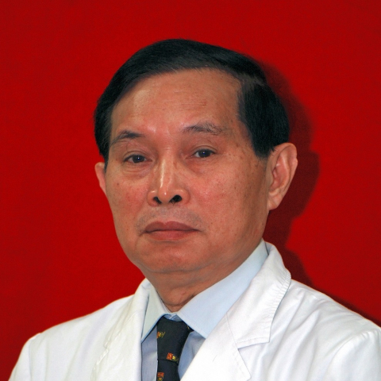

<!-- AUTO-GENERATED-BY: work/generate_obsidian_profiles.py -->

<!-- TEMPLATE: D:\workspace\信息收集整理\医生画像仓库\模板\医生画像模板.md -->

# 詹文华

## 基础信息

| 字段 | 内容 |
|---|---|
| 姓名 | 詹文华 |
| 医院 | 中山大学附属第一医院 |
| 科室 | 普通外科 |
| 职称/身份 | 主任医师/教授 |
| 来源链接 | [官网原文](https://www.fahsysu.org.cn/node/619) |
| 采集日期 | 2026-08-13 |

## 简介/擅长

从事普通外科工作四十六年，在胃肠胰腺外科及其营养支持方面积累了丰富的临床经验。 主要医疗专长是胃肠和胰腺肿瘤的诊断和外科治疗，胃癌病人手术后生存率有明显提高。 是目前国内业界公认的胃癌标准淋巴结清扫和胃癌扩大切除手术的领军人物，先后受国内30多个省市大型医疗单位邀请进行胃癌、胃肠间质瘤的手术表演和学术演讲。 为国内胃癌的标准化治疗作出了重要贡献，曾获邀分别在瑞士、意大利、日本、韩国、美国、巴西等举行的国际大型专业学术会议上作学术报告和担任会议主席。 与本院器官移植科合作成功完成亚洲第一例腹部多器官移植和胃癌结直肠癌并肝转移的肝移植。 1994年率先在国内提倡和开展结肠癌全直肠系膜切除手术，并在国内率先报告应用结肠贮袋重建直肠术的随机对照研究结果。 2004年至2008年期间，先后牵头全国范围的16家大型教学医院进行高风险复发转移胃肠间质瘤病人的术后辅助治疗的研究和胃肠手术后低氮低热卡营养支持的临床随机对照研究。 近10年来，多次担任中华医学会全国胃肠外科会议主席和两次担任中华医学会国际肠外肠内营养会议会长兼主席。 在全国有甚高的知名度，在国际胃肠外科学界有一定的知名度。 研究方向： 1、胃肠道癌肿特别是胃癌的诊断及外科...

## 教育与进修经历

- 主要教育和工作经历： 1979、9—1982、7 中山医科大学硕士研究生毕业 1982、7— 至今 中山大学附属第一医院胃肠胰外科工作 1991、1—7 香港大学医学院进修 1992、12—1993、3 日本长崎大学任客座研究员 1994、12 中山大学附属第一医院 破格晋升教授、主任医师 1998、3－ 2002、3 中山大学附属第一医院普通外科主任兼胃肠胰专科主任 1996、6—2000、6 中山大学附属第一医院常务副院长 2000、6—2004、12 中山大学附属第一医院院长 2004、6—2008、7 中…

## 论文与学术产出

- 担任《消化肿瘤杂志（电子版）》名誉主编，《中华普通外科杂志》副主编及国内其他10余种专业杂志编委，欧洲《Hepato-Gastroenterology》和亚洲《Asian Surgery》编委。

## 可包装亮点

- 为国内胃癌的标准化治疗作出了重要贡献，曾获邀分别在瑞士、意大利、日本、韩国、美国、巴西等举行的国际大型专业学术会议上作学术报告和担任会议主席。
- 1994年率先在国内提倡和开展结肠癌全直肠系膜切除手术，并在国内率先报告应用结肠贮袋重建直肠术的随机对照研究结果。
- 近10年来，多次担任中华医学会全国胃肠外科会议主席和两次担任中华医学会国际肠外肠内营养会议会长兼主席。

## 重点疾病/人群标签

- 慢性病：
- 肿瘤：肿瘤、癌、瘤、胃癌、肠癌、术后、营养、危重
- 生殖疾病：
- 免疫/风湿：
- 术后恢复/康复：肿瘤、癌、瘤、胃癌、肠癌、术后、营养、危重
- 疑难重症：肿瘤、癌、瘤、胃癌、肠癌、术后、营养、危重

## 证据摘录

> 只摘录官网公开信息中的短句或关键字段，不复制大段原文。

- 官网身份字段：主任医师/教授
- 官网简介/擅长：从事普通外科工作四十六年，在胃肠胰腺外科及其营养支持方面积累了丰富的临床经验。 主要医疗专长是胃肠和胰腺肿瘤的诊断和外科治疗，胃癌病人手术后生存率有明显提高。 是目前国内业界公认的胃癌标准淋巴结清扫和胃癌扩大切除手术的领军人物，先后受国内30多个省市大型医疗单位邀请进行胃癌、胃肠间质瘤的手术表演和学术演讲。 为国内胃癌的标准化治疗作出了重要贡献，曾获邀分别在瑞士、意大利、日本、韩国、美国、巴西等举行的国际大型专业学术会议上作学术报告和…
- 官网亮眼经历线索：为国内胃癌的标准化治疗作出了重要贡献，曾获邀分别在瑞士、意大利、日本、韩国、美国、巴西等举行的国际大型专业学术会议上作学术报告和担任会议主席。 1994年率先在国内提倡和开展结肠癌全直肠系膜切除手术，并在国内率先报告应用结肠贮袋重建直肠术的随机对照研究结果。 近10年来，多次担任中华医学会全国胃肠外科会议主席和两次担任中华医学会国际肠外肠内营养会议会长兼主席。 为国内胃癌的标准化治疗作出了重要贡献，曾获邀分别在瑞士、意大利、日本、韩国…
- 来源链接：https://www.fahsysu.org.cn/node/619

## BD 画像摘要

詹文华医生可作为肿瘤、术后恢复/康复、疑难重症方向的基础画像候选。后续 BD 使用应继续以官网来源和人工复核为准，不添加疗效承诺或无来源包装。

## 合规边界

- 仅使用医院官网、官方公众号、官方小程序等公开渠道。
- 不采集私人电话、私人微信、家庭住址、患者隐私或非公开排班信息。
- 不写“保证治愈”“疗效第一”“包治疑难杂症”等无法由官网证明的表述。
