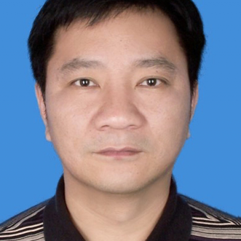

<!-- AUTO-GENERATED-BY: work/generate_obsidian_profiles.py -->

<!-- TEMPLATE: D:\workspace\信息收集整理\医生画像仓库\模板\医生画像模板.md -->

# 许多荣

## 基础信息

| 字段 | 内容 |
|---|---|
| 姓名 | 许多荣 |
| 医院 | 中山大学附属第一医院 |
| 科室 | 血液内科 |
| 职称/身份 | 教授 |
| 来源链接 | [官网原文](https://www.fahsysu.org.cn/node/771) |
| 采集日期 | 2026-08-13 |

## 简介/擅长

从事临床工作20余年，掌握血液系统常见疾病和疑难疾病的诊治。 尤其对白血病的诊断与治疗具有丰富的经验，主攻方向为造血干细胞移植。 研究方向：造血干细胞移植治疗恶性血液病 主要教育和工作经历： 1986.09-1991.07 安徽省皖南医学院临床医学系，学士学位。 1991.09-1995.07 安徽省皖南医学院附属第一医院内科，住院医师。 1995.08-1998.09 中山大学附属第一医院内科 ， 硕士学位。 2001.07-2004.12 中山大学附属第一医院内科，博士学位、主治医师。 2002.04-2004.07 美国亚拉巴马大学伯明翰医学院， 博士后访问学者。 2006.01-2011.12 中山大学附属第一医院内科，副教授/副主任医师。 2012.01-现在 中山大学附属第一医院内科，主任医师。 社会兼职：中华医学会广东血液学分会委员，广州市抗癌协会常委，中华骨髓库广东分库专家。 论著： 1. Functional identification of three RANK cytoplasmic motif mediating osteoclast diffe人tiation and function. J...

## 教育与进修经历

- 研究方向：造血干细胞移植治疗恶性血液病 主要教育和工作经历： 1986.09-1991.07 安徽省皖南医学院临床医学系，学士学位。
- 1995.08-1998.09 中山大学附属第一医院内科 ， 硕士学位。
- 2001.07-2004.12 中山大学附属第一医院内科，博士学位、主治医师。
- 2002.04-2004.07 美国亚拉巴马大学伯明翰医学院， 博士后访问学者。

## 可包装亮点

- 从事临床工作20余年，掌握血液系统常见疾病和疑难疾病的诊治。
- 医疗特长：从事临床工作20余年，掌握血液系统常见疾病和疑难疾病的诊治。
- 2002.04-2004.07 美国亚拉巴马大学伯明翰医学院， 博士后访问学者。
- 2006.01-2011.12 中山大学附属第一医院内科，副教授/副主任医师。

## 重点疾病/人群标签

- 慢性病：
- 肿瘤：癌、白血病、疑难
- 生殖疾病：
- 免疫/风湿：
- 术后恢复/康复：
- 疑难重症：癌、白血病、疑难

## 证据摘录

> 只摘录官网公开信息中的短句或关键字段，不复制大段原文。

- 官网身份字段：教授
- 官网简介/擅长：从事临床工作20余年，掌握血液系统常见疾病和疑难疾病的诊治。 尤其对白血病的诊断与治疗具有丰富的经验，主攻方向为造血干细胞移植。 研究方向：造血干细胞移植治疗恶性血液病 主要教育和工作经历： 1986.09-1991.07 安徽省皖南医学院临床医学系，学士学位。 1991.09-1995.07 安徽省皖南医学院附属第一医院内科，住院医师。 1995.08-1998.09 中山大学附属第一医院内科 ， 硕士学位。 2001.07-200…
- 官网亮眼经历线索：从事临床工作20余年，掌握血液系统常见疾病和疑难疾病的诊治。 医疗特长：从事临床工作20余年，掌握血液系统常见疾病和疑难疾病的诊治。 2002.04-2004.07 美国亚拉巴马大学伯明翰医学院， 博士后访问学者。 2006.01-2011.12 中山大学附属第一医院内科，副教授/副主任医师。
- 来源链接：https://www.fahsysu.org.cn/node/771

## BD 画像摘要

许多荣医生可作为肿瘤、疑难重症方向的基础画像候选。后续 BD 使用应继续以官网来源和人工复核为准，不添加疗效承诺或无来源包装。

## 合规边界

- 仅使用医院官网、官方公众号、官方小程序等公开渠道。
- 不采集私人电话、私人微信、家庭住址、患者隐私或非公开排班信息。
- 不写“保证治愈”“疗效第一”“包治疑难杂症”等无法由官网证明的表述。
