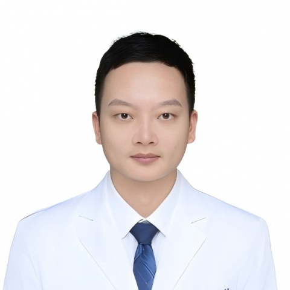

<!-- AUTO-GENERATED-BY: work/generate_obsidian_profiles.py -->

<!-- TEMPLATE: D:\workspace\信息收集整理\医生画像仓库\模板\医生画像模板.md -->

# 许琼聪

## 基础信息

| 字段 | 内容 |
|---|---|
| 姓名 | 许琼聪 |
| 医院 | 中山大学附属第一医院 |
| 科室 | 胆胰外科 |
| 职称/身份 | 副主任医师 |
| 来源链接 | [官网原文](https://www.fahsysu.org.cn/node/35662) |
| 采集日期 | 2026-08-13 |

## 简介/擅长

长期从事肝胆胰脾外科疾病诊治工作，擅长胆道胰腺肿瘤、肝脏脾脏肿瘤以及胆囊结石等良性疾病的诊治； 对复杂、疑难病例的诊治与围手术期管理也有较丰富的临床经验； 精通肿瘤多模式诊疗体系，擅长肝胆胰脾肿瘤外科手术，尤其注重微创手术治疗。 研究方向： 聚焦肝胆胰疾病的诊治，围绕肝脏、胆道和胰腺肿瘤的诊疗及其复发耐药机制展开研究。 主持多项国自然及省部级基金； 以第一/通讯（共同）作者身份在“Oncogene”、 “Molecular Therapy”、 “Advanced Science”等杂志发表多篇文章。 主要教育和工作经历： 2010-2015年就读于中山大学中山医学院临床医学，获得本科学位； 2015-2018年师从中山大学附属第一医院肝胆胰外科专家赖佳明教授，获得硕士学位； 2018-2021年师从中山大学附属第一医院肝胆胰外科专家殷晓煜教授，获得博士学位； 2021-2023年在中山大学附属第一医院从事肝胆胰肿瘤诊疗及其复发耐药机制的博士后研究工作； 2021年博士毕业后一直于中山大学附属第一医院肝胆/胆胰外科工作至今，历任住院医师、主治医师、副主任医师。 社会兼职： 广东省临床医学学会肝胆胰外科专业委员会委员/秘书...

## 教育与进修经历

- 主要教育和工作经历： 2010-2015年就读于中山大学中山医学院临床医学，获得本科学位；
- 2015-2018年师从中山大学附属第一医院肝胆胰外科专家赖佳明教授，获得硕士学位；
- 2018-2021年师从中山大学附属第一医院肝胆胰外科专家殷晓煜教授，获得博士学位；
- 2021-2023年在中山大学附属第一医院从事肝胆胰肿瘤诊疗及其复发耐药机制的博士后研究工作；

## 科研项目与成果

- 主持多项国自然及省部级基金；

## 论文与学术产出

- 以第一/通讯（共同）作者身份在“Oncogene”、 “Molecular Therapy”、 “Advanced Science”等杂志发表多篇文章。

## 可包装亮点

- 对复杂、疑难病例的诊治与围手术期管理也有较丰富的临床经验；
- 以第一/通讯（共同）作者身份在“Oncogene”、 “Molecular Therapy”、 “Advanced Science”等杂志发表多篇文章。
- 2021年博士毕业后一直于中山大学附属第一医院肝胆/胆胰外科工作至今，历任住院医师、主治医师、副主任医师。

## 重点疾病/人群标签

- 慢性病：
- 肿瘤：肿瘤、疑难、复杂
- 生殖疾病：
- 免疫/风湿：
- 术后恢复/康复：
- 疑难重症：肿瘤、疑难、复杂

## 证据摘录

> 只摘录官网公开信息中的短句或关键字段，不复制大段原文。

- 官网身份字段：副主任医师
- 官网简介/擅长：长期从事肝胆胰脾外科疾病诊治工作，擅长胆道胰腺肿瘤、肝脏脾脏肿瘤以及胆囊结石等良性疾病的诊治； 对复杂、疑难病例的诊治与围手术期管理也有较丰富的临床经验； 精通肿瘤多模式诊疗体系，擅长肝胆胰脾肿瘤外科手术，尤其注重微创手术治疗。 研究方向： 聚焦肝胆胰疾病的诊治，围绕肝脏、胆道和胰腺肿瘤的诊疗及其复发耐药机制展开研究。 主持多项国自然及省部级基金； 以第一/通讯（共同）作者身份在“Oncogene”、 “Molecular Thera…
- 官网亮眼经历线索：对复杂、疑难病例的诊治与围手术期管理也有较丰富的临床经验； 对复杂、疑难病例的诊治与围手术期管理也有较丰富的临床经验； 以第一/通讯（共同）作者身份在“Oncogene”、 “Molecular Therapy”、 “Advanced Science”等杂志发表多篇文章。 2021年博士毕业后一直于中山大学附属第一医院肝胆/胆胰外科工作至今，历任住院医师、主治医师、副主任医师。
- 来源链接：https://www.fahsysu.org.cn/node/35662

## BD 画像摘要

许琼聪医生可作为肿瘤、疑难重症方向的基础画像候选。后续 BD 使用应继续以官网来源和人工复核为准，不添加疗效承诺或无来源包装。

## 合规边界

- 仅使用医院官网、官方公众号、官方小程序等公开渠道。
- 不采集私人电话、私人微信、家庭住址、患者隐私或非公开排班信息。
- 不写“保证治愈”“疗效第一”“包治疑难杂症”等无法由官网证明的表述。
