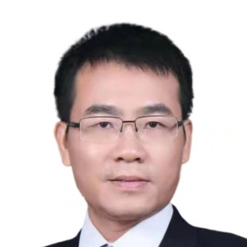

<!-- AUTO-GENERATED-BY: work/generate_obsidian_profiles.py -->

<!-- TEMPLATE: D:\workspace\信息收集整理\医生画像仓库\模板\医生画像模板.md -->

# 谢举临

## 基础信息

| 字段 | 内容 |
|---|---|
| 姓名 | 谢举临 |
| 医院 | 中山大学附属第一医院 |
| 科室 | 烧伤与创面修复科 |
| 职称/身份 | 主任医师 |
| 来源链接 | [官网原文](https://www.fahsysu.org.cn/node/663) |
| 采集日期 | 2026-08-13 |

## 简介/擅长

长期从事烧伤、瘢痕和各种急、慢性创面修复的临床和基础研究工作，擅长严重糖尿病足、静脉性溃疡、外伤、血管闭塞、褥疮等各种原因引起的慢性难治性皮肤创面的治疗，尤其应用先进技术治疗严重糖尿病足达到保肢效果。 擅长头面部、双手及各类复杂烧伤后遗畸形的瘢痕的综合治疗。 擅长大面积烧伤、高压电击伤、化学烧伤、手热压伤的治疗。 其他情况： 获得国家教育部科技进步一等奖1项，广东省科技进步二等奖1项，广东省科技进步三等奖1项，广州市科技进步二等奖1项。 获得国家发明和实用新型专利8项。 主持国家自然科学基金6项、省市科研基金10余项。 发表科研论文一百多篇，其中SCI论文30多篇。 中国医疗保健国际交流促进会烧伤医学分会 副主委 广东省健康管理学会创面修复专委会主任委员 广东省医学会烧伤分会副主任委员 中国医师协会创伤外科医师分会第三届委员会委员 中国医师协会整形美容分化瘢痕专业组常委 中国医疗保健国际交流促进会创面修复与再生分会 常委 中华医学会烧伤外科分会全国青年委员 国家卫生应急处置指导烧伤专业组专家 国家自然基金评审专家

## 科研项目与成果

- 获得国家发明和实用新型专利8项。
- 主持国家自然科学基金6项、省市科研基金10余项。
- 发表科研论文一百多篇，其中SCI论文30多篇。
- 中国医疗保健国际交流促进会烧伤医学分会 副主委 广东省健康管理学会创面修复专委会主任委员 广东省医学会烧伤分会副主任委员 中国医师协会创伤外科医师分会第三届委员会委员 中国医师协会整形美容分化瘢痕专业组常委 中国医疗保健国际交流促进会创面修复与再生分会 常委 中华医学会烧伤外科分会全国青年委员 国家卫生应急处置指导烧伤专业组专家 国家自然基金评审专家

## 论文与学术产出

- 发表科研论文一百多篇，其中SCI论文30多篇。

## 可包装亮点

- 其他情况： 获得国家教育部科技进步一等奖1项，广东省科技进步二等奖1项，广东省科技进步三等奖1项，广州市科技进步二等奖1项。
- 获得国家发明和实用新型专利8项。
- 主持国家自然科学基金6项、省市科研基金10余项。
- 发表科研论文一百多篇，其中SCI论文30多篇。

## 重点疾病/人群标签

- 慢性病：糖尿病、慢性、创面、烧伤、难治、复杂
- 肿瘤：
- 生殖疾病：
- 免疫/风湿：
- 术后恢复/康复：糖尿病、慢性、创面、烧伤、难治、复杂
- 疑难重症：糖尿病、慢性、创面、烧伤、难治、复杂

## 证据摘录

> 只摘录官网公开信息中的短句或关键字段，不复制大段原文。

- 官网身份字段：主任医师
- 官网简介/擅长：长期从事烧伤、瘢痕和各种急、慢性创面修复的临床和基础研究工作，擅长严重糖尿病足、静脉性溃疡、外伤、血管闭塞、褥疮等各种原因引起的慢性难治性皮肤创面的治疗，尤其应用先进技术治疗严重糖尿病足达到保肢效果。 擅长头面部、双手及各类复杂烧伤后遗畸形的瘢痕的综合治疗。 擅长大面积烧伤、高压电击伤、化学烧伤、手热压伤的治疗。 其他情况： 获得国家教育部科技进步一等奖1项，广东省科技进步二等奖1项，广东省科技进步三等奖1项，广州市科技进步二等奖1项…
- 官网亮眼经历线索：其他情况： 获得国家教育部科技进步一等奖1项，广东省科技进步二等奖1项，广东省科技进步三等奖1项，广州市科技进步二等奖1项。 获得国家发明和实用新型专利8项。 主持国家自然科学基金6项、省市科研基金10余项。 发表科研论文一百多篇，其中SCI论文30多篇。
- 来源链接：https://www.fahsysu.org.cn/node/663

## BD 画像摘要

谢举临医生可作为慢性病、术后恢复/康复、疑难重症方向的基础画像候选。后续 BD 使用应继续以官网来源和人工复核为准，不添加疗效承诺或无来源包装。

## 合规边界

- 仅使用医院官网、官方公众号、官方小程序等公开渠道。
- 不采集私人电话、私人微信、家庭住址、患者隐私或非公开排班信息。
- 不写“保证治愈”“疗效第一”“包治疑难杂症”等无法由官网证明的表述。
