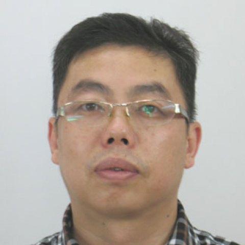

<!-- AUTO-GENERATED-BY: work/generate_obsidian_profiles.py -->

<!-- TEMPLATE: D:\workspace\信息收集整理\医生画像仓库\模板\医生画像模板.md -->

# 谢晓华

## 基础信息

| 字段 | 内容 |
|---|---|
| 姓名 | 谢晓华 |
| 医院 | 中山大学附属第一医院 |
| 科室 | 超声医学科、介入超声专科 |
| 职称/身份 | 主任医师 |
| 来源链接 | [官网原文](https://www.fahsysu.org.cn/node/5594) |
| 采集日期 | 2026-08-13 |

## 简介/擅长

## 教育与进修经历

- 研究方向：腹部疾病超声诊断、介入治疗与肿瘤消融治疗 教育和工作经历：1989年大学毕业，2011年获中山大学博士学位。

## 论文与学术产出

- 社会兼职： 广东省超声医学质控中心专家、秘书 中国医师协会介入医师分会介入超声专业委员 广东省医学教育协会超声医学专业委员会副主任委员 广东省医疗行业协会超声医学管理分会副主任委员 中国医学影像技术研究会腹部超声专业委员 广东省临床医学学会超声医学专业委员会第一届常委 广东省临床医学学会-华南名医专家委员会第一届委员 广东省超声医学工程学会理事 论著：发表SCI 30余篇，包括国际顶级期刊Gastroenterology、Radiology、European Radiology等，以及中华牌核心期刊10余篇 专著…

## 可包装亮点

- 社会兼职： 广东省超声医学质控中心专家、秘书 中国医师协会介入医师分会介入超声专业委员 广东省医学教育协会超声医学专业委员会副主任委员 广东省医疗行业协会超声医学管理分会副主任委员 中国医学影像技术研究会腹部超声专业委员 广东省临床医学学会超声医学专业委员会第一届常委 广东省临床医学学会-华南名医专家委员会第一届委员 广东省超声医学工程学会理事 论著：发表…

## 重点疾病/人群标签

- 慢性病：
- 肿瘤：肿瘤、肝癌、疑难、重症
- 生殖疾病：
- 免疫/风湿：
- 术后恢复/康复：
- 疑难重症：肿瘤、肝癌、疑难、重症

## 证据摘录

> 只摘录官网公开信息中的短句或关键字段，不复制大段原文。

- 官网身份字段：主任医师
- 官网亮眼经历线索：社会兼职： 广东省超声医学质控中心专家、秘书 中国医师协会介入医师分会介入超声专业委员 广东省医学教育协会超声医学专业委员会副主任委员 广东省医疗行业协会超声医学管理分会副主任委员 中国医学影像技术研究会腹部超声专业委员 广东省临床医学学会超声医学专业委员会第一届常委 广东省临床医学学会-华南名医专家委员会第一届委员 广东省超声医学工程学会理事 论著：发表SCI 30余篇，包括国际顶级期刊Gastroenterology、Radiol…
- 来源链接：https://www.fahsysu.org.cn/node/5594

## BD 画像摘要

谢晓华医生可作为肿瘤、疑难重症方向的基础画像候选。后续 BD 使用应继续以官网来源和人工复核为准，不添加疗效承诺或无来源包装。

## 合规边界

- 仅使用医院官网、官方公众号、官方小程序等公开渠道。
- 不采集私人电话、私人微信、家庭住址、患者隐私或非公开排班信息。
- 不写“保证治愈”“疗效第一”“包治疑难杂症”等无法由官网证明的表述。
