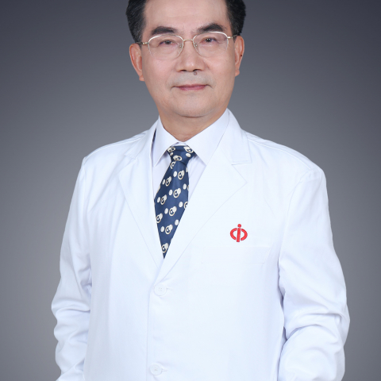

<!-- AUTO-GENERATED-BY: work/generate_obsidian_profiles.py -->

<!-- TEMPLATE: D:\workspace\信息收集整理\医生画像仓库\模板\医生画像模板.md -->

# 谢灿茂

## 基础信息

| 字段 | 内容 |
|---|---|
| 姓名 | 谢灿茂 |
| 医院 | 中山大学附属第一医院 |
| 科室 | 呼吸与危重症医学科 |
| 职称/身份 | 主任医师/教授 |
| 来源链接 | [官网原文](https://www.fahsysu.org.cn/node/800) |
| 采集日期 | 2026-08-13 |

## 简介/擅长

肺部感染性疾病、胸膜疾病、慢性阻塞性肺疾病、哮喘、肺部肿瘤和危重症监护医学等。 毕业于中山医学院，从医30多年。 1994年至1996年在美国加利福尼亚大学Irvine分校行博士后研究，同时被聘为加利福尼亚大学长滩退伍军人医学中心客座科学家。 从事呼吸内科医疗、教学和科研30多年。 主要从事胸膜疾病、肺感染性疾病、COPD、哮喘和危重症监护医学等临床和研究。 尤其专长于疑难病症的诊治。 现任中华医学会呼吸病学分会常委（肺癌学组副组长），广东省医学会常务理事，广东省医学会呼吸病学分会主任委员，广东省医学会内科学分会常务委员，广东省医院协会副会长。 中华医学会专家会员（FCMA）、美国胸科学会资深会员（FCCP）和美国重症医学会会员（SCCM）。 《中华结核和呼吸杂志》等多家杂志编委和特邀审稿专家，美国《International Pleural Newsletter》国际顾问，美国《Seminars in Respiratory and Critical Care Medicine》（SRCCM）中文版主编。

## 教育与进修经历

- 毕业于中山医学院，从医30多年。
- 1994年至1996年在美国加利福尼亚大学Irvine分校行博士后研究，同时被聘为加利福尼亚大学长滩退伍军人医学中心客座科学家。

## 科研项目与成果

- 从事呼吸内科医疗、教学和科研30多年。

## 论文与学术产出

- 《中华结核和呼吸杂志》等多家杂志编委和特邀审稿专家，美国《International Pleural Newsletter》国际顾问，美国《Seminars in Respiratory and Critical Care Medicine》（SRCCM）中文版主编。

## 可包装亮点

- 肺部感染性疾病、胸膜疾病、慢性阻塞性肺疾病、哮喘、肺部肿瘤和危重症监护医学等 医疗专长：肺部感染性疾病、胸膜疾病、慢性阻塞性肺疾病、哮喘、肺部肿瘤和危重症监护医学等。
- 1994年至1996年在美国加利福尼亚大学Irvine分校行博士后研究，同时被聘为加利福尼亚大学长滩退伍军人医学中心客座科学家。
- 主要从事胸膜疾病、肺感染性疾病、COPD、哮喘和危重症监护医学等临床和研究。
- 尤其专长于疑难病症的诊治。

## 重点疾病/人群标签

- 慢性病：慢性、肿瘤、肺癌、感染、疑难、危重、重症
- 肿瘤：慢性、肿瘤、肺癌、感染、疑难、危重、重症
- 生殖疾病：
- 免疫/风湿：慢性、肿瘤、肺癌、感染、疑难、危重、重症
- 术后恢复/康复：
- 疑难重症：慢性、肿瘤、肺癌、感染、疑难、危重、重症

## 证据摘录

> 只摘录官网公开信息中的短句或关键字段，不复制大段原文。

- 官网身份字段：主任医师/教授
- 官网简介/擅长：肺部感染性疾病、胸膜疾病、慢性阻塞性肺疾病、哮喘、肺部肿瘤和危重症监护医学等。 毕业于中山医学院，从医30多年。 1994年至1996年在美国加利福尼亚大学Irvine分校行博士后研究，同时被聘为加利福尼亚大学长滩退伍军人医学中心客座科学家。 从事呼吸内科医疗、教学和科研30多年。 主要从事胸膜疾病、肺感染性疾病、COPD、哮喘和危重症监护医学等临床和研究。 尤其专长于疑难病症的诊治。 现任中华医学会呼吸病学分会常委（肺癌学组副组长）…
- 官网亮眼经历线索：肺部感染性疾病、胸膜疾病、慢性阻塞性肺疾病、哮喘、肺部肿瘤和危重症监护医学等 医疗专长：肺部感染性疾病、胸膜疾病、慢性阻塞性肺疾病、哮喘、肺部肿瘤和危重症监护医学等。 1994年至1996年在美国加利福尼亚大学Irvine分校行博士后研究，同时被聘为加利福尼亚大学长滩退伍军人医学中心客座科学家。 主要从事胸膜疾病、肺感染性疾病、COPD、哮喘和危重症监护医学等临床和研究。 尤其专长于疑难病症的诊治。
- 来源链接：https://www.fahsysu.org.cn/node/800

## BD 画像摘要

谢灿茂医生可作为慢性病、肿瘤、免疫/风湿/感染、疑难重症方向的基础画像候选。后续 BD 使用应继续以官网来源和人工复核为准，不添加疗效承诺或无来源包装。

## 合规边界

- 仅使用医院官网、官方公众号、官方小程序等公开渠道。
- 不采集私人电话、私人微信、家庭住址、患者隐私或非公开排班信息。
- 不写“保证治愈”“疗效第一”“包治疑难杂症”等无法由官网证明的表述。
