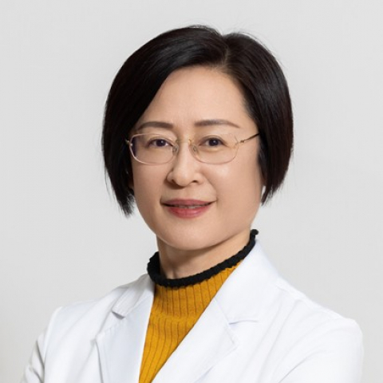

<!-- AUTO-GENERATED-BY: work/generate_obsidian_profiles.py -->

<!-- TEMPLATE: D:\workspace\信息收集整理\医生画像仓库\模板\医生画像模板.md -->

# 谢红宁

## 基础信息

| 字段 | 内容 |
|---|---|
| 姓名 | 谢红宁 |
| 医院 | 中山大学附属第一医院 |
| 科室 | 超声医学科 |
| 职称/身份 | 主任医师/二级教授 |
| 来源链接 | [官网原文](https://www.fahsysu.org.cn/node/5585) |
| 采集日期 | 2026-08-13 |

## 简介/擅长

胎儿畸形的超声诊断和遗传咨询、妇科疑难疾病的超声诊断及介入治疗，尤其在胎儿颅脑畸形、先天性心脏病产前诊断、病理产科超声诊断等方面积累了大量经验。 每年会诊大量妇产超声疑难杂症、各类胎儿异常1000+例。 拥有10年妇产科临床和30年妇产超声诊断经验。 基于临床经验发表研究论文近百篇； 主编《妇产科超声诊断学》等著作共5本； 参编多本教科书； 获广东省科技进步二等奖，中国出生缺陷基金会科技成果奖三等奖； 获产科超声AI发明专利5项； 主持及参与制定妇产超声行业技术标准； 曾获广东省“三八红旗手”称号，被评为中国医师协会超声医师分会“中国杰出超声医师”、“中山大学名医”等。 学术任职： 中国医师协会超声医师分会妇产专业委员会 主任委员 广东省医学会产前诊断学分会 主任委员 中国卫健委产前诊断专家组 成员 国家卫健委能力建设和继教超声医学专家委员会妇产组 副组长 《中华超声影像学杂志》 编委 曾任中华医学会超声医学分会妇产组副组长； 广东省医师协会超声医师分会副主任委员

## 科研项目与成果

- 获广东省科技进步二等奖，中国出生缺陷基金会科技成果奖三等奖；
- 获产科超声AI发明专利5项；

## 论文与学术产出

- 基于临床经验发表研究论文近百篇；
- 主编《妇产科超声诊断学》等著作共5本；
- 参编多本教科书；

## 可包装亮点

- 擅长胎儿畸形的超声诊断和遗传咨询、妇科疑难疾病的超声诊断及介入治疗，尤其在胎儿颅脑畸形、先天性心脏病产前诊断、病理产科超声诊断等方面积累了大量经验。
- 每年会诊大量妇产超声疑难杂症、各类胎儿异常1000+例。
- 医疗特长： 擅长胎儿畸形的超声诊断和遗传咨询、妇科疑难疾病的超声诊断及介入治疗，尤其在胎儿颅脑畸形、先天性心脏病产前诊断、病理产科超声诊断等方面积累了大量经验。

## 重点疾病/人群标签

- 慢性病：
- 肿瘤：
- 生殖疾病：
- 免疫/风湿：
- 术后恢复/康复：
- 疑难重症：疑难

## 证据摘录

> 只摘录官网公开信息中的短句或关键字段，不复制大段原文。

- 官网身份字段：主任医师/二级教授
- 官网简介/擅长：胎儿畸形的超声诊断和遗传咨询、妇科疑难疾病的超声诊断及介入治疗，尤其在胎儿颅脑畸形、先天性心脏病产前诊断、病理产科超声诊断等方面积累了大量经验。 每年会诊大量妇产超声疑难杂症、各类胎儿异常1000+例。 拥有10年妇产科临床和30年妇产超声诊断经验。 基于临床经验发表研究论文近百篇； 主编《妇产科超声诊断学》等著作共5本； 参编多本教科书； 获广东省科技进步二等奖，中国出生缺陷基金会科技成果奖三等奖； 获产科超声AI发明专利5项； 主…
- 官网亮眼经历线索：擅长胎儿畸形的超声诊断和遗传咨询、妇科疑难疾病的超声诊断及介入治疗，尤其在胎儿颅脑畸形、先天性心脏病产前诊断、病理产科超声诊断等方面积累了大量经验。 每年会诊大量妇产超声疑难杂症、各类胎儿异常1000+例。 医疗特长： 擅长胎儿畸形的超声诊断和遗传咨询、妇科疑难疾病的超声诊断及介入治疗，尤其在胎儿颅脑畸形、先天性心脏病产前诊断、病理产科超声诊断等方面积累了大量经验。 每年会诊大量妇产超声疑难杂症、各类胎儿异常1000+例。
- 来源链接：https://www.fahsysu.org.cn/node/5585

## BD 画像摘要

谢红宁医生可作为疑难重症方向的基础画像候选。后续 BD 使用应继续以官网来源和人工复核为准，不添加疗效承诺或无来源包装。

## 合规边界

- 仅使用医院官网、官方公众号、官方小程序等公开渠道。
- 不采集私人电话、私人微信、家庭住址、患者隐私或非公开排班信息。
- 不写“保证治愈”“疗效第一”“包治疑难杂症”等无法由官网证明的表述。
