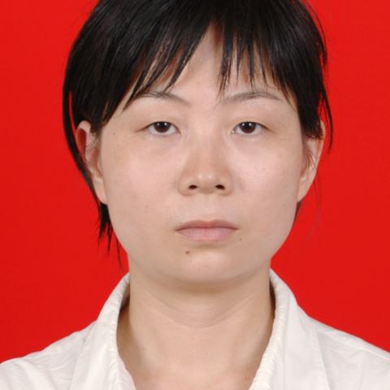

<!-- AUTO-GENERATED-BY: work/generate_obsidian_profiles.py -->

<!-- TEMPLATE: D:\workspace\信息收集整理\医生画像仓库\模板\医生画像模板.md -->

# 谭畅

## 基础信息

| 字段 | 内容 |
|---|---|
| 姓名 | 谭畅 |
| 医院 | 中山大学附属第一医院 |
| 科室 | 中医科 |
| 职称/身份 | 副主任医师 |
| 来源链接 | [官网原文](https://www.fahsysu.org.cn/node/5729) |
| 采集日期 | 2026-08-13 |

## 简介/擅长

从事中医内科临床工作20年，重视发挥中医的整体观念和辨证论治特点，经验丰富。 擅长治疗中医痹证，尤其对各种风湿关节痛、类风湿关节炎、骨关节炎等的中医诊治。 研究方向：中医风湿病 主要教育和工作经历：1995年毕业于广州中医药大学医疗系。 2007年获得中医内科副主任医师资格。 2010年获广州中医药大学医学硕士学位。 1995年7月在中山大学附属第一医院东山院区工作至今。 社会兼职： 论著： 专著： 其他主要工作成绩（比如获奖情况）：

## 教育与进修经历

- 研究方向：中医风湿病 主要教育和工作经历：1995年毕业于广州中医药大学医疗系。
- 2010年获广州中医药大学医学硕士学位。

## 可包装亮点

- 2007年获得中医内科副主任医师资格。
- 社会兼职： 论著： 专著： 其他主要工作成绩（比如获奖情况）：

## 重点疾病/人群标签

- 慢性病：
- 肿瘤：
- 生殖疾病：
- 免疫/风湿：风湿、类风湿
- 术后恢复/康复：
- 疑难重症：

## 证据摘录

> 只摘录官网公开信息中的短句或关键字段，不复制大段原文。

- 官网身份字段：副主任医师
- 官网简介/擅长：从事中医内科临床工作20年，重视发挥中医的整体观念和辨证论治特点，经验丰富。 擅长治疗中医痹证，尤其对各种风湿关节痛、类风湿关节炎、骨关节炎等的中医诊治。 研究方向：中医风湿病 主要教育和工作经历：1995年毕业于广州中医药大学医疗系。 2007年获得中医内科副主任医师资格。 2010年获广州中医药大学医学硕士学位。 1995年7月在中山大学附属第一医院东山院区工作至今。 社会兼职： 论著： 专著： 其他主要工作成绩（比如获奖情况）：
- 官网亮眼经历线索：2007年获得中医内科副主任医师资格。 社会兼职： 论著： 专著： 其他主要工作成绩（比如获奖情况）：
- 来源链接：https://www.fahsysu.org.cn/node/5729

## BD 画像摘要

谭畅医生可作为免疫/风湿/感染方向的基础画像候选。后续 BD 使用应继续以官网来源和人工复核为准，不添加疗效承诺或无来源包装。

## 合规边界

- 仅使用医院官网、官方公众号、官方小程序等公开渠道。
- 不采集私人电话、私人微信、家庭住址、患者隐私或非公开排班信息。
- 不写“保证治愈”“疗效第一”“包治疑难杂症”等无法由官网证明的表述。
