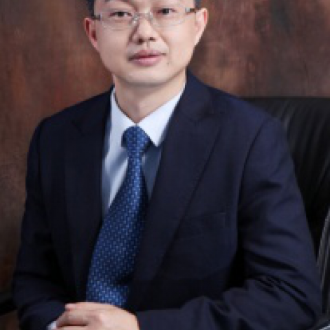

<!-- AUTO-GENERATED-BY: work/generate_obsidian_profiles.py -->

<!-- TEMPLATE: D:\workspace\信息收集整理\医生画像仓库\模板\医生画像模板.md -->

# 谭进富

## 基础信息

| 字段 | 内容 |
|---|---|
| 姓名 | 谭进富 |
| 医院 | 中山大学附属第一医院 |
| 科室 | 胃肠外科三科 |
| 职称/身份 | 副主任医师 |
| 来源链接 | [官网原文](https://www.fahsysu.org.cn/node/759) |
| 采集日期 | 2026-08-13 |

## 简介/擅长

于结直肠癌、胃癌及胃肠间质瘤的微创及开放手术治疗； 擅长于微创手术治疗肥胖症及肥胖性2型糖尿病； 擅长于腹股沟疝、切口疝、脐疝和食管裂孔疝等的微创手术治疗。 研究方向： 1. 胃肠道肿瘤的诊断及外科治疗，尤其胃癌、结直肠癌规范化外科治疗； 2. 胃肠道肿瘤达芬奇机器人手术； 3 、腹腔镜减肥手术和治疗肥胖性2型糖尿病手术； 主要教育和工作经历： 1. 2013.06 — 2013.09 ：香港东区尤德夫人那打素医院，外科进修 2. 2012.08 — 2012.10 ：香港大学玛丽医院，外科进修 3. 2001.09 — 2006.06 ：中山大学附属第一医院，博士（硕博连读） 4. 1996.09 — 2001.06 ：赣南医学院，临床医学系，学士 主要工作经历 1. 2015.12– 至 今：中山大学附属第一医院，胃肠外科中心、胃肠外科三科，副主任医师 2. 2014.08– 2015.11 ：中山大学附属第一医院，胃肠外科中心、胃肠外科三科，主治医师 3. 2009.12– 2014.07 ：中山大学附属第一医院，微创外科、疝与腹壁外科中心，主治医师 4. 2006.07– 2009.11 ：中山大学附属第一医院...

## 教育与进修经历

- 主要教育和工作经历： 1. 2013.06 — 2013.09 ：香港东区尤德夫人那打素医院，外科进修 2. 2012.08 — 2012.10 ：香港大学玛丽医院，外科进修 3. 2001.09 — 2006.06 ：中山大学附属第一医院，博士（硕博连读） 4. 1996.09 — 2001.06 ：赣南医学院，临床医学系，学士 主要工作经历 1. 2015.12– 至 今：中山大学附属第一医院，胃肠外科中心、胃肠外科三科，副主任医师 2. 2014.08– 2015.11 ：中山大学附属第一医院，胃肠外科中心…

## 可包装亮点

- 主要教育和工作经历： 1. 2013.06 — 2013.09 ：香港东区尤德夫人那打素医院，外科进修 2. 2012.08 — 2012.10 ：香港大学玛丽医院，外科进修 3. 2001.09 — 2006.06 ：中山大学附属第一医院，博士（硕博连读） 4. 1996.09 — 2001.06 ：赣南医学院，临床医学系，学士 主要工作经历 1. 20…

## 重点疾病/人群标签

- 慢性病：糖尿病、代谢、肿瘤、瘤、胃癌、肠癌、康复
- 肿瘤：糖尿病、代谢、肿瘤、瘤、胃癌、肠癌、康复
- 生殖疾病：
- 免疫/风湿：
- 术后恢复/康复：糖尿病、代谢、肿瘤、瘤、胃癌、肠癌、康复
- 疑难重症：

## 证据摘录

> 只摘录官网公开信息中的短句或关键字段，不复制大段原文。

- 官网身份字段：副主任医师
- 官网简介/擅长：于结直肠癌、胃癌及胃肠间质瘤的微创及开放手术治疗； 擅长于微创手术治疗肥胖症及肥胖性2型糖尿病； 擅长于腹股沟疝、切口疝、脐疝和食管裂孔疝等的微创手术治疗。 研究方向： 1. 胃肠道肿瘤的诊断及外科治疗，尤其胃癌、结直肠癌规范化外科治疗； 2. 胃肠道肿瘤达芬奇机器人手术； 3 、腹腔镜减肥手术和治疗肥胖性2型糖尿病手术； 主要教育和工作经历： 1. 2013.06 — 2013.09 ：香港东区尤德夫人那打素医院，外科进修 2. 2…
- 官网亮眼经历线索：主要教育和工作经历： 1. 2013.06 — 2013.09 ：香港东区尤德夫人那打素医院，外科进修 2. 2012.08 — 2012.10 ：香港大学玛丽医院，外科进修 3. 2001.09 — 2006.06 ：中山大学附属第一医院，博士（硕博连读） 4. 1996.09 — 2001.06 ：赣南医学院，临床医学系，学士 主要工作经历 1. 2015.12– 至 今：中山大学附属第一医院，胃肠外科中心、胃肠外科三科，副主任医…
- 来源链接：https://www.fahsysu.org.cn/node/759

## BD 画像摘要

谭进富医生可作为慢性病、肿瘤、术后恢复/康复方向的基础画像候选。后续 BD 使用应继续以官网来源和人工复核为准，不添加疗效承诺或无来源包装。

## 合规边界

- 仅使用医院官网、官方公众号、官方小程序等公开渠道。
- 不采集私人电话、私人微信、家庭住址、患者隐私或非公开排班信息。
- 不写“保证治愈”“疗效第一”“包治疑难杂症”等无法由官网证明的表述。
