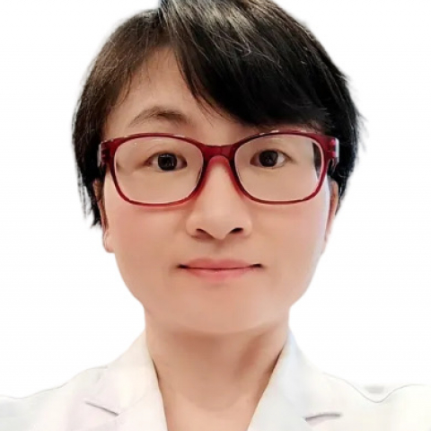

<!-- AUTO-GENERATED-BY: work/generate_obsidian_profiles.py -->

<!-- TEMPLATE: D:\workspace\信息收集整理\医生画像仓库\模板\医生画像模板.md -->

# 谭金凤

## 基础信息

| 字段 | 内容 |
|---|---|
| 姓名 | 谭金凤 |
| 医院 | 中山大学附属第一医院 |
| 科室 | 妇科 |
| 职称/身份 | 副主任医师 |
| 来源链接 | [官网原文](https://www.fahsysu.org.cn/node/35730) |
| 采集日期 | 2026-08-13 |

## 简介/擅长

子宫肌瘤、子宫内膜异位症、子宫腺肌病、月经病、不孕症、流产、宫颈HPV感染及宫颈癌前病变、宫颈癌、卵巢肿瘤、子宫内膜疾病（子宫内膜息肉、宫腔粘连、子宫内膜增生、子宫内膜癌等）、盆底功能障碍性疾病（子宫脱垂、张力性尿失禁）等疾病的临床诊治，擅长宫腔镜及腹腔镜微创手术、高强度聚焦超声（海扶）微无创等手术及治疗。 研究方向：HPV感染与子宫颈癌的发生机制研究、子宫内膜病变及子宫内膜癌的发生机制研究、生殖道感染性疾病与不孕症的关系研究。 主要教育和工作经历： 2005年毕业留校工作，一直在中山大学附属第一医院妇产科工作至今。 社会兼职：广东省医学会计划生育学学组分会第六届委员会流产后关爱成员。 论著：在国内外核心期刊发表论文20余篇，其中以第一作者或通讯作者发表的SCI文章有11篇。 参与科研基金项目多项，包括国家级3项，省级5项，市级2项，主持校级基金1项。 专著： 参与《子宫内膜异位症诊断和治疗实用指南》翻译。 参与《实习医生手册》的编写。 其他主要工作成绩（比如获奖情况）： 2023年“谁与争锋”妇科宫腔镜知识全国总决赛一等奖。

## 教育与进修经历

- 主要教育和工作经历： 2005年毕业留校工作，一直在中山大学附属第一医院妇产科工作至今。

## 科研项目与成果

- 参与科研基金项目多项，包括国家级3项，省级5项，市级2项，主持校级基金1项。

## 论文与学术产出

- 论著：在国内外核心期刊发表论文20余篇，其中以第一作者或通讯作者发表的SCI文章有11篇。

## 可包装亮点

- 社会兼职：广东省医学会计划生育学学组分会第六届委员会流产后关爱成员。
- 论著：在国内外核心期刊发表论文20余篇，其中以第一作者或通讯作者发表的SCI文章有11篇。
- 专著： 参与《子宫内膜异位症诊断和治疗实用指南》翻译。
- 其他主要工作成绩（比如获奖情况）： 2023年“谁与争锋”妇科宫腔镜知识全国总决赛一等奖。

## 重点疾病/人群标签

- 慢性病：
- 肿瘤：肿瘤、癌、瘤、生殖、不孕、卵巢、月经、感染、功能障碍
- 生殖疾病：肿瘤、癌、瘤、生殖、不孕、卵巢、月经、感染、功能障碍
- 免疫/风湿：肿瘤、癌、瘤、生殖、不孕、卵巢、月经、感染、功能障碍
- 术后恢复/康复：肿瘤、癌、瘤、生殖、不孕、卵巢、月经、感染、功能障碍
- 疑难重症：

## 证据摘录

> 只摘录官网公开信息中的短句或关键字段，不复制大段原文。

- 官网身份字段：副主任医师
- 官网简介/擅长：子宫肌瘤、子宫内膜异位症、子宫腺肌病、月经病、不孕症、流产、宫颈HPV感染及宫颈癌前病变、宫颈癌、卵巢肿瘤、子宫内膜疾病（子宫内膜息肉、宫腔粘连、子宫内膜增生、子宫内膜癌等）、盆底功能障碍性疾病（子宫脱垂、张力性尿失禁）等疾病的临床诊治，擅长宫腔镜及腹腔镜微创手术、高强度聚焦超声（海扶）微无创等手术及治疗。 研究方向：HPV感染与子宫颈癌的发生机制研究、子宫内膜病变及子宫内膜癌的发生机制研究、生殖道感染性疾病与不孕症的关系研究。 主要…
- 官网亮眼经历线索：社会兼职：广东省医学会计划生育学学组分会第六届委员会流产后关爱成员。 论著：在国内外核心期刊发表论文20余篇，其中以第一作者或通讯作者发表的SCI文章有11篇。 专著： 参与《子宫内膜异位症诊断和治疗实用指南》翻译。 其他主要工作成绩（比如获奖情况）： 2023年“谁与争锋”妇科宫腔镜知识全国总决赛一等奖。
- 来源链接：https://www.fahsysu.org.cn/node/35730

## BD 画像摘要

谭金凤医生可作为肿瘤、生殖疾病、免疫/风湿/感染、术后恢复/康复方向的基础画像候选。后续 BD 使用应继续以官网来源和人工复核为准，不添加疗效承诺或无来源包装。

## 合规边界

- 仅使用医院官网、官方公众号、官方小程序等公开渠道。
- 不采集私人电话、私人微信、家庭住址、患者隐私或非公开排班信息。
- 不写“保证治愈”“疗效第一”“包治疑难杂症”等无法由官网证明的表述。
