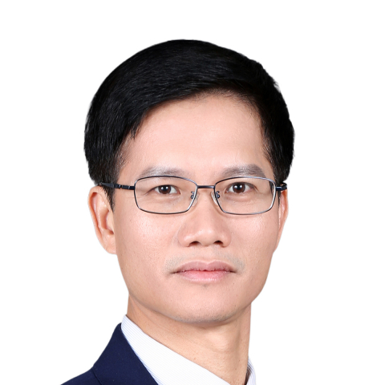

<!-- AUTO-GENERATED-BY: work/generate_obsidian_profiles.py -->

<!-- TEMPLATE: D:\workspace\信息收集整理\医生画像仓库\模板\医生画像模板.md -->

# 赖佳明

## 基础信息

| 字段 | 内容 |
|---|---|
| 姓名 | 赖佳明 |
| 医院 | 中山大学附属第一医院 |
| 科室 | 胆胰外科 |
| 职称/身份 | 主任医师 |
| 来源链接 | [官网原文](https://www.fahsysu.org.cn/node/712) |
| 采集日期 | 2026-08-13 |

## 简介/擅长

毕业后一直从事肝胆胰脾外科临床工作； 擅长胆道肿瘤、胰腺肿瘤、肝脏肿瘤、肝胆管结石、门静脉高压症等疾病的诊断与外科手术治疗，特别是处理肝胆胰脾疾病的疑难重症方面有丰富的经验； 在传统开腹手术和利用腹腔镜、胆道镜、十二指肠镜、 达芬奇机器人 等微创技术治疗肝胆胰疾病有较深的造诣。 研究方向：肝胆胰脾疾病的基础和临床研究，特别专注于肝胆胰肿瘤的手术与综合治疗。 主要教育和工作经历：1993年7月毕业于原中山医科大学医疗系，已先后获得外科学医学硕士、博士学位，曾在香港大学玛丽医院和美国华盛顿大学医学院进修留学。 社会兼职：广东省健康管理学会胰腺疾病专委会主任委员，广东省医学会肝胆胰外科分会胰腺学组组长，广东省抗癌协会胆道肿瘤专业委员会常委和全国委员，广东省医师协会胰腺外科医师分会常委，广东省器官医学与技术学会腹腔镜手术技术与培训专委会副主委，广东省医学会肠外肠内营养分会委员和代谢营养学组副组长，广东省肝脏病学会肝病微创治疗分会副主委，广东省医师协会毕业后医学教育工作委员会委员等。 论著专著：从医以来在国内外有影响的杂志发表学术论文80余篇，主持省部级科研和教学基金8项，获得省部级科研成果3项，主编出版学术著作6部，参编6部。

## 教育与进修经历

- 毕业后一直从事肝胆胰脾外科临床工作；
- 医疗特长： 毕业后一直从事肝胆胰脾外科临床工作；
- 主要教育和工作经历：1993年7月毕业于原中山医科大学医疗系，已先后获得外科学医学硕士、博士学位，曾在香港大学玛丽医院和美国华盛顿大学医学院进修留学。
- 社会兼职：广东省健康管理学会胰腺疾病专委会主任委员，广东省医学会肝胆胰外科分会胰腺学组组长，广东省抗癌协会胆道肿瘤专业委员会常委和全国委员，广东省医师协会胰腺外科医师分会常委，广东省器官医学与技术学会腹腔镜手术技术与培训专委会副主委，广东省医学会肠外肠内营养分会委员和代谢营养学组副组长，广东省肝脏病学会肝病微创治疗分会副主委，广东省医师协会毕业后医学教育工作委员会委员等。

## 科研项目与成果

- 论著专著：从医以来在国内外有影响的杂志发表学术论文80余篇，主持省部级科研和教学基金8项，获得省部级科研成果3项，主编出版学术著作6部，参编6部。

## 论文与学术产出

- 论著专著：从医以来在国内外有影响的杂志发表学术论文80余篇，主持省部级科研和教学基金8项，获得省部级科研成果3项，主编出版学术著作6部，参编6部。

## 可包装亮点

- 擅长胆道肿瘤、胰腺肿瘤、肝脏肿瘤、肝胆管结石、门静脉高压症等疾病的诊断与外科手术治疗，特别是处理肝胆胰脾疾病的疑难重症方面有丰富的经验；
- 主要教育和工作经历：1993年7月毕业于原中山医科大学医疗系，已先后获得外科学医学硕士、博士学位，曾在香港大学玛丽医院和美国华盛顿大学医学院进修留学。
- 社会兼职：广东省健康管理学会胰腺疾病专委会主任委员，广东省医学会肝胆胰外科分会胰腺学组组长，广东省抗癌协会胆道肿瘤专业委员会常委和全国委员，广东省医师协会胰腺外科医师分会常委，广东省器官医学与技术学会腹腔镜手术技术与培训专委会副主委，广东省医学会肠外肠内营养分会委员和代谢营养学组副组长，广东省肝脏病学会肝病微创治疗分会副主委，广东省医师协会毕业后医学教育工…

## 重点疾病/人群标签

- 慢性病：代谢、肿瘤、癌、营养、疑难、重症
- 肿瘤：代谢、肿瘤、癌、营养、疑难、重症
- 生殖疾病：
- 免疫/风湿：
- 术后恢复/康复：代谢、肿瘤、癌、营养、疑难、重症
- 疑难重症：代谢、肿瘤、癌、营养、疑难、重症

## 证据摘录

> 只摘录官网公开信息中的短句或关键字段，不复制大段原文。

- 官网身份字段：主任医师
- 官网简介/擅长：毕业后一直从事肝胆胰脾外科临床工作； 擅长胆道肿瘤、胰腺肿瘤、肝脏肿瘤、肝胆管结石、门静脉高压症等疾病的诊断与外科手术治疗，特别是处理肝胆胰脾疾病的疑难重症方面有丰富的经验； 在传统开腹手术和利用腹腔镜、胆道镜、十二指肠镜、 达芬奇机器人 等微创技术治疗肝胆胰疾病有较深的造诣。 研究方向：肝胆胰脾疾病的基础和临床研究，特别专注于肝胆胰肿瘤的手术与综合治疗。 主要教育和工作经历：1993年7月毕业于原中山医科大学医疗系，已先后获得外科学…
- 官网亮眼经历线索：擅长胆道肿瘤、胰腺肿瘤、肝脏肿瘤、肝胆管结石、门静脉高压症等疾病的诊断与外科手术治疗，特别是处理肝胆胰脾疾病的疑难重症方面有丰富的经验； 擅长胆道肿瘤、胰腺肿瘤、肝脏肿瘤、肝胆管结石、门静脉高压症等疾病的诊断与外科手术治疗，特别是处理肝胆胰脾疾病的疑难重症方面有丰富的经验； 主要教育和工作经历：1993年7月毕业于原中山医科大学医疗系，已先后获得外科学医学硕士、博士学位，曾在香港大学玛丽医院和美国华盛顿大学医学院进修留学。 社会兼职：…
- 来源链接：https://www.fahsysu.org.cn/node/712

## BD 画像摘要

赖佳明医生可作为慢性病、肿瘤、术后恢复/康复、疑难重症方向的基础画像候选。后续 BD 使用应继续以官网来源和人工复核为准，不添加疗效承诺或无来源包装。

## 合规边界

- 仅使用医院官网、官方公众号、官方小程序等公开渠道。
- 不采集私人电话、私人微信、家庭住址、患者隐私或非公开排班信息。
- 不写“保证治愈”“疗效第一”“包治疑难杂症”等无法由官网证明的表述。
