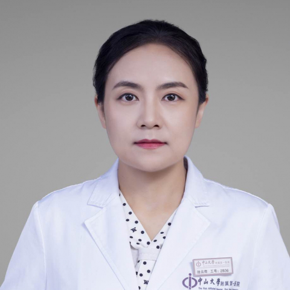

<!-- AUTO-GENERATED-BY: work/generate_obsidian_profiles.py -->

<!-- TEMPLATE: D:\workspace\信息收集整理\医生画像仓库\模板\医生画像模板.md -->

# 赵云荷

## 基础信息

| 字段 | 内容 |
|---|---|
| 姓名 | 赵云荷 |
| 医院 | 中山大学附属第一医院 |
| 科室 | 妇科 |
| 职称/身份 | 副主任医师 |
| 来源链接 | [官网原文](https://www.fahsysu.org.cn/node/29217) |
| 采集日期 | 2026-08-13 |

## 简介/擅长

现任中山一院东院妇产科副主任； 妇科肿瘤博士，硕士研究生导师。 熟练掌握妇科腹腔镜、宫腔镜、阴式手术等微创手术技术，并通过微创技术诊治妇科良恶性肿瘤、子宫内膜异位症、不孕症、子宫脱垂等常见多发疾病，积累了丰富诊疗经验。 对宫颈癌、卵巢癌、子宫内膜癌有深入研究，掌握学科前沿进展，解析分子诊断报告，规范化实施妇科肿瘤的手术、化疗、个体化靶向治疗和长期管理。 研究方向：妇科恶性肿瘤的微创治疗； 上皮性卵巢癌患者维持治疗的循证医学研究； 复发性、难治性妇科恶性肿瘤的临床试验研究 主要教育和工作经历： 北京大学临床医学专业本科毕业; 2008年硕士毕业，中山一院妇产科工作； 先后获得中山大学妇产科硕士、妇科肿瘤学博士学位； 从住院医师依次晋升主治医师、副主任医师； 扎根妇科肿瘤临床实践10余年； 自2017年派遣至中山一院东院任妇产科副主任至今。 社会兼职： 广东省基层医药学会妇科专业委员会委员 论著： 代表性论著 PARP inhibitors in breast and ovarian cancer with BRCA mutations: a meta-analysis of survival. Aging (Albany...

## 教育与进修经历

- 复发性、难治性妇科恶性肿瘤的临床试验研究 主要教育和工作经历： 北京大学临床医学专业本科毕业;
- 2008年硕士毕业，中山一院妇产科工作；
- 先后获得中山大学妇产科硕士、妇科肿瘤学博士学位；

## 可包装亮点

- 从住院医师依次晋升主治医师、副主任医师；
- 社会兼职： 广东省基层医药学会妇科专业委员会委员 论著： 代表性论著 PARP inhibitors in breast and ovarian cancer with BRCA mutations: a meta-analysis of survival. Aging (Albany NY). 2021 Mar 11;
- 东院妇产科教学主任，硕士研究生导师，2013年承担“全国医学生临床技能大赛国赛”妇产科教官，带教中山大学本科生团队获全国特等奖。
- 医学专业英语能力凸出，2016年带教英国格拉斯哥大学交换生。

## 重点疾病/人群标签

- 慢性病：
- 肿瘤：肿瘤、癌、化疗、靶向、不孕、卵巢、难治
- 生殖疾病：肿瘤、癌、化疗、靶向、不孕、卵巢、难治
- 免疫/风湿：
- 术后恢复/康复：
- 疑难重症：肿瘤、癌、化疗、靶向、不孕、卵巢、难治

## 证据摘录

> 只摘录官网公开信息中的短句或关键字段，不复制大段原文。

- 官网身份字段：副主任医师
- 官网简介/擅长：现任中山一院东院妇产科副主任； 妇科肿瘤博士，硕士研究生导师。 熟练掌握妇科腹腔镜、宫腔镜、阴式手术等微创手术技术，并通过微创技术诊治妇科良恶性肿瘤、子宫内膜异位症、不孕症、子宫脱垂等常见多发疾病，积累了丰富诊疗经验。 对宫颈癌、卵巢癌、子宫内膜癌有深入研究，掌握学科前沿进展，解析分子诊断报告，规范化实施妇科肿瘤的手术、化疗、个体化靶向治疗和长期管理。 研究方向：妇科恶性肿瘤的微创治疗； 上皮性卵巢癌患者维持治疗的循证医学研究； 复发…
- 官网亮眼经历线索：从住院医师依次晋升主治医师、副主任医师； 社会兼职： 广东省基层医药学会妇科专业委员会委员 论著： 代表性论著 PARP inhibitors in breast and ovarian cancer with BRCA mutations: a meta-analysis of survival. Aging (Albany NY). 2021 Mar 11; 东院妇产科教学主任，硕士研究生导师，2013年承担“全国医学生临床技能大…
- 来源链接：https://www.fahsysu.org.cn/node/29217

## BD 画像摘要

赵云荷医生可作为肿瘤、生殖疾病、疑难重症方向的基础画像候选。后续 BD 使用应继续以官网来源和人工复核为准，不添加疗效承诺或无来源包装。

## 合规边界

- 仅使用医院官网、官方公众号、官方小程序等公开渠道。
- 不采集私人电话、私人微信、家庭住址、患者隐私或非公开排班信息。
- 不写“保证治愈”“疗效第一”“包治疑难杂症”等无法由官网证明的表述。
