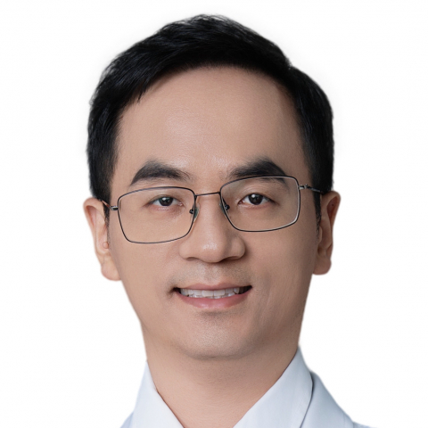

<!-- AUTO-GENERATED-BY: work/generate_obsidian_profiles.py -->

<!-- TEMPLATE: D:\workspace\信息收集整理\医生画像仓库\模板\医生画像模板.md -->

# 赵坤

## 基础信息

| 字段 | 内容 |
|---|---|
| 姓名 | 赵坤 |
| 医院 | 中山大学附属第一医院 |
| 科室 | 神经外科 |
| 职称/身份 | 副主任医师 |
| 来源链接 | [官网原文](https://www.fahsysu.org.cn/node/38215) |
| 采集日期 | 2026-08-13 |

## 简介/擅长

1、颅脑肿瘤：包括脑膜瘤、胶质瘤、脑转移瘤、胆脂瘤等肿瘤的精准和个体化手术治疗。 2、颅神经疾病：包括面肌痉挛、三叉神经痛的显微手术治疗。 3、其他疾病：脑外伤、脑出血、脑积水、颅骨缺损、小脑扁桃体下疝畸形等疾病的手术治疗。 （一）研究方向：颅脑肿瘤的基础和临床研究。 （二）主要教育和工作经历：硕士、博士毕业于中山大学，中山大学博士后。 历任神经外科住院医师、主治医师、副主任医师。 （三）社会兼职：广东省精准医学应用学会神经肿瘤分会委员。 担任瑞士Frontiers 出版社《Frontiers in Neuroscience》期刊客座编委，领导并组建Frontiers 前沿专刊。 （四）科研情况：以第一作者或通讯作者在国际知名期刊Nature Communications (IF 17分)、 Journal of Neurotrauma、Scientific Reports等期刊发表SCI论文7篇。 主持中国博士后创新人才支持项目、国家自然科学基金、中国博士后科学基金面上项目等科研项目3项。 （五）获奖情况：作为主要参与人荣获2022年度广东省科学技术奖一等奖。

## 教育与进修经历

- （二）主要教育和工作经历：硕士、博士毕业于中山大学，中山大学博士后。
- 主持中国博士后创新人才支持项目、国家自然科学基金、中国博士后科学基金面上项目等科研项目3项。

## 科研项目与成果

- （四）科研情况：以第一作者或通讯作者在国际知名期刊Nature Communications (IF 17分)、 Journal of Neurotrauma、Scientific Reports等期刊发表SCI论文7篇。
- 主持中国博士后创新人才支持项目、国家自然科学基金、中国博士后科学基金面上项目等科研项目3项。

## 论文与学术产出

- 担任瑞士Frontiers 出版社《Frontiers in Neuroscience》期刊客座编委，领导并组建Frontiers 前沿专刊。
- （四）科研情况：以第一作者或通讯作者在国际知名期刊Nature Communications (IF 17分)、 Journal of Neurotrauma、Scientific Reports等期刊发表SCI论文7篇。

## 可包装亮点

- 擅长： 1、颅脑肿瘤：包括脑膜瘤、胶质瘤、脑转移瘤、胆脂瘤等肿瘤的精准和个体化手术治疗。
- 历任神经外科住院医师、主治医师、副主任医师。
- （三）社会兼职：广东省精准医学应用学会神经肿瘤分会委员。

## 重点疾病/人群标签

- 慢性病：
- 肿瘤：肿瘤、瘤
- 生殖疾病：
- 免疫/风湿：
- 术后恢复/康复：
- 疑难重症：

## 证据摘录

> 只摘录官网公开信息中的短句或关键字段，不复制大段原文。

- 官网身份字段：副主任医师
- 官网简介/擅长：1、颅脑肿瘤：包括脑膜瘤、胶质瘤、脑转移瘤、胆脂瘤等肿瘤的精准和个体化手术治疗。 2、颅神经疾病：包括面肌痉挛、三叉神经痛的显微手术治疗。 3、其他疾病：脑外伤、脑出血、脑积水、颅骨缺损、小脑扁桃体下疝畸形等疾病的手术治疗。 （一）研究方向：颅脑肿瘤的基础和临床研究。 （二）主要教育和工作经历：硕士、博士毕业于中山大学，中山大学博士后。 历任神经外科住院医师、主治医师、副主任医师。 （三）社会兼职：广东省精准医学应用学会神经肿瘤分会委…
- 官网亮眼经历线索：擅长： 1、颅脑肿瘤：包括脑膜瘤、胶质瘤、脑转移瘤、胆脂瘤等肿瘤的精准和个体化手术治疗。 擅长： 1、颅脑肿瘤：包括脑膜瘤、胶质瘤、脑转移瘤、胆脂瘤等肿瘤的精准和个体化手术治疗。 历任神经外科住院医师、主治医师、副主任医师。 （三）社会兼职：广东省精准医学应用学会神经肿瘤分会委员。
- 来源链接：https://www.fahsysu.org.cn/node/38215

## BD 画像摘要

赵坤医生可作为肿瘤方向的基础画像候选。后续 BD 使用应继续以官网来源和人工复核为准，不添加疗效承诺或无来源包装。

## 合规边界

- 仅使用医院官网、官方公众号、官方小程序等公开渠道。
- 不采集私人电话、私人微信、家庭住址、患者隐私或非公开排班信息。
- 不写“保证治愈”“疗效第一”“包治疑难杂症”等无法由官网证明的表述。
