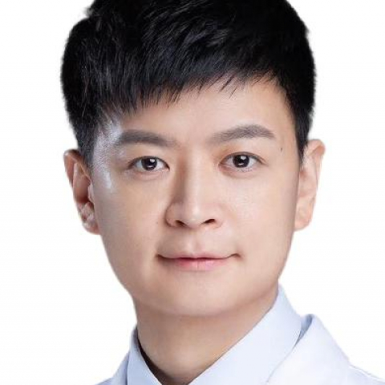

<!-- AUTO-GENERATED-BY: work/generate_obsidian_profiles.py -->

<!-- TEMPLATE: D:\workspace\信息收集整理\医生画像仓库\模板\医生画像模板.md -->

# 赵强

## 基础信息

| 字段 | 内容 |
|---|---|
| 姓名 | 赵强 |
| 医院 | 中山大学附属第一医院 |
| 科室 | 肝移植专科、器官移植科 |
| 职称/身份 | 主任医师/教授 |
| 来源链接 | [官网原文](https://www.fahsysu.org.cn/node/5671) |
| 采集日期 | 2026-08-13 |

## 简介/擅长

长期从事各类肝病的诊治及肝移植手术工作，擅长中晚期肝癌的综合诊治，对肝硬化、肝衰竭等疑难危重症救治具有丰富的临床经验。 特色技术为无缺血肝脏移植术，破解了器官缺血损伤世界性难题，复流后综合征发生率下降92.1%，肝损伤指标谷丙转氨酶峰值下降77.7%，1年患者生存率提高9.8%，大幅降低了移植手术风险，临床疗效为国际领先水平。 工作经历： 2005/09-2013/6:中山大学临床医学(八年制); 2013/07-2015/12:中山大学附属第一医院器官移植科，住院医师 2016/01-2017/12:中山大学附属第一医院器官移植科，主治医师 2018/01-2022/12:中山大学附属第一医院器官移植科，副主任医师 2023/01-至今:中山大学附属第一医院器官移植科，主任医师 社会兼职: 中科院深圳先进技术研究院客座研究员 中华医学会器官移植学分会青年委员 广东省医学会器官移植分会青委会副主任委员 科研情况： 致力于器官医学技术创新及成果转化工作，以第一或通讯作者在Gut、Journal of Hepatology等期刊发表SCI论文20余篇，获授权美国发明专利3项、中国专利7项，主持国家重点研发计划子课题1项、国...

## 科研项目与成果

- 2013/07-2015/12:中山大学附属第一医院器官移植科，住院医师 2016/01-2017/12:中山大学附属第一医院器官移植科，主治医师 2018/01-2022/12:中山大学附属第一医院器官移植科，副主任医师 2023/01-至今:中山大学附属第一医院器官移植科，主任医师 社会兼职: 中科院深圳先进技术研究院客座研究员 中华医学会器官移植学分会青年委员 广东省医学会器官移植分会青委会副主任委员 科研情况： 致力于器官医学技术创新及成果转化工作，以第一或通讯作者在Gut、Journal of Hepa…

## 可包装亮点

- 长期从事各类肝病的诊治及肝移植手术工作，擅长中晚期肝癌的综合诊治，对肝硬化、肝衰竭等疑难危重症救治具有丰富的临床经验。
- 医疗特长： 长期从事各类肝病的诊治及肝移植手术工作，擅长中晚期肝癌的综合诊治，对肝硬化、肝衰竭等疑难危重症救治具有丰富的临床经验。
- 2013/07-2015/12:中山大学附属第一医院器官移植科，住院医师 2016/01-2017/12:中山大学附属第一医院器官移植科，主治医师 2018/01-2022/12:中山大学附属第一医院器官移植科，副主任医师 2023/01-至今:中山大学附属第一医院器官移植科，主任医师 社会兼职: 中科院深圳先进技术研究院客座研究员 中华医学会器官移植学分…

## 重点疾病/人群标签

- 慢性病：
- 肿瘤：肝癌、疑难、危重
- 生殖疾病：
- 免疫/风湿：
- 术后恢复/康复：
- 疑难重症：肝癌、疑难、危重

## 证据摘录

> 只摘录官网公开信息中的短句或关键字段，不复制大段原文。

- 官网身份字段：主任医师/教授
- 官网简介/擅长：长期从事各类肝病的诊治及肝移植手术工作，擅长中晚期肝癌的综合诊治，对肝硬化、肝衰竭等疑难危重症救治具有丰富的临床经验。 特色技术为无缺血肝脏移植术，破解了器官缺血损伤世界性难题，复流后综合征发生率下降92.1%，肝损伤指标谷丙转氨酶峰值下降77.7%，1年患者生存率提高9.8%，大幅降低了移植手术风险，临床疗效为国际领先水平。 工作经历： 2005/09-2013/6:中山大学临床医学(八年制); 2013/07-2015/12:中山…
- 官网亮眼经历线索：长期从事各类肝病的诊治及肝移植手术工作，擅长中晚期肝癌的综合诊治，对肝硬化、肝衰竭等疑难危重症救治具有丰富的临床经验。 医疗特长： 长期从事各类肝病的诊治及肝移植手术工作，擅长中晚期肝癌的综合诊治，对肝硬化、肝衰竭等疑难危重症救治具有丰富的临床经验。 2013/07-2015/12:中山大学附属第一医院器官移植科，住院医师 2016/01-2017/12:中山大学附属第一医院器官移植科，主治医师 2018/01-2022/12:中山大…
- 来源链接：https://www.fahsysu.org.cn/node/5671

## BD 画像摘要

赵强医生可作为肿瘤、疑难重症方向的基础画像候选。后续 BD 使用应继续以官网来源和人工复核为准，不添加疗效承诺或无来源包装。

## 合规边界

- 仅使用医院官网、官方公众号、官方小程序等公开渠道。
- 不采集私人电话、私人微信、家庭住址、患者隐私或非公开排班信息。
- 不写“保证治愈”“疗效第一”“包治疑难杂症”等无法由官网证明的表述。
